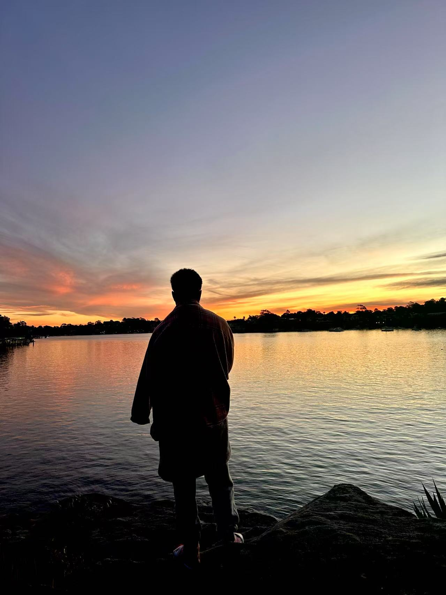
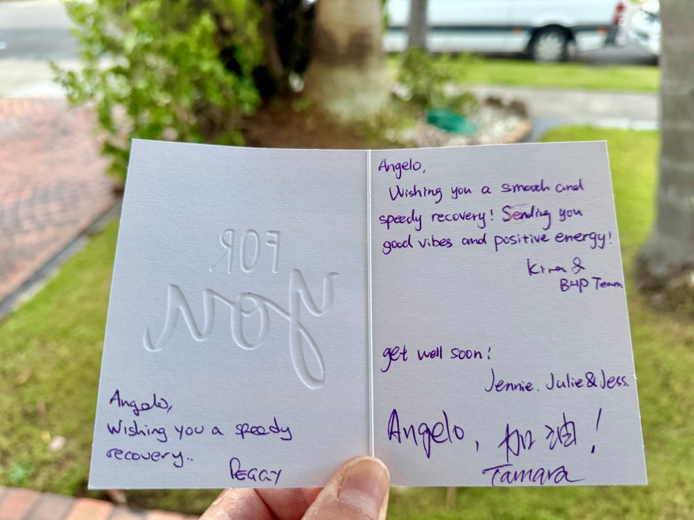

_**导读：**_我在四十出头的年纪，迎来了一次“焖锅式”的艰难的宽恕课题。背景是一次严重的摔车事故，原因很简单却又充满戏剧性。作为《奇迹课程》自修者，深知唯有“宽恕”才是唯一的宿命，但我并非圣人，于是大家可以从本文中窥视一个普通修行之人，如何克服我执（小我思想）怨愤与牺牲的“心魔”，毅然决然的选择了走上心灵的宽恕与解脱之路，重返心灵的平安。飞心在这宽恕功课中起到了非常关键的作用，在心灵最暗淡的时期，她犹如灯塔照耀着我前行的道路，而不至于迷失真我，非常庆幸在人生的修行道路上，能够有如此志同道合之人。

等待手术中

**_缘起：_**我经历了一次非常严重的摔车事故，在这个大背景下，迎来了我人生目前最大的一次“焖锅式”的宽恕课题。现在已经过去正好一个月，我才能够平静下来写一些东西。

事故的原因很简单却又充满戏剧性，一个很久不曾一起骑车的朋友再次第一次出来和我的另两位朋友一起约骑悉尼最受欢迎和安全的国家公园West Head线路。在返回的途中，大牛凭借出色的爬坡能力一个人走远了，当我正在前面领骑，我的朋友突然加速从我的右侧冲出去，我以为他要前去领骑，于是就加速前去接上，由于我是靠马路路边一侧领骑，朋友靠近马路道路中间加速，于是我就沿着原来的路径追上去，一边追击一边大喊：一起去追大牛！目的也是好让朋友知道我追上来了，结果这几个字刚喊完，从我加速到快追上时这短短几秒钟内，我的朋友的神一样的操作把我惊呆了！他竟然突然停止踩踏并且迅速从道路中间往路边无限接近！突如其来来速度差立马把我前轮挟在了他的后轮内侧，他卸力与变道的瞬间，就如同一颗朝我扔来的超级飞弹一样无情的击中了我，这一突如其来的卸力加变道太快，我毫无反应与调整的余地，也就在一两秒钟之内，在两人一波加速瞬间时速可能接近50km/h的高速情况下，朋友的后轮与我的前轮触碰摩擦，就好似高速行驶时，突然前轮抱死，导致我连人带车在空中翻滚之后狠狠的砸在了马路上，左肩膀和左侧头部着地！

最终被救护车送往就近的公立医院接受检查与治疗，左侧锁骨粉碎性骨折，左侧前胸和后背多根肋骨骨折，其中侧面一根肋骨戳伤肺部，并引发气胸。周六当天进入急症室，前几天主要处理肺部情况，直到周五才接受锁骨手术。虽然我现在说起来很轻松，但在但是被医生接踵而来的坏消息给整得惶恐不安，在接二连三的紧急拍片与CT全身扫描中折腾得痛苦不堪，以及徘徊于锁骨手术日复一日的不确定性与焦虑的等待之中。

在医院的几个夜晚，几乎每夜都难以入眠，不仅是身体的疼痛不适，更是心中的无尽懊悔。懊悔不应该叫这朋友出来，懊恼朋友不负责任的“骚操作”，我参加的赛事中经常上演突围与追击的场景，但从未遇到如此任性的操作，一般都是前方突围者突围之后，开始力竭，示意后方的人轮流领骑，或者前方突围者不想继续突围，企图节省体力，于是边减速边变道到路的中央位置，左侧回头示意我前去配合领骑。也怨恨朋友卸力与变道只要不同时发生，就不会引发事故，这怎么可能是一个骑车十几年的人能够做的事呢？

不管怎么样，我也知道，不论我在心中如何怨恨，朋友这种行为虽然也明显缺乏经验和不负责任，但总归不是故意要害我，于是只有咬牙在心中默默的宽恕这发生的一切。

公立医院做手术是按照紧急情况来排队等待的，在每天禁食的等待中，一个星期后，终于在周五下午才正式接受锁骨手术。手术后第二天，我的朋友和他老婆带了些甜点来看望我，朋友来看望我也是挺高兴，一开始边吃着甜点边听着朋友老婆分享她最近练习骑马术的经历，朋友也一旁应和着。飞心帮忙泡了两杯特意从家里带来的茶叶客气的请他们喝。一切都显得轻松愉悦，在欢谈中，我也暂时忘却了手术的疼痛与焦虑感。

但没想到朋友接下来的“骚炒作”让我在当下特别的生气与无语，就如他骑车不负责的行为一样的令人无语！

朋友说：“你摔车之后，我就悄悄的买了自行车保险。”说保险不仅包括医药，复健还包括误工费。在这个时候给我说这些不是给我添堵吗？要说也等我回家以后康复差不多之后慢慢再说也不迟嘛，而且从头到尾也没有说，让我也买一份，好似显得他比较机智一点的样子！我也没多想，于是就说“那你也把链接发我一份，我想以后我也买一份”！

然后立马又说：“今天跟他们骑车，他们都骑得好慢呀！”我受伤不能骑车，朋友和大牛他们约好周六骑车，我就心情本就很失落，本来周末我应该和大牛杰克去骑车的日子，如今我却身受重伤只能躺在病床上！心中的失落感是不言而喻的。

朋友又说：我在大牛后面跟车时，前面有一个坑，也没有给指示，差点就害我摔车！我当时虽然心理已经开始有点不耐烦了，但还是很客气的说道：大概是3G路线大家比较熟悉了吧！朋友却补道：那也可能随时有新的坑洞产生呀！

之后，又炫耀大牛借他破风之后冲坡破PR，又抱怨他们骑车不喝咖啡，又开始说着骑车要休闲，要喝咖啡享受之类的话术，好似在宣扬自己的精致生活主义，虽然以前他也经常这么说，我也只是听听就好，可这个时候是应该对一个刚做完手术的人，未来可能三四个月不能骑车的人该说的话吗？

接下来让我彻底破防的是，他鬼使神差般的，不知为何又重提：由于前面的人没有提醒前面的坑洞，差点害他摔车的事情。我一听就内心非常生气了，好似他在通过这个事情再次给我传达这样的一个信息：骑车摔车是时有发生的，你这次摔车不能赖我，你看，这次我跟他们骑车不也差点摔车了吗！？

我那个时候无法压抑心中的愤怒，用极其不耐烦的语气说道：正常跟车的话，不仅前后保持一定的距离，左右也要偏一点距离，才好看到前面的道路情况呀！朋友却立马反驳道：这样的话，就蹭不到风了呀！我越发的不耐烦的说道：这只是平时训练，又不是比赛啊！

沉默片刻，我忍不住问他：你当时从我身后加速冲出去，我立马加速跟上，你怎么突然变道把我夹击，毫无任何反应的时间啊！他沉默没说话。我接着说道：你变道就变道，怎么突然卸力（停止踩踏）啊！他说：我就是这样骑不了太久，你知道的呀！我非常克制的说道：那你还突然骑那么快！？

之后，大家都不说话了，我看着也没有必要留他们在病房里面，于是非常客气的请他们离开了！

还好，没过多久，好友Guorium结束了当日监考老师的任务，就马不停蹄的赶过来探望我，特意带了四个西式手工饼，我则请他享用医院的免费伙食，Guorium的到来稍微平复了一下我的心情。

_**感悟：**_“焖锅式”的宽恕就在于你以为自己受到委屈够多的时候，接二连三的心烦意乱的事情接踵而至，让心灵毫无喘息的余地，与此同时，还要记得“宽恕”这茬子事儿！

我也深刻领悟到《奇迹课程》之所以称之为“奇迹”，是因为发生在我们身上看起来不可宽恕的事情，却还要去宽恕它，因此这个转念的过程才称之为“奇迹”，所以《奇迹课程》实际上是“宽恕的课程”！

在“宽恕”的心灵之路上，我是受过训练的，然而，那个时候，我非常痛苦的在宽恕与不宽恕的边缘挣扎，一边骂着那人那事，一边却又宽恕着那人那事，心灵好似被无情的撕裂着！

在寂静的夜里，我喘息片刻间，我开始记起在心中问耶稣：请帮帮我，我要如何才能宽恕这一切啊！内心浮现耶稣受难日对其施行的刽子手说过的一句话：“上主，宽恕他吧！他不知道他在做什么！”是啊，他只是不知道自己在做或者说什么！

耶稣认为世界上只有两种人，一种是“死人”，一种是“活人”。听从二元性（我执或小我）思想体系的是“死人”，听从一体性（圣灵或灵性）思想体系的是“活人”，所以耶稣才会说：“让死人埋葬死人吧；你跟随我吧！”——《马太福音》8:22.

就好比《黑客帝国》电影里面只有两类人，一类任由“史密斯”利用的“死人或工具人”，一类是觉醒而不受“史密斯”所操控的“活人”一样的概念。前者受“小我思想”（史密斯）操控而不自知，后者则觉悟中不再受“小我思想”所操控。

所谓的“宽恕”只不过是在这两者间重新抉择的时刻，也被称为“神圣一刻”！

耶稣智慧的声音也开始慢慢浮现：“你到底是想要你是对的？还是想要幸福？”“对与错”属于二元性思想范畴，一旦心灵陷入到二元性的纠缠中，就不可能有真正的心灵的平安与幸福！只有彻底放弃对与错的概念为代表的二元性思想，才可能通过宽恕法则享有真正的平安与幸福！

正在科学家们还在争论量子力学，尤其是量子纠缠到底是怎么一回事，又该如何利用量子力学为人类造福时，真正看清世界本质的人们早已明了，形体层面的二元性的量子纠缠属性，只不过是更广义无形概念上二元性的量子纠缠的一个特殊实例罢了，意思就是说，例如“对与错”、“善与恶”、“好与坏”、“爱与恨”等这样的二元性思想范畴，就如物理量子力学（粒子物理属性，如左旋或右旋）所呈现的量子纠缠一样，在“对”的时刻，必然注定了某个时刻的“错”的体验，在狭义“善”的时刻，必然注定了某个时刻的“恶”的体验，在好与坏中，在（狭义）爱与恨中纠缠不已！

就好比大牛某日约我喝咖啡，探望我之际，我们对话所达成的共识一样：我们都已不再年轻，不要在荒废时光在那些内耗与纠缠之中了，把时光留着去做真正热爱的事吧！

也是那次和大牛的会晤，最后大牛说，虽然我们都曾经历着这些令人痛苦不堪的事情，但总有一天，我们回过头来再看待整个事件时，我们一定会学到些什么东西！

是的，正如耶稣所言：“把建筑工人丢弃的石头拿给我看吧，它将成为屋子的基石”——《多玛斯福音》66 。意思就是，那些看起来毫无意义的东西，经过思想的升华与领悟，终将成为我们开悟，重返心灵平安的基石。一切苦难的唯一有意义的时刻，仅在于我们认清一切苦难毫无意义之时！

我的心灵开始慢慢平静下来，内心不愿宽恕的声音也开始逐渐消逝下去。虽然我的宽恕不如耶稣那样完美，但终究坚定不移的选择跟随耶稣的步伐，虽迟但到，一起迈入那心灵的平安之境，心灵安息之地。

“没有牺牲，只有爱。”；“爱内没有怨尤！”；“没有罪咎的心灵，是不会受苦的！”这些《奇迹课程》最精简的名言再次萦绕在我的耳畔。

这次飞心全职照料我三个星期，对我无微不至，无怨无悔的关怀无以言表，也对她在精神境界上的表现刮目相看！在我与内心小我的声音“交战”之时，我很希望她能够袒护我，为我的小我思想撑腰，然而，飞心是好样的，她没有一点惯着我的小我思想，任其蔓延，而是不厌其烦的给我提醒圣灵与耶稣的心灵一体不分的真实教诲，让我不致于迷失自我，夜晚在床头上读书给我听，那句耶稣之所以能够放下一切发生在他身上的事情，是因为“终于明白思维中的障碍与限制都不是真的，它不过是头脑中创造出来的思维过程”！

我曾写过老子和佛陀的教诲，作为三部曲的耶稣的教诲，却迟迟没有下笔创作，如今我终于领悟了，老子思想如果是一体性（道）的启蒙的话，那么佛陀的教义则是对一体性（佛）的完整阐述，其精华浓缩于《心经》（大乘佛法核心经要）中，而耶稣则是用其一生透过完美的“宽恕”向世人演绎着一体性（基督）的精神！

耶稣的教诲不是用来书写的，而是用来实践的，他的教诲在我们心中，在我们的实践中，是要用心去书写的！

_**结语：**_在思想层面，只有一体性与二元性的区别；在现实实践层面，则表现为宽恕与不宽恕这两类。不宽恕的人，总会从外在找到不宽恕的借口与理由，哪怕是暴君或施害者，因为在人人内心深处的罪咎与痛苦，总得有地方安放（投射），而这正是这整个“娑婆世界”存在的原因。而对于认清世界本质的人来说，宽恕意味着彻底化解心中的罪咎与痛苦，这才是心灵平安与世界和平的根本基础。

宽恕的本质，只不是就是“化二为一”罢了！宽恕的道理很简单，但宽恕的过程却是不容易的。内心想要投射潜意识罪咎的意图总是那么的强烈与顽固，而走在宽恕之路的修行者只有一点一滴与坚持不懈的努力，才能够一劳永逸获得真正的心灵的平安与救赎！

最后，真诚感谢那些给我关怀与温暖我的人们！

_**《友林感悟系列》相关文章：**_
