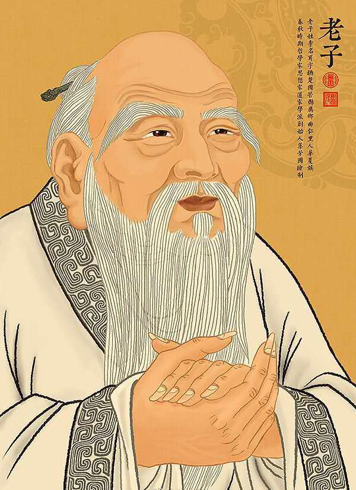
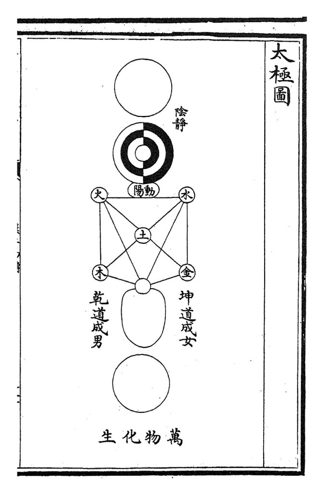
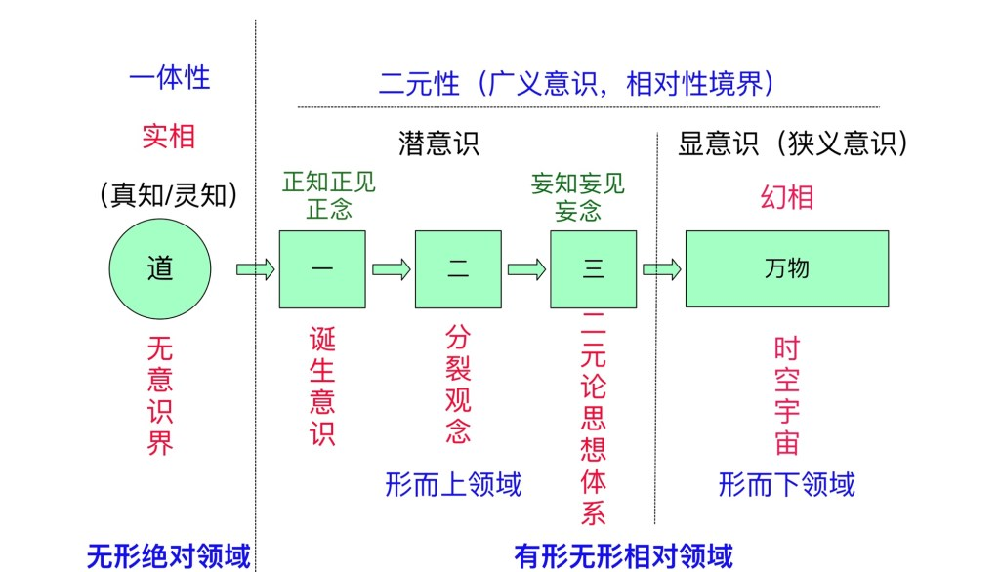
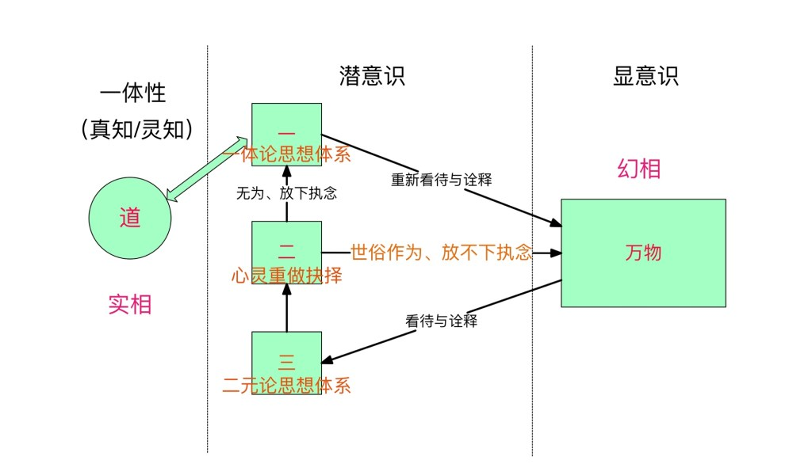

导读：对于老子思想解读的著作，从古至今不计其数，本文将从无极（一体性）与太极（二元性）的最高灵性视野进行解读，虽不一定是最全面的，但一定是最深刻的。本文将通过“道四生万物”之蓝图来介绍老子最为深刻的形而上哲学思想体系，且通过逆向诠释重构悟道思想体系，并着重介绍老子的教导中对修行者最重要的教诲，这些教诲将穿越时空之境，为修行实践提供重要启示。

文：友林 时间：2021.12.30

本文目录：  
1、老子与《道德经》  
2、非凡之“道”——超越二元性  
3、无极与太极——一体性与二元性  
4、老子的悟道思想体系——道四生万物  
5、悟道的阶梯——重构悟道思想体系  
6、道教与佛教的结合——禅宗  
7、老子的教导  
7.1、静坐在悟道上的作用  
7.2、欲望导致痛苦  
7.3、万物不是针对你而来的  
7.4、 行为训练使心灵训练变得更加简单

7.5、驯服小我——谦卑乃真道德的基础  
7.6、 层次上的混淆——心灵与梦的层次  
7.7、身体在悟道上的角色与作用  
8、结语

**1、老子与《道德经》**

老子生于公元前600年前后，姓李，名耳或贞，字伯阳、外字聃，世人尊称为“老子”，生于东周的楚国，师从商容，于东周春秋时周朝守藏室任柱下史一职。中国春秋时代思想家，隐居邢台广阳山。其著作被人们广泛称为《道德经》，是道家的经典，亦是全球文字出版发行量最大的著作，也是除了《圣经》以外被译成外国文字发布量最多的文化名著。

<figure>

<figcaption>

老子

</figcaption>

</figure>

老子的学说后被庄周、杨朱、列御寇等人发展，后人奉为道家学派之开教宗师。老子主张无为而治、天人合一、清静无为的统治理念，和庄子同样是道家的重要人物，合称“老庄”。 老子被尊为道家与道教始祖、东方三大圣人之首。

《德道经》，又被人们广泛称为《道德真经》、《老子》。全书形成于东周末期至春秋战国时期，分上下两篇：《德经》与《道经》，相传是老子留下约五千言的著作。

据统计，清代之前，《道德经》版本有103种之多，都是从汉以来经每个朝代的文人墨客撰写流传而来。古书在上千年的传抄、刻印过程中难免出现错误，因此，不断地出现校订本，迄今为止，校订本共三千多种。

千百年来，为《道德经》作注书者不计其数。元代正一天师张与材曾说：“《道德经》八十一章，注本三千余家。”据学者调查，流传至今的《道德经》注本约有一千余种。

《道德经》与《圣经》作为历史上发行量最大的两个著作，在长时期没有印刷术而依靠手抄流传的背景之下，加上每个人都有自己的注解与诠释，以及政客与文人为巩固自己的政治与文学地位而篡改的目的，使得人们很难单纯的去看待这些著作的意图。

《道德经》历经两千多年的演变发展，已经很难说它是老子一人的作品了，更准确的说，老子是它的主要作者之一，里面的核心内容，也已经从老子的一体论思想逐渐演变成了二元论思想，这是许多一体论著作与教派在流传与发展过程中几乎无法避免的事。

**2、非凡之“道”——超越二元性**

在学术界，一般认为，“道法自然”是《道德经》中老子思想的精华。“道”作为《道德经》中最抽象的概念范畴，是天地万物生成的动力源。“德”是“道”在伦常领域的发展与表现。哲学上，“道”是天地万物之始之母，阴阳对立与统一是万物的本质体现，物极必反是万物演化的规律。伦理上，老子之道主张纯朴、无私、清静、谦让、贵柔、守弱、淡泊等因循自然的德性。政治上，老子主张对内无为而治，不生事扰民，对外和平共处，反对战争与暴力。这三个层面构成了《道德经》的主题，同时也使得《道德经》一书在结构上经由“物理至哲学至伦理至政治”的逻辑层层递进，由自然之道进入到伦理之德，最终归宿于对理想政治的设想与治理之道。也就是从自然秩序中找出通向理想社会秩序的光明正道。

以上是从大众学者由二元论思想解读的信息，二元论思想是未修道之常人无法逾越的知见体系，然而老子在《道德经》开篇阐明：“道可道，非常道。名可名，非常名。无，名天地之始；有，名万物之母。故常无，欲以观其妙；常有，欲以观其徼。此两者同出而异名，同谓之玄。玄之又玄，众妙之门。”就明确指出他理解的“道”并非当时社会一般的道， 即人伦、常理之道，也非人们固有二元论思想体系中所能命名之道。“道”在老子那里已经超越了世俗社会生活，老子用“玄之又玄”来描述道的非凡性与深奥性，强调了所言之道的超然性与根基性，是二元论思想的世俗眼光无法企及的境界。

所以老子在第七十章的论述中也有坦言：“吾言，甚易知也，甚易行也，而人莫之能知也，而莫之能行也。”并感慨道：“知我者希，则我贵矣。是以圣人被褐而怀玉。”（译注：我的话很容易理解，很容易施行。但是天下竟没有谁能理解，没有谁能实行。正由于人们不理解这个道理，因此才不理解我。能理解我的人很少，那么能取法于我的人就更难得了。因此有道的圣人总是穿着粗布衣服，怀里揣着美玉。）

老子的“道”应该由超越二元性之二元论思想体系的框架去觉知，即代表一体性之“道”的一体论思想体系。因此，本文将跳脱二元性思维框架，从一体论思想体系全新视野来诠释老子的“悟道”思想。当我们开始学会逆向思维时，将信念从二元性幻相的执迷不悟状态中抽离，回过神来再次全面的看待老子所言之“道”的真谛时，我们才会发现老子所言不虚，“道”真的很好理解，因为相比二元性本质的纷繁无常，在“说是爱又是恨”的错综复杂的关系中，每个人都活得毫无胜算，也毫无公平正义可言；而“道”的境界更加单纯，因为它恒常不变，只要放下原有的无明之执着心理，向其敞开心来，它对每个人都是公平正义的，也更加容易实践。

正如耶稣所说的那样：“门口站着好多人，但只有无伴者方能登堂进入那新娘的闺室。”（多玛斯福音：75）在这里可以简单解释为：想要求道与悟道者众多，但是只有那些愿意放下对旧有思想体系执着的人，才能够进入另一片新天地，真正获得自由解脱与终极喜悦之境。

在世人都在想方设法滋养与装饰身体，使其看起来更加华丽和与众不同的时候，然而得道的圣人并不需要供奉身体，因为平凡的身躯之下，怀揣的“美玉”就是重新认识了自己的神圣自性——神圣的灵性（圣灵）。然而人们对于灵性世界或灵性法则知之甚少。

**3、无极与太极——一体性与二元性**

一般人所认为的“太极图”准确应该称之为是太极阴阳图☯️（又称太极两仪图），而真正的“太极图”如下图所示：

<figure>

<figcaption>

太极图

</figcaption>

</figure>

道教的太极图据传是宋朝的陈抟所创，原名叫“无极图”。据史书记载，陈抟曾将“太极图”传给其学生种放，种放又分别传穆修、李溉等人，后来穆修将“太极图”传给周敦颐。周敦颐写了《太极图说》加以解释。现在我们看到的太极图，就是周敦颐所传。

“无极”二字最早出自老子《道德经》第二十八章（知其雄章）：“为天下式，常德不忒，复归于无极。”复归于无极，意思是恢复到不可穷极的真理，无极在此即绝对真理或本源的意思。

周敦颐写下《太极图说》，解释无极与太极的奥秘。前半段基本上符合道教的思想。后半段比较多地讲了儒家的仁义道德思想。 他的解释，第一句是“自无极而太极”，意思是从无极生出太极，但南宋著名的理学家朱熹整理注解《太极图说》时，删去了“自”字，改成“无极而太极”，认为无极只是形容太极 ，说明它之上没有更高的本源。这并不符合陈抟所传《太极图》的原意，而且抹去了它出自道教的事实。同时，朱熹对图也有个别改动。

陈抟所创的“无极图”，后经流传演变为“太极图”，由周敦颐所写《太极图说》的“自无极而太极”，到了朱熹笔下，成了“无极而太极”，将无极与太极混为一谈，认为无极只是形容太极，之后世人又普遍认为太极图就是象征二元性对立互补的太极阴阳图。从这里容易看出，老子崇尚的终极真理就是代表一体性的“无极”，“道”就是一体性，“道”就是无极，然而越往后世传下来，就变成了以代表二元性的“太极”为中心思想的学说与教派，一体论思想是普通大众（未经心灵训练与未修行者）很难坚持的思想体系，非常容易演变成二元论思想体系，因为人的一切感官与意识都是建立在二元性基础上的，这也是为什么对于真正的修行者会用“三只猴子的雕像”来警示自己。这三只猴子分别是捂嘴、蒙眼、堵耳，就是在警示修行者，一体性或无极之真理超越表象与感官之上，或者说超越“时间、空间、形体”之上。（参见《三只猴子的故事——真实的生命纯属理念》一文）

如果太极（阴阳）图象征着这个世界万事万物的二元性的内在本质，呈现出二元性的相互扭曲、交换与纠缠的特性的话，那么无极图（空白圆圈）则象征着一体性，呈现出合一、完美与容纳百川而毫无对立面的特性。道即一，即道就是一体性，那么无极图代表的就是道的内涵。

如今，太极文化作为中国哲学思想非常重要的组成部分，太极阴阳图似乎成了智慧的最高的象征，成为了中国道家乃至整个中国文化中最重要的象征符号。

与此同时，随着近一百多年来量子力学的发展，对量子微观领域深入的研究，发现构成宏观物质世界的微观量子世界的底层逻辑同样是二元对立互补的本质。自此，不论是代表人类文明最高哲学思想水平的太极文化，还是代表科学前沿的量子力学理论都同样地走到了世界万事万物运作的的底层逻辑基础——二元性！

波尔是量子力学领域主流的哥本哈根学派的核心人物，1947年丹麦国王弗雷德里克九世宣布授予玻尔大象勋章（通常只有王室成员和国家元首能获此殊荣），表彰玻尔在量子力学领域的卓越贡献。玻尔亲自设计了这枚勋章，章纹由象征二元性的太极图以及用拉丁文所写的格言“对立即互补”为主旨设计的。

<figure>

<figcaption>

波尔设计的大象勋章

</figcaption>

</figure>

如果领悟了二元性的本质特性就是扭曲、交换与纠缠，二元性的底层运作逻辑才是“众生皆苦”根本症结所在，那么解脱的不二法门必然就是抛弃为二元性代言的二元论思想体系，重新认识并实践为一体性代言的一体论思想体系！所谓的修行、灵修、禅修或修道，其实就是这“化二为一”的心灵训练过程。

我们必须了解一体性是如何演变为二元性的，或者说，是如何“自无极而太极”的，唯有知悉其底层演变机理，如此我们才能够顺藤摸瓜，逆势而为，通过逆向思维“化二为一”，将心灵中二元论思想信念逐一洗涤，由一体论思想信念取而代之。

**4、老子的悟道思想体系——道四生万物**

《道德经》第四十二章提到了著名的“道生一，一生二，二生三，三生万物”这句名言，我将其简称为“道四生万物”，这是老子整个哲学思想体系上最重要的一句归纳总结的话，它如此精简，又如此美妙，用平凡的话语概述了一幅非凡的“自无极而太极”之宏大蓝图。

目前主流学者把它视为老子宇宙生成论的概述，通常认为这句话是在描述“道”生万物从少到多，从简单到复杂的一个过程。然而非凡之“道”，必然用非凡之视野去看待，如果只是以“多与少”或“简单与复杂”这种二元性的眼光，是无法跳脱二元性思维框架，得到一体性“无极之道”的终极真理的。

用佛教领悟万事万物空性的“悟空”觉识，少或多如何能够掩盖其虚无的本质？简单或复杂如何能够掩饰其虚空的实质？二元性境界就是这样玩弄“时间、空间、形体”的幻化花招，而小心翼翼的隐藏其虚幻不实的本质，然而作为心灵训练有素的一体论思想大师的老子，是不可能受其蒙蔽与束缚的。正如柏拉图曾说：“我认为我们应该从认清这一点开始：真实的永恒不变，不真实的永远在变”，其实柏拉图是引自印度教经典《薄伽梵歌》中的一句经文：“有两条永恒的道路。一条是光明之道，另一条是黑暗之道。前者带你脱离生死轮回；后者继续流转人间。凡是真实的，永恒存在；凡是不真实的，未曾存在过”。（注：“生死轮回”是形而下之表象，其形而上内涵是“二元性的纠缠”，“生与死”在此代表二元性；“未曾存在过”却又以为身处其中，就是佛教中幻相即梦境的思想。）

对于真正悟道的修行之人，这是“悟道的阶梯”，它涵盖了整个悟道的精髓所在，可以说，成功诠释这句话的人，明晰其内在机制的人，才能够说真正走上了悟道之路，离苦得乐的解脱之法近在咫尺。如同《多玛斯福音》开篇第一句话就是：“凡是发现这一语录的诠释之人，不会尝到死亡的滋味。”。

世界万物的底层逻辑本质上是二元性的，如太极阴阳图所呈现的扭曲、交换与纠缠的特性，参见《二元性世界底层逻辑概述》一文。因此，“道四生万物”，其实是在描绘一幅完整的“道”是如何经历四次分裂衍生出“万物”的整体画面，我们可将其逆向思维称之为“悟道蓝图”或“灵修蓝图”。

关于“道四生万物”从一体性到二元性的完整诠释参见《老子悟道思想解析——道四生万物》一文，这里简单总结一下：

<figure>

<figcaption>

“道四生万物”四次分裂

</figcaption>

</figure>

**第一次分裂：“道生一”，从无意识界到意识界**

“道”就是圆满的一体性，这是言语道断之境，是灵性圆满的境界，属于佛教中所谓的“无意识界”，因为意识就是一系列判断的集合，要有比“一体”多一点的东西，与之互动，才有判断与意识可言。

人类是基于意识而生存的，意识本身是一种基于二元性的不确定性而存在的，因此人生的悲欢离合、生老病死、喜怒哀乐等等所谓现实，乃至情感上的体验都是二元性与不确定性的。在一体性境界没有不确定性，这种境界在二元性思维框架之下很难体会与领悟，因为人类的喜乐与满足是建立在从“某种不确定性”到“确定性”的某种形式的“成功”而获得的结“果”，但根据二元性运作法则，正如太极阴阳图所呈现的那样，“因”与“果”这两个极性元素在“玩太极游戏”——循环往复、周而复始。这种“确定性”在某种幻化时空转移之中，也将成为其它某种不确定的诱“因”，因此在这种二元性的因果关系之中，人们无法寻获永恒的喜乐与圆满，这是注定的！要想跳脱二元性的太极之境，就要像佛陀跳出万事万物的“因果循环往复的怪圈”，领悟出我们身处所知所见的万物统统都是“果相”，其上还有高一层“因地”，修正“果相”不如修正“因地”。

在“无意识界”的一体性境界，没有二元性的判断与对比，喜乐与满足不是通过对比获得的，对比本身就是二元性的思维产物，因此对比的结果必然也受制于二元性法则——时而喜乐时而忧虑，时而满足时而失落。而是一种基于一体性或整体性的无限扩展，创造是毫无极限的，喜悦也是毫无极限的，这种“无极”的喜悦与圆满以及创造活力是世俗世界眼光下无法理解的。

因此“道生一”表示意识的诞生。

**第二次分裂：“一生二”，由意识形成第一个（分裂）观念**

“一生二”表达的是无意识界的一体性的灵性生命，成为了进入二元性意识领域之后的心灵（灵性与意识的混合体），即此时属灵生命变成了有意识可判断的心灵，所做的第一个意识性的观点判断：相信（道生一）分裂发生了；分裂未曾发生（不相信分裂发生）。

如果做后者判断，即相信分裂未曾发生，那么导致“道生一”没有存在基础，心灵将维持“道”的一体性境界，二元性意识境界也将没有存在的基础，游戏到此为止。不幸的是，心灵处于某种原因做了前者判断，即相信分裂发生了，巩固了二元性与意识境界。

对于佛陀而言，二元性境界就等同于“梦境”，是虚幻与无常的，只有一体性的“佛/道”的无意识界才是心灵本来境界，是无极性的真实境界，即实相或梵天。

佛教有言：“虚空无南北，人心妄分别，执妄信为真。”就是在说，本来没有虚无的二元性的无常梦境，只有一体性境界；然而心灵妄自分别，相信还有除了“道”的一体性境界之外，还有其它的境界存在，它就是二元性的无常“梦境”；梦境本是虚无，只因为心灵执意信奉这与“道”分裂之境，才将梦境演绎的如此真实。

因此，“一生二”表示心灵执迷不悟，将信念投掷于这二元性梦境之中，相信分裂之念，成为梦境的存在基础。

**第三次分裂：“二生三”，分裂的观念形成整个分裂思想体系**

既然心灵选择相信与“道”的一体性境界分离了，那么表示心灵选择相信了分裂之境，心灵的一个基本法则就是：你将把自己所相信的视为真实的（执妄信为真）。

一旦将某物（此时是形而上的，泛指理念）视为真实的，就必然为其存在的真实性进行潜意识级别的辩护，因此，既然心灵将信念投掷于这非一体性的梦境，势必保护其存在，所以“二生三”表示心灵形成了整个的思想体系，用来自圆其说，保护其自身存在的合法性，它就是为二元性撑腰的整个二元论思想体系。

**第四次分裂：“三生万物”，由二元论思想体系形成时空宇宙**

“道”代表一体性境界，“一”代表意识，“二”代表分裂的观念，“三”代表二元论思想体系，那么“万物”代表的自然就是“有迹可循”的时空宇宙。

“宇宙大爆炸”就是“三生万物”的象征与演绎：宇宙万物是如何从一个什么都不是，却似乎又蕴含了一切可能性的“奇点”演化而来的。

“万物”是由二元论思想体系产生的，因此，万事万物都在为二元性作见证的，它的存在原是出于对其创造者的保护，而最好的保护措施就是“声东击西”、“顾左右而言它”，将其始作俑者的意图隐藏起来，所以可以说“万物”是对“三”（二元论思想体系）的保护或防卫措施，“三”是对“二”（相信分裂观念）的掩护，而“二”是对“一”（二元性的意识境界）的防护。

一体性的“道”与二元性的“幻相”是水火不容的， 耶稣对此非常清楚，于是才会说：“一个人无法同时骑两匹马或是拉两张弓；一个仆人也无法同时伺候两个主人，否则他不是恭奉了这一位，就是冒犯了那一位。”

因此与“道”的一体性境界背道而驰的二元性境界的“一”（意识）、“二”（分裂观念）、“三”（二元论思想体系）、“万物”（有形时空宇宙）是势不两立的，即二元性与一体性互不相容。而且“一”、“二”、“三”、“万物”都属于二元性的产物，四者相辅相成，前者为后者创造存在基础，后者为前者提供庇护与防卫，其防范与抵制的对象就是真相与真理之“道”。

**5、悟道的阶梯——重构悟道思想体系**

一体性本身毫无区分，但悟道有次第，因身处二元性境界的心灵不大可能“一步登天”，抵达一体性的“道”的境界。

二元性境界的所知（“一”、“二”、“三”）所见（“万物”），统称为“知见”，凡“知见”者就属于二元性范畴，因只有比“一体”多一点的非一体性境界，才有可能有所知、有所见，在“无意识界”的道境不存在知见，只有真知。

所有知见都是基于二元性底层逻辑运作的，但在二元性的知见领域，有一种知见叫“正知正见”（正念），它是为一体性境界备书与作见证的，基于“天人合一”的观念而成；其它的都是妄知妄见（妄念），它是为二元性境界作见证与备书的，基于“天人分裂”的观念。

在“万物”皆在为二元性作见证，人的脑袋里到处充斥着二元论思想的世界里，为一体性作见证的“正知正见”显得稀少又难能可贵，于是耶稣才对此比喻到：“你们要走窄门，因为引到灭亡，那门是宽的，路是大的，进去的人也多；引到永生，那门是窄的，路是小的，找着的人也少。”（《马太福音》：7:13）这也是为什么佛教那么强调正念，要化解的对象是妄念，换成现代用语，正念就是一体论思想体系，要化解的是二元论思想体系。

若要悟道就必须明晰“道四生万物”的这四次分裂，穿透二元性境界三层防护措施：

第一层防护措施：“分裂观念”防卫“二元性意识”；

第二层防护措施：“二元论思想体系”保护“分裂观念”；

第三层防护措施：“万物”掩护“二元论思想体系”。

这三重防护措施的共同目标都是为了防范“真相”，防护二元性境界免受一体性的侵扰，好让二元梦境能够持续运行下去。要层层瓦解二元性的三重防护措施，就必须通过逆向思维，构建新的重归“道”的思想路线。

为瓦解第三层防护措施，就必须彻底领悟“万物”之有形物理逻辑层面与传统哲学思维层面的共同本质，如二元太极哲学思想与量子力学底层二元性逻辑的理念上的重合，这是突防第三层防护措施的关键所在。由于“万物”的存在依赖“二元论思想体系”，而“二元论思想体系”又依赖其“分裂观念”，思想与观念又离不开其源头心灵，因此，瓦解“二元论思想体系”只需要改变心灵内的观念，心灵彻底认清“二元论思想体系”纠缠本质即可。

为瓦解第二层防卫措施，就是彻底明白“众生皆苦”的根源就在于二元论思想体系的“扭曲”、“交换”、“纠缠”的无常幻化本质，而信仰“分裂观念”是该思想体系存在的根基，于是“天人合一观念”，即重归一体性的观念是对“分裂观念”的一种反制与修正，真正的修行就是修正这“分裂的观念”，由“天人合一”的观念取而代之，这是整个禅修体系的关键之所在。

老子的“天人合一”的观念是其悟道思想的根本所在，“天”代表“道”，类似基督教派中的“天父”的概念，“人”的概念应该首先被提升到“心灵”的层次，因为只有心灵才可被修正，万物包括物质身体在内，无法也无需被修正，它只是一种象征形式而已，因其主导思想体系而幻化，对万物包括身体的任何执着心理都将牵制心灵的觉醒，而不得修正与解脱。因此“天人合一”就是要心灵与一体性之道合而为一，使心灵重归一体性境界。这也是耶稣为何要说“我原是与天父一体的”这句话，他并不是要证明自己的特殊性，而是要以身作则地教导世人，每个人都可以“天人合一”，因为每个人本是源自这一体性境界。

禅宗六祖惠能大师（始祖达摩）有曰：“菩提般若之智，世人本自有之。”所谓般若，梵语意为“终极智慧”、“辨识智慧”，专指如实认知一切事物和万物本源的终极智慧，区别于一般的智慧。在古典瑜伽经典《瑜伽经》（又称《合一经》，瑜伽是合一的意思）中有明确定义：辨识智慧是消除见者和所见结合并引向解脱之道的方法，通过合一各分支的实践，不纯逐渐减少，知识之光将照亮辨识能力。

因此，般若智慧，即合一智慧，或者说对一体性境界之慧见，是世人本来就有的智慧。

为瓦解第一层防卫措施，就必须彻底放下“意识”，意识是一种判断与对比的机制，只不过由于分裂观念的作祟，心灵的判断全部导向二元论思想体系，又由此衍生唯物主义等，如此又进一步的加深了对“万物”的执着心念，而无法从执念中得以解脱，心灵被牢牢的桎梏于幻境之中。

理论上，对意识的反制措施应该是“无意识界”，但是意识是二元性存在的鼻祖，一切观念包括“合一观念”又都建筑于意识之上，过早的进入无意识界，将无法达成“瓦解第二层防卫”的目的，因为依赖意识而存在的观念已经不复存在，基于“天人合一”的观念也无法得以践行。于是，在进入“无意识界”之前，我们要充分利用意识的作用，因此在意识界与无意识界之间有一个过渡阶段，这个阶段就是一体论思想体系。

如果瓦解了第二层防卫措施，意味着“分裂观念”灭亡与“合一观念”的兴起，因此所有的意识判断都必须是反“分裂”、反“背道而驰”的，它是合一的意识，合一的意识形成合一的观念，合一的观念形成合一的思想体系，即一体论思想体系。最后，一体论思想体系将顺理成章的接管或托管“万物”，不要轻忽“万物”对心灵的作用，在心灵还未做好准备之前，“万物”（包括身体）亦是必不可少的修行工具，过早的舍弃“万物”将加深心灵的牺牲与分裂的观念。

这就是“道四生万物”的“合一”版本，逆向思维的结果，是对“道四生万物”的“分裂”版本的反制，同时也兼顾了过早舍弃“意识”与“万物”为心灵所带来的负面影响，起到过渡缓冲的作用。

所以，利用悟道的逆向逻辑，老子“道四生万物”的反向诠释为：

“道”是亘古不变的一体性境界；

“一”则是一体论思想体系；

“二”则是心灵重新选择的力量，用老子的话来说就是“无为”（佛陀是“放下”，耶稣是“宽恕”），将信念从万物以及背后的二元论思想体系的信仰中脱离出来；

“三”依然是“万物”的支持者，二元论思想体系。

“万物”依然是有形时空幻境，所谓的“有形”不一定指可见可碰触，凡是可测量者均为有形的概念范畴。

<figure>

<figcaption>

“道四生万物”的反向诠释的修行蓝图

</figcaption>

</figure>

从“分裂观念”到“合一观念”的转变（唯两种可能存在的本质性观念），是完成从二元论思想体系到一体论思想体系转变（唯两种可能存在的本质性思想体系）的关键所在。而它们都建立在“意识”的基础之上，“意识”在这里发挥新的重要作用，于是依然基于意识而存在的“一体论思想体系”成为了从整个“二元性境界”过渡到“一体性境界”的一个桥梁，这个桥梁是悟道的重要组成部分，它好似是从二元性的意识领域做好心灵上的准备，这个准备所需的时间就是悟道所需的时间，它依心灵内“执念”的强弱程度而定。

**6、道教与佛教的结合——禅宗**

总体来说，禅宗是大乘佛教从东印度地区流传于中国本土，并与本土道家思想相结合而形成的。

老子与佛陀一样，没有信奉任何外在的神明，将信念从外转向内，纯粹明心见性，才参悟道境与佛境。由于二元论思想体系作祟，普通人必然向外寻求偶像，不论是钱财、名利都有自己的偶像，对于非一体性之道修行者也自然塑造自己信仰上的偶像，因此在佛陀与老子离世，佛教与道教发展起来以后（佛教与道教并非佛陀与老子所创立），信仰的偶像也被自然而然的建立起来，比如各类佛像、太上老君等等。而禅宗就好像当年的佛陀为了从印度教中诸多神明的供奉与繁杂礼仪中脱离出来，全心领悟生命的真谛，领悟自性的本来圆满境界，才终有所成。

因此，作为禅宗代表经典的《六祖坛经》，惠能大师主张心性本净，佛性本有，觉悟不假外求，舍离文字义解，直彻心源。认为“于自性中，万法皆见；一切法自在性，名为清净法身”。一切般若智慧，皆从自性而生，不从外入，若识自性，“一闻言下大悟，顿见真如本性”，提出了“即身成佛”的“顿悟”思想。主张心性本净，觉悟不假外求，不重戒律，不拘坐作，不立文字，强调“无念”、“无相”，“即心是佛”，“见性成佛”，自称“顿门”。

禅坐与禅机是禅宗的两大特点，在所有的修行体系中，静坐是最基本的法门，它是让心灵平静下来，为新的信念体系做好准备的一种必要的表现形式。而“打禅机”则是禅师或禅僧与他人参禅或者沟通交流时，常以寄寓深刻、无迹象可寻，乃至似乎非逻辑性的言语来表现一己的境界或考验对方。

之所以参禅悟道时，许多言语乍听之下，似乎毫无道理，也毫无逻辑性可言，这是因为真正的禅修者，向往的境界是超越世俗的二元性境界的一体性境界的，因此普通人用二元性思维模式去看其中言语之间的含义时，无法跳脱二元性的思维惯性，就无法参透言语间的一体性真谛。

如惠能大师语：“禅者不思善，不思恶，各自观心，自见本性，即可顿悟菩提。”

禅者不思善，不思恶，就是指一个真正追求圆满的一体性境界的禅修者，不可执念于善与恶，“善与恶”是二元性的典型代表，与《心经》中的“不生不灭，不垢不净，不增不减”都是在说，修行者必须超越二元性逻辑，守住一体性心境，方可明心见性，顿悟圆满一体的本来境界。然而，基于二元论思想体系之未修行者，就只能够从二元性体系中做判断与选择，要么评判某人某事是善还是恶，或者有多善，又有多恶，始终无法跳脱二元性思维框架。

所以惠能才又说：“佛性是远离永恒与短暂、美与丑、善与恶的境界，完全超乎分别之上，就是不二之法。”。所谓的“不二”，就是超越二元性的法门，就是指一体性，这也是真正修行人所要践行的“化二为一”禅修宗旨。

不修行者必被二元性思想体系所掌控，基于二元性的纠缠与扭曲的特性，世人是无法真正从中解脱的。不化解“二元论思想体系（小我思想体系，同佛教的“我执”）”，“小我”就会继续防范真相，执意背“道”而驰。所以，不化解“小我”，“小我”必化解真相，因为两者势不两立。于是耶稣才会说“上帝的归上帝，凯撒的归凯撒”与“同一源泉不可能流淌出甘甜与苦涩的泉水”等名言。

《多玛斯福音》于1945年在埃及的拿戈玛第（Naj' Hammādi）被人发现，是所有被发现的经文中最重要，也是保存最完整的一部，其文本在1975年向公众释出。从此，它被翻译成多国文字，有关的论文及注译如雨后春笋般散播开来。

美国的非宗教性学术研究团体“耶稣研究会”，将《多玛斯福音》列为值得信赖且有关耶稣传道训义的“第五福音”。天主教教宗本笃十六世指《多玛斯福音》“对基督信仰团体的起源，该文献是很重要的研究资料”，但天主教却不承认是其正统福音地位。

《多玛斯福音》被称为是西方界基督宗教的“禅宗”。普林斯顿大学宗教系教授伊莱恩·柏高丝认为《多玛斯福音》及拿戈玛第经集的经文“有部分和佛教相似，这些早期的经文很可能受到当时已经发展成熟的佛教传统影响。”柏高丝认为若把《多玛斯福音》里的耶稣换成释迦牟尼（佛陀），经文的许多教诲都几乎和佛经所说的一样。

《耶稣灵道论语‧多玛斯福音》作者娄卋钟在其导言中也揭示：“《多玛斯福音》里有相当多的资料可以和佛禅的灵修及老庄的领悟相互引证。要是把《福音四书》比作基督宗教的净土宗，那么《多玛斯福音》就是基督宗教的禅宗。这样的比喻对研究过这份灵道的人来说是一点也不为过，只不过《多玛斯福音》比佛门禅宗始祖早问世近五百年罢了。读者若将福音四书中的话和这百余则灵道论语，当成耶稣对门徒们所说的“公案”也并无不可。所不同的是，《多玛斯福音》强调天父所赐的原本一体的灵性、光明和平安。”

只不过西方文献不会出现“道”或者“佛”的称呼，取而代之的是“上主”或“天父”的概念。

**7、老子的教导**

领悟了老子“道四生万物”完整的悟道思想体系之后，我们才能够清晰的明白老子超凡脱俗的智慧、其所要教导世人的非二元的哲学思想以及训练心灵实践全新思想体系的方法。本来想单独阐述老子的“无为”思想的，然而老子的“无为”思想始终贯彻其教导的方方面面，实在是无需单独阐述，人们应该举一反三，从中领悟其“无为”思想的真谛。

**7.1、静坐在悟道上的作用**

人的感受是相当深层次的，不论外在有没有表现出来，即使外表看起来很平静的人，往往内心也有很深的感受在暗潮汹涌，甚至是那些表面上看起来相当文静的人。

要观照心灵之中的起心动念，观照内心的那些冲突、负面、评判、定罪的念头。但有一点是容易被人们所忽视掉的，那就是我们也要同时观照自己的感受，这一点相当重要。因为在绝大多数情况下，我们其实更加依赖按照自己的感受而采取行动。大多数人所没有意识到的是，我们的感受其实是由潜意识下更深层的念头所引发的，这些念头都是人们根深蒂固且不易察觉的。总之，人们是先有念头，再有感受的，只不过这些念头都是埋藏于潜意识中的而已。觉察自己的念头，甚至是那些看似本能感受之下的深层的念头，予以正视且修正，对于真正修行者来说是非常重要的。而这样的修正必须配合一定的静坐形式。

静坐是老子在教学中，所有弟子日常的必修功课，目的是让心灵达到绝对的宁静的状态，不受任何世俗念头的干扰，使心灵充满平安。而心灵的平安是进入真理之境的先决条件，如此，静坐便为心灵的训练做好准备（准备接纳新的思想体系）。静坐基本法门也是老子整个“无为思想”的一个组成部分。

**7.2、欲望导致痛苦**

老子是最早教导“欲望会导致痛苦”的老师，并且认为舍弃物质有助于他的弟子放下欲望，于是老子才说出了“圣人无为故无败”这句名言。老子要求跟随他的弟子，必须抛弃所有物质财富，舍弃世间的所有欲望。正如在《道德经》第十二章所言：“五色令人目盲；五音令人耳聋；五味令人口爽；驰骋畋猎，令人心发狂；难得之货，令人行妨；是以圣人为腹不为目，故去彼取此。”（译文：缤纷的色彩，使人眼花缭乱；嘈杂的音调，使人听觉失灵；丰盛的食物，使人舌不知味；纵情狩猎，使人心情放荡发狂；稀有的物品，使人行为不轨。因此，圣人但求吃饱肚子而不追逐声色之娱，所以摒弃物欲的诱惑而保持安定知足的生活方式。）

虽然老子自身已经活出了一体性之“道”的境界，过着对世界无欲无求的禁欲生活，但是他的弟子们却很难活出完全没有欲望的生活，这种极端的放弃物质与舍弃世间一切欲望的生活方式，反而让其弟子们对物质与欲望更加当真了，从而无法领会到一体性的“道”的真谛。

其实老子只是想通过舍弃欲望来放下对“万物”的执着心理，正如《道德经》所言：“是以圣人为而不恃，功成而不处，其不欲见贤。”（译文：有道的圣人虽有所作为而不占有，有所成就而不居功。他是不愿意显示自己的贤能。）言外之意是，得道的圣人虽然有所作为，有所成就，但却不占有，不居功。这里“作为”与“成就”代表“万物”之表象上的行为，而“占有”与“居功”表示心理上的执着。真正要舍弃的是对“万物”的执念心理，而非其表现形式，形式本身无关紧要，要紧的是我们对待形式的态度与内在看法。

在老子时代约两百年后的佛陀，受到老子“无为”的修行观念的影响，同样抱持“欲望导致痛苦”信念。但是透过进一步的实践，佛陀发现藉由舍弃欲望来远离痛苦——这是道教与佛教的主要目标之一，但这种极端的生活往往会妨碍我们的清明，并且也无法真正使我们感到满足，在刻意舍弃物质欲望的时候，往往容易将其当真。

佛教后来也对此总结道：“厌即是恋”。意思就是，厌恶世间的一切事物与迷恋世间一切事物是一回事，都是把世界当真了。于是佛陀才提出了“中道”的修行思想，即面对世俗生活，采取“不厌亦不恋”的态度，其本质上就是对老子“无为”思想的有力补充，也充分展现出了“化二为一”最原始的实践法门。不当真就是跳脱二元性惯性思维，就是从幻境之中解脱（参见《悉达多的开悟之路——一体论思想之佛法解析》一文）。

**7.3、万物不是针对你而来的**

南怀瑾年轻时求师问道，一位高僧告诉他，在我们观看风景画面时，不要投入心念“去看”，而是让景色自己映入眼帘，即不要有所求，而是顺其自然，这也是某种形式的“无为”观念。

然而，老子的“无为”思想是非凡而彻底的，结合老子与佛陀的“万物”之“空性”的观念，老子的无为思想认为，人之所见一切万事万物，皆来自于心灵，源自我们一体不分的自性。“万物”并不是由外到内而来的，根本没有“内”与“外”这种二元对立的存在，一切二元性的表象均属幻相，就如同太极（阴阳）图那样循环往复的扭曲、交换与纠缠在一起，使心灵看不到一体性的真相。

真相就是我们以为万物是从外界映入我们的眼帘之内，而实际上这只是幻觉，这缤纷万象的世界的念头或观念是在心灵之内，而非在外，它只是看起来好似在外而已。观念离不开其源头——心灵，心灵是一切观念的永恒居所。它也是唯一可以改变念头与观念，真正解决问题的地方。

认识这一点，是领悟无主客体之分的一体论思想体系的基础，也是实践一体论思想体系的关键所在。就好比《黑客帝国》里面的剧情，虚拟世界的画面看起来真实，但其实只是由二进制代码所虚拟生成的影像而已，都只是代码的表现形式而已。用老子的话来说，“万物”看起来真实，似乎在外面，其实都是与心灵内念头、观念与信仰相互纠缠的结果。

对于修行的基本意义就是，几乎所有的人都视自己为外在世界的受害者，如果世界是真实的，那么我们也是受害者无疑，牺牲与受苦的观念必然显得真实无比。实际上，世界之所以显得真实无比，只是因为我们心灵中先有了牺牲与受苦的观念，凡人的眼光与老子的眼光是完全相反的！

如果世界只是由观念（代码）虚拟出来的，那么我们也不可能是真正的受害者，进而我们只需要修正心灵内的牺牲与受苦的观念即可得以解脱，世界万物也会随之发生转机。如此，世界所表现出来的受苦受难的形式只是修行中借以修正内心苦难观念的道具，表现形式是“果”，其背后的观念是“因”，修果必先修因。“苦因”得以修正，那么“果相”也必将得以改变，不可本末倒置。真正的修行者只需要照顾好“因”，“果”则水到渠成，不用操心。

根源性的“苦因”是什么呢？与“万物”之表现形式无关，表现形式上苦难只是掩饰心灵深藏之“苦因”的幌子罢了。从老子“道四生万物”可以得知，“万物”之形式上的“苦因”是“二元论思想体系”，而“二元论思想体系”之“苦因”又是“分裂之观念”及其“二元性意识”，但归根究底，本源性的“苦因”乃是与“道”分裂之念，因此离苦得乐的终极法门就是“悟道”！

**7.4、 行为训练使心灵训练变得更加简单**

在了解狭义意识（显意识或表意识）与广义意识（显意识与潜意识）的区别之后，我们才能够深刻的明白了悟一个心得或者观念，只能够算是让表意识暂时接受了这个观念，而潜意识却不一定接受，如果不运用必要的心灵训练或实践过程，潜意识不仅无法接受新的观念，甚至抵触它，且很快就会瓦解表意识所暂时接受的新观念，遗忘就是表现形式之一。

不仅是新观念，对于整个思想体系的转变亦是如此。表意识作为整个广义意识的冰山一角，绝大部分的念头都是在潜意识中隐秘运作的，因此，心灵训练过程的主要“角逐场”是在潜意识。如果潜意识是由二元论思想体系所主导的（目前绝大部分人所拥有的思想体系），在学习一体论思想体系时，若不加以运用与实践，充分锻炼心灵，那么潜意识就会抵触与瓦解一体论思想体系，直至潜意识这个“主战场”被彻底扭转局面——主导权被一体论思想体系所接管。

这也是为什么老子的原始一体论思想教诲会被后世人文政客所扭曲成二元论思想的教诲，后世之人其实也并不知道自己改造了老子所教导的真相，人们只是以为自己是正确的，其中的主要差别就在于心灵有没有经过必要的训练过程，实践真理。这一点同样适用于人们日常生活中的各种评判与指责行为，因为人们不知道自己其实是在投射自己的潜意识中未被察觉的罪咎（苦因），而只是认为自己是对的。所以老子才说：“知者不言，言者不知”，即真正的智者不多说话，而到处说长论短的人就不是聪明的智者。

老子说：“道之出口，淡乎其无味，视之不足见，听之不足闻，用之不足既。”（用言语来表述“道”，是平淡而无味儿的，看它，看也看不见，听它，听也听不见，而它的作用，却是无穷无尽的，无限制的。）即道是无形且无极限的。作为老子这样资深修行悟道之人，其实完全不动声色就可以完成修正心灵中妄念的目的。

然而，对于老子的弟子们这些初级寻道者，并未领悟“道”的本质，“万物”行为与形式对他们显得依然非常坚固而真实，其“二元论思想体系”也显得根深蒂固，于是对于习惯行为与形式的初级悟道者，配合一定的行为上的训练是非常必要的，静坐、禁欲、舍弃世界是老子对弟子们行为训练的主要表现形式，老子认为行为训练使心灵训练变得更加容易。

正如佛陀在教导弟子时，授予“八戒”作为行为训练的一部分，并说这是“方便法门”，适合初学者，好让弟子们从有形的训练过渡到无形的心灵潜意识层面的训练，因为这些戒律的唯一目的就是让心灵从纷杂的欲望世界中抽离出来，为进一步的心灵训练做好准备。

然而，弟子们只是抱持着这过渡期的“方便法门”不放，将各种戒律当作教诲本身，就是本末倒置，无法彻底领会无形之“道”的真谛。若领悟到了“道”之真谛，戒律的生活只能够单纯被视作一种自然而然的生活方式，它只是一种纯粹的偏好与选择，而不是修行者所必须付出的代价。

**7.5、驯服小我——谦卑乃真道德的基础**

史记中有记载孔子问礼于老子，孔子主张恢复周朝礼仪，而老子说：“子所言者，其人与骨皆已朽矣，独其言在耳。”就是在告诉孔子，你得到的只是周公的糟粕。“礼”的真正的意义已经随着周公的尸骨消失在人世上了。

老子认为人和人相处，最好的状态应该是不用强调什么，不用提倡什么，只是安照人最本真的性情去面对，人和人自然善意的交流，不用刻意怎样。正如我所看国外记者深入采访某部落纪录片，他们族人之间从来不打招呼，嘘寒问暖，因为他们都把彼此当作一家人，一家人不需要特意打招呼问候，看着彼此的眼睛就够了，哪怕是一句话也不说也没有关系。

《道德经》第三十八章：“故失道而后德，失德而后仁，失仁而后义，失义而后礼。”在孔子还在强调礼仪对社会的影响这一层面时，老子的悟道视野则更加宏大，两者在思想境界上不可同日而语。老子对“道”、“德”、“仁”、“义”、“礼”的关系看得非常的透彻，这句话的对应关系与老子“道四生万物”有某种程度的联系。

老子认为：“上德不德，是以有德；下德不失德，是以无德。上德无为而无以为；下德无为而有以为。”（译文：具备“上德”的人不表现为外在的有德，因此实际上是有“德”；具备“下德”的人表现为外在的不离失“道”，因此实际是没有“德”的。“上德”之人顺应自然无心作为，“下德”之人顺应自然而有心作为。）

“道”是一体性的无意识界，更没有所谓的思想体系，而“失道”之后便是落入二元性境界的意识领域，在意识领域只可能有两种思想体系，即二元论思想体系与一体论思想体系。

老子所谓的“上德”就是基于“合一观念”的一体论思想体系，“下德”就是基于“分裂观念”的二元论思想体系。老子主张“天人合一”的观念（天就是指“道”），而“上德”是“得道”的必经之路，这里的“上德”就是老子所谓的“道德”概念，因为“上与下”的概念是相对“道”而言的，与“道”合一乃是“上德”。于是“上德”就是老子的真“道德”概念，就是“无为”。即“道德”者谓之“无为”，“道”者谓之“无极”。

王弼在其《老子》注书中说：“凡不能无为而为之者，皆下德，仁义礼节是也。”又说“只有‘得一’(“道”)，这社会的天才清、地才宁。”

孔子寄希望于恢复周礼来得太平，而老子则认为多此一举，“得道”或“悟道”就好了，“道德”乃是最佳选择，即一体论思想体系。所谓的“仁义礼节”都是二元论思想体系那套东西，并直言道：“夫礼者，忠信之薄，而乱之首。”意思是说，“礼”这个东西，是忠信不足的产物，而且是祸乱的开端。所谓忠信不足是指对“道”没有信仰。

所以老子对于“仁义礼节”思想根源非常清楚，都是二元论思想体系的产物，其本质就是“扭曲”、“交换”与“纠缠”。试想跆拳道双方开战前，先礼仪相待，然后便开始了攻击与防守。“礼”是因为先有“不义”，“不义”是因为先“不仁”，而所有的“不仁”都是因为“不道德”！

至此，“道德”就是“天人合一”，就是“无为”，为过渡到“无极”之“道”作好准备。而“失道”就是“天人分裂”，就是“有所为”，就是“不道德”，所以就要“仁义礼节”，“不道德”就是二元论思想体系，进入到了“仁与不仁、义与不义、礼与不礼”的二元性纠缠境界。所以老子才会说“礼”是“祸乱的开端”，只因“礼”的观念表示已经陷入到了二元性纠缠境界。

因此，老子的“道德”思想很简单，就是要舍去一切二元论思想的小我观念，谦卑是老子非常强调的一点，他认为我们应该学会谦卑，谦卑到能够向一个小孩子顶礼的地步，舍掉尊荣之心，因为我们根本就不需要它，如果我们需要什么东西，我们就会变成它的阶下囚。对于二元性境界，不需要就是“知足”，我们以为需要某样东西就是“不知足”，不知足是因为“失道”，真正的知足者必是“得道”者。

谦卑的观念就是要放下对“万物”来自“二元论思想体系”的执念，在谦卑中，我们才能够穿透万事万物的表象，看透生命的真相，也是“无为”的一种心态上的体现，如此才能够得“道”。无为式的谦卑应该视为老子“真道德”的基础。

**7.6、 层次上的混淆——心灵与梦的层次**

总体而言，我们有两种不同的层次，一个是心灵的层次，一个是梦的层次。正如之前所言，《黑客帝国》里面的虚拟世界是二进制代码运作的结果，而我们所处的梦的世界，也是各种念头与观念相互纠缠与运作的结果。而观念离不开其宿主心灵，因此梦在心灵中，这也是一体论思想的具体体现。

我们无需改变梦的世界，只需要改变看待它的方式。这就是身为梦境的起因与身为梦境的结果之间的区别。我们的责任是去照顾好“因”；只要“因”被照顾好了，“果”就不用操心了。而世上唯有一体论与二元论思想体系所主导的这两种看法存在，不是“一”就是“二”，人们一般对自己活在“二元性”境界的事实都并非了解，更不清楚关于“一体性”境界的真相了。

什么是梦境？严格来说，二元性境界就是梦境。什么是心灵？心灵是灵性与意识的混合产物。纯粹灵性可以等同于一体性来理解，就是合一性，源自一体性境界，意识可以是为分裂观念效命，也可以为合一观念效力。意识的本质只不过是对比与判断的机制。

在彻底摆脱二元性的纠缠与束缚之前，意识可以成为“悟道”或“救赎”的工具，从分裂的观念与思想模式转变为“天人合一”观念，再形成整套合一或一体论思想体系，并依此而活，依此而践行。意识作为对比与判断机制，在二元论思想体系中，意识陷于二元性的纠缠状态，而在一体论思想体系中，意识成为了“无为”、“放下”与“宽恕”的驱动力，它已跳出二元论思想体系，将二元性与一体性作对比，且永远站在一体性心态一边。

这也是对比或意识的最高使用方法，在二元论思想体系中的对比与判断机制，只能够使心灵陷于二元性心态之中，而不可自拔。直到有一天，一体性的心态完全成为我们潜意识级别的思维习惯，至此，意识将没有存在的必要，心灵将自然复归无极，回归一体性境界。

“万物”原是“二元论思想体系”设计用来掩护其存在目的的，如今却在“无为思想”之下，被一体论思想体系所接管，成为彰显一体性境界的象征。世界只是一个虚幻的梦境，为了从梦境觉醒，人们无需在梦境中逃亡或抗争，而只需要在心灵层次逐渐觉醒，梦境的遗害将自然不复存在，因为它已失去了存在的基础——心灵中分裂的观念，由“天人合一”的观念取而代之。

为了使梦境变得更加温和，不再那么恐怖难耐，心灵的层次绝对是我们首当其冲要修正的地方，且唯有心灵才可获得修正，因为梦境既然是二元性的幻觉，那么幻觉无论如何也是无法被修正的，修正梦境的幻觉依然还是梦境本身。

且修正梦境的心态，其前提必已将梦境当真了，否则是不会丢弃真实之物（心灵），修正虚假之物（幻境）的。将梦境当真的心态属于二元性心态，因此修正梦境就是在助长其存在的真实性。

正如莎士比亚所说：“世界就是一个舞台，所有男男女女都是演员。”演员因为不会将戏剧当真才称之为演员，否则将戏剧当真，就成了我们所谓的“现实”了，如此便混淆了戏剧与现实。其中的差别是，演员可以转化心态，从戏剧回归现实，而“迷失自我的演员”则分不清戏剧还是现实，因而无法回归真正的现实，活在精神错乱或精神分裂的痛苦之中，最终可能不得不借助死亡的力量来解脱，于是死亡便成为了那些活在“分裂幻相”人们的神明与救星。

总之，修行者要清晰的认识到，我们要修正的是心灵的层次，梦的层次只是“果相”，它无法被修正，也无需被修正，要修正的是“因”，而“因”全在心灵中，且主要集中在潜意识中，这才是修行的“主战场”。

**7.7、身体在悟道上的角色与作用**

身体不过是用来防止我们看清真相的面纱，并不是什么值得重视的东西，不只是人的身体，而是万事万物都是此目的。把万物——尤其是身体——当作是遮蔽在一体性之“道”上的一层迷雾或面纱。

覆盖在真相之上的面纱本质上是“二元论思想体系”，而建筑于该思想体系之上的“万物”则多增加了一层面纱，如果把“二元论思想体系”比做面纱的内层，那么“万物”就是该面纱的外层了。在领悟真相之前，必须彻底移除这内外两层面纱，于是耶稣才会说：“你们为什么要清洗杯子的外层？难道你们不知，造出内层之人也正是造出外层之人吗？”言外之意就是要同时清理遮蔽真相的内外两层面纱，只做表面上的修正无济于事，治标要治本，修正潜意识下的“二元论思想体系”才堪称真正的修正，用“一体论思想体系”取而代之才堪称真正的修行。

佛教明确的提出“无我”的修行概念，认为身体不但经常在变，而且必定会死亡；念头经常在变，而且必定会消灭。就因肉体和精神构成的生命现象，经常变动，都不永恒，所以也不算是真的有“我”。这种“无我”境界也被称之为“人空”境界。

耶稣在《多玛斯福音》中说：“凡是已认清这世界的人，必也看清了这具身体；凡是已看清这具身体的人，世界对他不再有任何价值。”万事万物的价值都是建立在“身体”的基础上的，能够提供衣食住行，或荣耀身体的东西才是有价值的。然而如果认清这具“身体”只不过是这二元性“生与死”的虚假生命之外衣或象征物而已，那么世界的确也没有了任何价值。

老子曰：“何谓贵大患若身？吾所以有大患者，为吾有身，及吾无身，吾有何患？”意思是说，什么叫做重视大患像重视自身生命一样？我之所以有大患，是因为我有身体；如果我没有身体，我还会有什么祸患呢？（老子在提出了这个如此深刻的命题之后，竟然有些版本接着说：“故贵以身为天下，若可寄天下；爱以身为天下，若可托天下。”这必然是某些政客自己添加的话。老子怎么可能提出如此超凡脱俗的深刻问题之后，又给出一个如此俗套的“政治正确”的标准答案呢？）

老子通过这句话向“身体”提出了深刻的反问与质疑，其实是想将梦境中的“身体”层次提升到“心灵”层次，将梦境提升到心灵。心灵是不可能有任何损失的，只有身体才会患得患失，因为身体有物质层面的需求，而心灵则没有物质上的需求。然而，心灵却可能因为与“道”的分裂之感，而有所匮乏的心理，即不圆满的心态，这种不圆满与身体上的患得患失的形体层面的不圆满是一脉相承的，只不过是通过“万物”与“身体”的物质层面的不圆满来掩饰心灵层面更为深层的不圆满心境，用表象化的虚假问题来回避内涵性的真实问题，这都进一步加强了对真相的防护与抵制措施。

身体如同万物一样，都只是一种心识的投射与幻觉，它们都无所谓好，也无所谓坏，一切视我们如何去看待它们，因此，修行者第一步就是要解放身体与世界，修行的“主战场”不在身体与这个世界，而在自己的心灵中，在自己的潜意识中。

身体与万物既然只是一个象征，那么它即可为二元论思想体系做象征，也可以为一体论思想体系做象征。前者可能将身体用于攻击与防卫的工具，后者却可能用作纯粹交流与学习的工具。

万物与身体一样，其实什么都不是，它也什么都做不了，如果我们的执念强迫身体做不属于它职能之事，那么它必定会看似毫无灵气，只因为心灵指派了它不可能完成的任务，攻击的念头来自于心灵，观念离不开它的源头心灵，那么攻击的念头伤害的是自己，而心灵只可能不圆满，而不可能有所损伤，那么身体就成为了心灵的替罪羔羊，心灵的攻击之念必然引发身体的损伤与疾病，心灵的不圆满最终都会演变为身体层次的病苦。

一切身体上的病苦都只是心灵内在不圆满的象征而已。

**8、结语**

本文可谓《悉达多的开悟之路——一体论思想之佛法解析》一文的姊妹篇。

在了悟老子“道四生万物”其中的深层内涵之后，写下《老子悟道思想解析——道四生万物》与《人类自由意志的错觉——论广义意识与狭义意识》，本认为就算是作为老子主要哲学思想的解读。后来受《悉达多的开悟之路》一文的启发，应该着重写写老子的核心教导方面的内容，毕竟这是与修行实践密切相关的。

当然，随着日益增长的修行实践心得，本文也着重对老子“道四生万物”进行了逆向思维，重构完整的悟道思想体系，明晰修行悟道核心思想脉络。

可以说我们所处的世界，与老子所描绘的“道”的世界截然不同，具体而言，我们所处的“娑婆世界”是背“道”而驰的，因此它们的运作底层逻辑是完全相反的。因此，悟道其实相对我们目前主流思想体系，在底层逻辑上是完全相反的，重构悟道思想体系实际上非常需要逆向思维。

但这种逆向思维只是针对心灵层次的，对于“万物”之梦的层次无需也无法改变（因为只是幻觉），否则心灵无法从梦的层次抽离，为修行提供动力。

英国生物学家、科学史家李约瑟对老子与道家有评价：道家对自然界的推究和洞察，完全可与亚里士多德以前的希腊相媲美，而且成为中国整个科学的基础。

的确如此，例如太极文化、“道德”文化等都是根深蒂固的，只是太极之上有无极，无极便是道。“道德”其实是作为老子驯服与化解小我思想体系而提出的概念，“上德”就是一体论思想体系，“下德”就是二元论思想体系，所谓的“道德”就是从“二”到“一”的转化，即“化二为一”，而基于无为思想的谦卑应该作为理解老子真“道德”的基础。

只是人们始终无法逾越二元论思想体系，“道德”也只不过沦为人们相互指责与定罪的二元性纠缠的“理由”。

千万不要低估了人们向外投射自身罪咎的能力，人们可能因为任何事物而进行看似合理的指责与定罪的，其实人们通常不知道自己在向他人投射自己的罪咎，只是认为自己是正确的。

只是我们所处的二元性世界底层逻辑本来就是黑白颠倒，是非循环往复的纠缠之境。在一个没有绝对性是非对错的世界，没有人能够独善其身的。“化二为一”的核心悟道精神，才是心灵得以解脱的不二法门。
