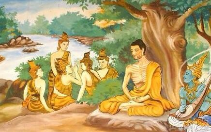
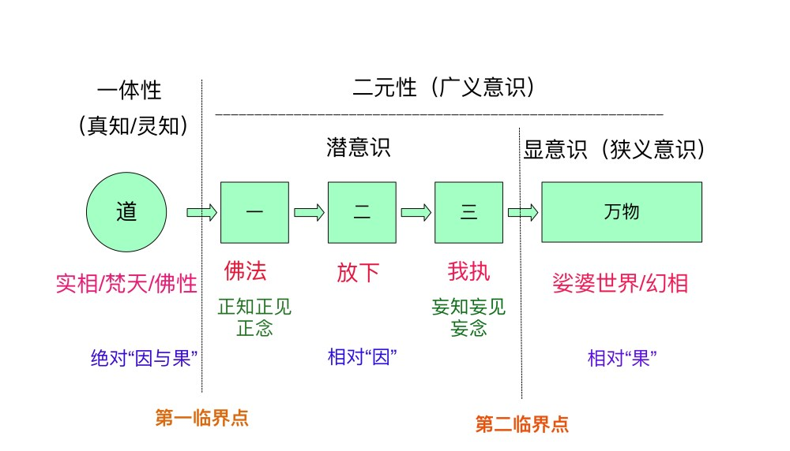
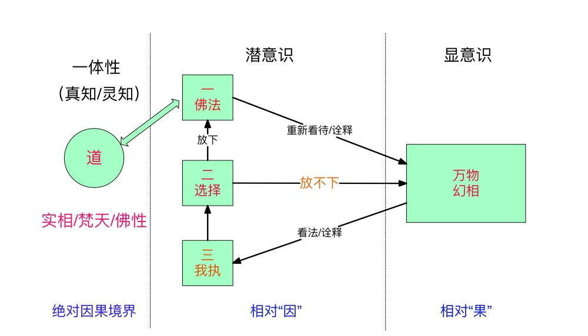

<figure>


<figcaption>

文：友林  
时间：2021.8.31

</figcaption>

</figure>

导读：悉达多（佛陀）出身王族，从小享尽荣华富贵，却依然感受内心深处的不圆满而逃离皇宫修行，求师问道，领悟到中道的修行原则，也成为了静坐大师，为进一步精进修行创造了先决条件。不仅深刻领悟到欲望与痛苦之间的关系，彻底领悟万物万法之空性，将信念从空性之幻境中撤回，修正颠倒的因果关系，并且通过思想与信念的协同作用，心境不断精进，彻底化解我执（小我）。从悉达多的修行经验来明晰悟道所需的基本领悟。

**本文目录：**

- 悉达多的出身
- 悉达多寻师问道
- 痛苦与欲望的关系
- 小乘佛教与大乘佛教
- 从《心经》看佛法
- 修正颠倒的因果
- 思想与信念的协同作用
- 总结  
      
    

**悉达多的出身**

悉达多，或释伽牟尼，后人尊称为佛陀，公元前约600至400年间出生于今尼泊尔南部的王族家庭，是东印度国王净饭王的大儿子，也是继承国王的太子。

悉达多的母亲在他出生之后不久便去逝，自幼由其姨母抚养长大。悉达多从小在皇宫长大，他的皇宫很大，又有良好的教育，尽管净饭王不允许他离开皇宫，也没有觉得有什么限制。

其养母对悉达多爱护有佳，其父也特别疼爱悉达多，成年后，为他建了春、夏、冬三幢宫殿。在他十九岁那年，养母为其介绍了一位美丽的女子耶输陀罗，两人一见钟情，在没有任何强迫的情况下，两人在满心欢喜中结婚，过着如同童话般的美好生活。

随着岁月的流逝，悉达多在皇宫越来越待不住。尽管他深爱着美丽又聪慧的妻子，但他开始越来越想要去看看父王禁止他目睹外面的世界。虽然悉达多享受常人难以享受的荣华富贵，过着无比美好的生活，自己却非常痛苦。他感觉自己好像失落了什么，必须出宫把它找回来。悉达多开始出现一些梦与显境，告诉他应该出去游历探访诸多修行人，他的解脱正在王宫的花园和墙壁外等待着他。

经过多年的怀疑和犹豫不决，心中挥之不去的灵性追求使悉达多觉得自己不得不采取行动了。尽管离开亲人的痛苦心如刀割，他还是在某个夜晚趁大家都熟睡时，从一个秘密出口离开王宫。

**悉达多寻师问道**

在悉达多出宫之后，前几年的时间都在东印度地区寻师问道。经过数年的时间苦修行之后，作为与他出家前在皇宫享尽人间的荣华富贵，两种生活形成强烈的对比，于是悉达多开始领悟到：禁欲苦行是不必要的。

<figure>



<figcaption>

悉达多修苦行

</figcaption>

</figure>

如果不是他曾有过荣华富贵的生活，又通过数年的苦修行的经验之后，就不可能彻底领悟到这一点。因为王宫的富足生活使他体悟到，拥有物质和感官的快乐并不能真正满足他，而现在他同样了解到，即使放弃这些事物及其他所谓的美好生活，也仍无法使他感到满足。

为了寻求终极的解脱法门，悉达多遍访名师，遇阿罗逻伽蓝，阿罗逻为数论派上师，按照阿罗逻伽蓝的教义和教规过梵行生活。这种教义主张通过一系列禅定功夫，达到无所有处定的禅定状态（以色空识三者均无所有故名）。不久悉达多达到了阿罗逻所教导的一切，使后者大为叹服，建议合作领导他的沙门团体。然而悉达多却不满足于这种学说而选择退出。仍未成道的他接着又跟随郁陀罗摩子修行，得到非想非非想处定（又译作非有想非无想定）的禅定状态。但是他认为这仍然不是解脱的境界，然而悉达多已经找不到老师。

数年的苦修行之后，悉达多开始领悟到禁欲苦行没有必要，意识到苦行无法达到解脱，修行应采取“中道”原则。领悟修行的中道思想，是悉达多一生所了悟到的第一个重要领悟。

那么在经历长期的禅定修行之后，悉达多成为了静坐大师。他人生中第二个重要的领悟就是：静坐本身无法使人开悟，因为它无法化解“小我”（佛教称之为“我执”）。然而要达到开悟，化解小我是百分之百必要的；但是勤加练习静坐，确实能够让心灵变得平静而有力量，如此，要修行或者训练心灵也就变得更为容易。当心灵处于静心状态时，操练某个思想体系就会更有效果。

**痛苦与欲望的关系**

中国老子是最开始教导“欲望会导致痛苦”的老师，并且认为舍弃物质有助于他的弟子放下欲望，于是老子才说出了“圣人无为故无败”这句名言。老子要求跟随他的弟子，必须抛弃所有物质财富，舍弃世间的所有欲望。虽然老子自身已经活出了一体性之“道”的境界，但是他的弟子们却很难活出完全没有欲望的生活，这种极端的放弃物质与舍弃世间一切欲望的教导，反而让其弟子们对物质与欲望更加当真的，从而无法领会到一体性的“道”的境界。

悉达多受到早其两百年多年诞生的老子的影响，同样抱持“欲望导致痛苦”信念。但是透过进一步的实践，悉达多发现，想要藉由舍弃欲望来远离痛苦——这是道家与佛教的主要目标之一，但这种极端的生活往往会妨碍我们的清明，并且也无法真正使我们感到满足，在刻意舍弃物质欲望的时候，往往容易将其当真，佛教后来也对此总结道：“厌即是恋”，意思是说，厌恶世间的一切事物与迷恋世间一切事物是一回事，都是把世界当真了。于是悉达多才提出了“中道”的修行思想。

传统的“舍弃欲望能够获得解脱”的思想是，倘若我们什么都不需要，那么即使没有某样东西，也不会感受到任何的痛苦。悉达多认为既然世间不是真的，万物皆属空性，舍弃世间只是多此一举。世间有形万物本来就不是真实的，我们并不需要禁欲苦行，或在物质上舍弃这个世界，我们可以、也应该在心灵上完成这点，真正该修正的是心灵对万事万物的看法。在心灵层面将信念从外在世界以欲望为主导的心态撤回，将信念放到真实的事物上——实相或梵，

悉达多在王宫中学习过吠陀经典和奥义书，因此非常了解梵与世界之间的差别。如同《薄伽梵歌》所说的：凡是真实的，永远存在；凡是不真实的，未曾存在过。

经过长年的修行，悉达多越来越了悟世界的虚幻，他坚信世界只是一个幻相，只有“梵”才是实相。

**小乘佛教与大乘佛教**

老子的“道生一，一生二，二生三，三生万物”是我们理解一体论思想体系的“标准蓝图”，从“道”到“万物”的底层逻辑解释参见《老子悟道思想解析》一文。下图是“标准蓝图”的反向诠释之佛法等效诠释示意图。 

<figure>



<figcaption>

老子“道四生万物”的反向诠释之佛法等效诠释

</figcaption>

</figure>

在《论广义意识与狭义意识》一文中，我们就讨论了“道生一”的第一临界点，与“三生万物”的第二临界点。第二临界点意味着超越狭义意识（显意识），而第一临界点则意味着超越广义意识（潜意识与显意识）。

佛教认为身体不但经常在变，而且必定会死亡；念头经常在变，而且必定会消灭。就因肉体和精神构成的生命现象，经常变动，都不永恒，所以也不算是真的有“我”。这种“无我”境界也被称之为“人空”境界，小乘佛教一般主张这种“人空”的无我境界。

从“标准蓝图”来看，代表“我执”的“三”，即“二元论思想体系”，属于妄知妄见，或妄念的部分。人之初，本性既非“善”，也非“恶”，而是“人之初，性本‘二’”，这里的“二”是指“二元论思想体系”。“善与恶”属于二元性观念，二元性的对立思维模式是二元论思想体系的本质所在，一般人的思想非善即恶，非黑即白，非对即错的二元对立的观念非常明显。

代表“放下”的“二”，即“心灵重新选择的力量”，就是要放下对“万物”与“二元论思想”的执着，重新选择代表“佛法”的“一体论思想”。“佛法”或“一体论思想体系”的目标就是要化解心灵对“我执”与“万物”的执念，回归代表“佛性”的“佛法”去为人处事。

所以小乘佛教的目标就是要化解“我执”，放下对世间万物的妄念与执着，选择依据代表明心见性的“佛法”去生活。因此，可以这样说，小乘佛教的目标就是突破“第二临界点”。

突破“第二临界点”的关键就是不仅领悟到万物的空性，还要领悟到其背后所支撑的“二元论思想体系”，因此耶稣才会说：“你们为什么要清洗杯子的外层？难道你们不知，造出内层之人也正是造出外层之人吗？”，杯子外层就是有形可见的“万物”，杯子内层就是“我执”或“二元论思想体系”。

大乘佛教认为一切皆空，不仅人的肉体与念头是空性的，法的自性也是空的，一切法的存在也都是如幻如化。因此不仅主张“人空”，也主张“法空”。“法”究其根本，唯有“一体论思想”与“二元论思想”两种，对应佛教就是佛法与我执。佛法只是我执的过渡性替代方案，佛法本身也是空性的。

大乘佛教的逻辑是严谨正确的，因为为了放下对世间执念的念头也是念头，虽然目的是为了达到佛法之正念，但依然是一种念头，既然凡念头者皆属空性，那么代表正知正见的佛法也是一些列之念头构成的，“无我”之“人空”也必须包括“法空”才对。

大乘佛教的空性是最为彻底的，而对于大乘佛法而言，化解“我执/小我”，依据“佛法”去重新看待“万物”；达到“人空”之“无我”境界只是一个阶段性过渡目标，其最终目标是突破“第一临界点”。

其实，从现代一体性与二元性的观念是很好理解的，小乘佛教意在突破第二临界点，将意识从狭义意识扩展到广义意识，将心灵以往专注于有形层面的知见，提升到无形层面潜意识的知见，即将形下意识领域扩展到形上意识领域。根据《老子悟道思想解析》一文，凡意识与思想者，均属于二元性范畴，因为只有二元相对领域才有可判断的意识与思想可言，意识其实是一种不确定性，因为不确定所以要判断。一体性范畴不需要基于二元相对性的意识观念，一体性没有二元性的不确定性，因为一体性没有对立面可言，自然也没有判断的需要与可能，在这一领域只有非常确定的知道，即“真知”，相对于二元性范畴的“知见”。

虽然“法空”境界是最符合逻辑的修行境界，其目的是彻彻底底的超越二元性境界，进入一体性境界。但是一般人很难坚持这一点，哪怕是修行相对较深的人，这也是为什么自古以来，诸多法师主张大乘佛法与小乘佛法的争辩。小乘佛法主张者，认为佛教之需要普及到佛法层面就可以，即“人空”之无我境界，这也是大部分人能够接受到的境界，其目的仅是突破第二临界点；而大乘佛法主张者则坚持“法空”的无我境界，坚持突破第一临界点，只有这样才堪称圆满解脱。

关于大乘佛教与小乘佛教的区别与主张，不同的人有不同的看法，这里试图给出一种最本质的全新诠释，仅供参考。本文介绍的佛法是属于大乘佛法，意在彻底突破第一临界点，超越二元性，进入一体性境界。

**从《心经》看佛法**

《般若波罗蜜多心经》简称《般若心经》或《心经》，其中“心”是指核心精髓的意思，属于《大般若经》的核心之大乘佛法精要，与《金刚经》并为通行最广的般若经。

所谓般若，梵语意为“终极智慧”、“辨识智慧”。专指：如实认知一切事物和万物本源的终极智慧，区别于一般的智慧。在古典瑜伽经典《瑜伽（合一）经》中有明确定义：辨识智慧是消除见者和所见结合并引向解脱之道的方法，通过合一各分支的实践，不纯逐渐减少，知识之光将照亮辨识能力。

值得注意的是，其中“见者”与“所见”的合一，其本质就是无主客体之分的一体论思想，所以基于般若智慧之佛法代表的就是一体论思想体系。

《心经》是所有经文中最短的，也是佛教徒们最常念诵的经文，全文共两百余字。该经文作为大乘佛教经典核心精髓所在，全文第一句是：

```
“观自在菩萨，行深般若波罗蜜多时，照见五蕴皆空，渡一切苦厄。”
```

用佛教解释是：以般若智慧观照自心而获得解脱自在的菩萨，修行极深的般若智慧时，观察洞见到集聚构成人我的肉体、感受、思想、意志、心识等五种要素，皆属虚空，而非实体的存在。 菩萨因彻见这五种集聚的要素是缘起性空，所以脱离生老病死以及一切的痛苦。

```
“色不异空，空不异色；色即是空，空即是色；受想行识，亦复如是。”
```

色即物质，物质是空性的，物质与虚空互不相异，两者是同一回事。除了我们的肉体，我们的感受、思想、意志、心识也是同样的道理，它们都属空性，都是彼此因缘相互依存的生灭关系。

```
“是诸法空相，不生不灭，不垢不净，不增不减。是故空中无色，无受想行识，无眼耳鼻舌身意，无色声香味触法，无眼界，乃至无意识界。”
```

从诸法缘起性空的本质来说，它既没有生起或灭失，也没有所谓污垢或清净，更不会增多或减少。所以，在缘起性空的本质上，物质、感受、思想、意志、心识都不是真实的存在，而是空。 人对外界的认识，需透过眼、耳、鼻、舌、身体、意识六种感官与其对应所感知到的物质、声音、香臭、味觉、触觉、以及一切事物及概念等六种外境，这些都不是真实的存在，而是空。不仅可以视觉之有形境界是虚空，就连其对应的无形意识境界亦是虚空的。“无意识界”就是指明了最终目标是无意识境界之一体性的真知境界，这是大乘佛法的核心宗旨所在。

```
“无无明，亦无无明尽，乃至无老死，亦无老死尽，无苦集灭道。”
```

“无明”与“老死”是佛教十二因缘首尾两个，“无明”是“因”，“老死”是“果”。上世纪五十年代左右出土的《多玛斯福音》第一句话就说：“凡是发现这一语录的诠释之人，不会尝到死亡的滋味。”所谓的“诠释”在佛教中，就是指的佛法之正知正见，也就是说，凡明了佛教所教导的一切缘起空性，看清万事万物之空性本质，就不会有无明的执着，也就不会有世间一切痛苦，也自然不会感受到老死之恐惧与痛苦。死亡最大的痛苦是死亡之前的恐惧感，了解其本质缘由之后，这种恐惧感自然也就消失了。死亡之时的痛苦也会由于对肉体与世间强烈的执念而显得痛苦万分，但只要明了生命之真谛，看清幻相之本质，不论死亡之前活着时的恐惧感（显现为对人生的不确定与不安），还是死亡来临之时的苦痛都会随之消逝，而“不会尝到死亡的滋味”。

以佛法之般若智慧明晰痛苦的原因，因而化解心灵中对“苦难”的妄知妄念而得以解脱，化解苦难的方法“苦、集、灭、道”这四谛都是缘起性空的，不是实体的存在。不同的人对“苦”有不同的理解，世间一切烦恼和身心不安的事，都可以叫做苦；“集”谛是指造成人世间的痛苦的原因，“集”是招集一切苦恼的意思。世人所以有苦恼，都因为倾向于以“我相”为基础和出发点，因有“我相”，故执著我有与我所有的妄想，一切争夺欺诈、穷奢极欲无不因之而起，也无不因之而导致更大的痛苦。世间的快乐，说到底也仍是苦，如《薄伽梵歌》里面说“在世间，喜悦等同于痛苦”，这就是二元性的本质。

“灭”与“道”二谛统称出世间法门，“灭”即灭有为还于无为，也就是涅槃，亦即靠修行而达于最终的寂静；“道”是指脱离“苦”、“集”的世间因果关系而超入无苦之恒常“无我”清净地的修行法门。在佛教里，这一套修行法门总结就是"知苦、断集、修道、证灭"。

特别注意，世间的“苦”必须从二元性面向去理解，二元性的“苦”天然印证着二元性的“乐”，只是“时间、空间、形体”的区别而已，两者本质上是一回事，是一种禁锢与束缚。是非、善恶等等二元性的观念亦是如此，从二元性境界来说，它们毫无差别，只是一种时空性“纠缠态”。

这从现代量子力学理论的观点也是很好理解的，由于我们所处的世界为二元性，一切都是以对立的形式存在的，“量子纠缠”效应揭示出，我们不可能真的将二元性事物从根本上进行分离。二元性的“苦乐”亦是如此，我们在某一个时刻与空间体验到“乐”的一面，我们也必将在另一时刻与空间体验到“苦”的一面，它们是对立互补的关系，而不论这种时间跨度与空间跨度有多长或多远，出现的形式如何千差万别，它们都因我们的执念而牢牢的相对性的存在着，这种二元性好似一种诅咒与桎梏。这种“二元纠缠”的本质，是了解二元性宇宙法则的根本所在，了解事物之空性，“化二为一”是唯一从根本破除这一二元性桎梏的解脱方法。详见《化二为一基本原理》一文。

```
“无智亦无得。以无所得故，菩提萨埵，依般若波罗蜜多故，心无罣碍，无罣碍故，无有恐怖，远离颠倒梦想，究竟涅槃。”
```

菩萨所证得的境界中，既不存有能证悟的般若智慧，也不存有所证得的境界，因为菩萨彻见一切是缘起性空的，一切是不可得的，心不执着于一切。 使自己及一切众生都获得开悟的菩萨，由于修行可至生死彼岸的般若智慧，而通达万物万法之空性真理，所以心中没有一丝牵掛及烦恼障碍；因而不恐惧生死，出离这一因果颠倒的梦境幻想，终达到寂灭无为的涅槃境界。

这里与老子“圣人无为故无败”的无为境界是一致的，因为在二元性时空领域的一切行为举措，全都是妄造，源自妄念，都是与一体性生命本质相违背的，因此，“无为”即“无败”的说法是符合逻辑。但是，要特别注意，这里的“无为”必须是从心灵层面来理解诠释的，即放下对世间有所求的执念，世间的物理法则就按其时空法则自然发展即可，只是不要对其执着而已。同时佛陀也指出了“厌即是恋”的道理，迷恋世间一切幻相与厌恶世间是同样的道理，都是处于某种形式的执念，所以对于有形层面的物理法则只是保持“中道”原则，不厌亦不恋，做一个行为举止相对“正常”的人。这一点很重要，不可混淆。

**修正颠倒的因果**

悉达多相信，重要的不是我们做什么，而是我们到底是怎么想的。当然，行为举止是我们想法的结果，但我们的想法又取决于我们所看到的世界，包括人际关系中各种行为表现。接着我们又通过对之前的行为举止的诠释来思考和行为，陷入到“行为-想法-行为”之中，我们的思考方式的出发点是从外部世界的行为表现开始，所有的想法都服务于进一步的行为表现。在这种循环之中，我们只不过是在强化行为表现，而思想或想法受制于行为表现，或者说，内在的想法是被外在的世界之行为表现带着走的。

<figure>



<figcaption>

修正颠倒的因果

</figcaption>

</figure>

悉达多认为“万物”属于“果相”，它是果，不是因；而大部分人根据“果相”去为人处事，就是把“果”当作了“因”，而把本是“因”的“我执”当作了“果”。比如，一般人把自己的生活环境当作自己受苦受难的“因”，自己心中的苦难成了“果”，埋怨生活的不公平，即所谓的“外因苦果”。 

悉达多现在正在把这种颠倒的因果纠正过来，把马匹放回马车的前面。即从“想法-行为-想法”入手，让行为服务于想法，从行为表现窥视我们潜意识中的想法，将外部世界之行为表现当作心灵参照的镜子，从而修正我们的想法，通过分享我们的想法，进一步的强化我们的想法。善用这面镜子，对于修行者而言是非常重要的领悟与实践基础。

他认为我们所处的外在环境只是“果”，真正的“因”是“我执”。唯有放下了“我执”，放下对世间外界事物的执念，心灵才有可能解脱，外界的“果”也才有可能通过我们重新的看法而焕然一新。

我们为什么会将“果”当成“因”，因果颠倒呢？佛教认为“虚空无南北，人心妄分别，执妄信为真”。

就是因为我们的分别心，以及强烈的执念之心，把信心全都投射给了万物之“果相”。然而，我们必然会信任我们信以为真的事物，而信以为真的事物反过来必会影响我们的心念，这样我们的心念反而成了“果”，那万物之果相反而成了“因”。

本来是代表有形肉身之我，以及代表无形念头之我，都是一种无常“我相”，皆空性，二元性境界本属空相，“万物”亦本属幻相，只因心中有执念，而将幻相信以为真，万物才显得如此真实而坚固。

“万物”只不过是心识的一面镜子，对万事万物的烦恼与苦难之看法及其诠释，必然来自于其背后的“我执”，要想彻底从这种二元幻相中解脱，就必须“化二为一”，从一体性的本质去重新看待问题，其前提就是必须放下对事物固有的知见看法，如果放不下，就会进入苦难之幻相的循环往复的境地，心灵不得解脱，因为心灵不肯放下对万事万物的执念。

如同耶稣所说：“门口站着好多人，但只有无伴者方能登堂进入那新娘的闺室。”“无伴者”就是指那些甘愿放下对世界固有执念的人，才能够解脱于自己固有看法所带来的桎梏，进入全新的境界。

在佛教里，这种全新看待万事万物的心态就是“佛法”，即基于一体性思维的一体论思想体系，“万物”得以重新诠释，我们才有完全不同于二元性天然的“纠缠态”的方式去看待世界与我们生活的环境，这种完全不同的心态就是一体性心态。

要化解那造出一切幻相的我执或幻相是可能的。印度教不仅对小我（ego，与我执概念类似）知之甚详，而且知道小我只有一个，即所谓的“那显现为万物的一”。这世界的形形色色所见到的一切，都是源自小我而妄造出来的。一旦找到化解小我的方法，我们便找到化解幻相之“因”的方法！

《楞严经》中佛陀告诉弟子阿难：“一切众生，实本真净。因彼妄见，有妄习生。因此分开，内分外分。”

所谓“小我”只不过是一种“分别相”，分别相就是幻相，分别相的本质就是二元性，“量子纠缠”效应反映出，分别相看似分离，其实不可分。分离是因为对“时、空、形”的执着，事物才可能有了不同时间、空间、形体之面貌，然而这只是幻觉，唯有超越线性时空概念，了悟“时空形”皆空，才领悟得了分别相其实不可分，究其根本，是因为它们都源自同一小我之妄知妄见。小我只有一个，“众生”也源自同一个心灵，即类似于荣格所谓的“集体潜意识”。“小我/我执”与“佛法”都源自同一个心灵。

“一切众生实本真净”，注意这里的“真净”是超脱二元性的“净”，不可与《心经》中“不垢不净”的“净”等同看待，后者是二元性的“净”，二元性的“净”与二元性的“诟”本质上是同一回事，这是二元性的特点，唯有“真净”才是超越二元性的“净”，它独立存在，因为独立而没有相反的参照物，因此在一体性境界是意识不到它的，因为那是心灵唯一且真实的本性，属于自性的范畴，不可意识，不可论断，一意识一论断，就不属于一体性境界，跌落到二元性境界。

这也是为什么耶稣说：“不要论断人，免得被论断”，所有论断都属于二元性范畴（是非、对错、善恶，好坏等），论断人就是在替二元性存在撑腰，而根据二元性的相对性原理，这种论断必然会以不同“时、空、形”返回我们身上，牢牢的被二元性境界所俘获。

所谓的“真知”也是如此，它属于一体性范畴，在二元性领域，没有真知，只有“知见”，因为有相互对立，才可知可见，而“真知”超越二元性的知见，它是心灵唯一且真实的本性，属于自性范畴。我们从“真知”与“真净”的概念，可以一窥“化二为一”的精髓所在。

因此，佛陀的放下的概念，与老子无为的概念，包括耶稣宽恕的概念，是非常类似的。万事万物正因为我们的执念，而变得坚固不已，好似心灵的桎梏，陷入稠密的现实而不可自拔。可以说，我们为自己建造了一座监狱，还以为身陷其中，只要意识到了这一点，放下执念之心，心就自由了。佛陀、老子甚至是耶稣都在教导世人，将信念从“万物”世界撤回，放到“道/佛”上。然而，不论是“道”还是“佛”属于一体性境界，不仅都是无形无相的，而且是“法空”的，即不可意识不可评断，属于言语道断之境，只可用心领悟。

而“一体论思想体系”或者“佛法”就成了心灵从二元性到一体性的过渡的桥梁。深陷虚幻的心灵需要这个桥梁，重新诠释世界，将我们的妄知见转化为正知见。可以说，世间的苦难都是由于妄知见导致的，心灵的正知见就能够转换到一个相对美好的世界，世界万物是心灵状态的一种自然反映。对于集体意识来说，就是整体性的转变，而对于个体意识来说，就是其局部所体验到的环境的转变，具体原理参见《量子式非线性思维基本原理》与《二元存在的谜思》这两篇文章。

**思想与信念的协同作用**

虽然当时印度教是多神的信仰，但悉达多并没有将这种信仰具体化，因为他们信仰的对象莫衷一是。许多印度教徒会从众神中挑选一个，然后终生只专注于礼拜这位神。但悉达多在心理上并没有献身于某位神祗，而是选择专注他所谓的“梵”——即实相。

《金刚经》中佛陀说“是实相者，即是非相”。为了充分理解实相，我们可根据“标准蓝图”将“万物”称为幻相；潜意识的形而上领域称为法相，所谓“法”可以理解为思想体系，这里主要包括代表一体论思想体系的“一”，以及代表二元论思想体系的“三”，在佛教体系中分别为“佛法”与“我执”；“道/佛”的一体性境界则称之为实相。 

<figure>


<figcaption>

“实相、法相、幻相”相对关系

</figcaption>

</figure>

佛教的“无我”境界分为“人无我”或“人空”，以及“法无我”或“法空”这两种境界，分别由小乘佛教与大乘佛教主张。“人空”就是指上图中的代表我执的“三”和幻相之“万物”，通过象征放下的“二”，由代表佛法的“一”来取代。而“法空”不仅要求“人空”，还要求领悟佛法自身的空性，因此法空境界就只剩一体性的“道/佛”一途。小乘佛教其实本质上不是完全的解脱，唯有大乘佛教才是彻底的解脱，彻底的悟道，真正做到“时、空、法”皆空，回归纯然一体之“道”。

法相与幻相都属于二元性领域，小乘佛教主张化解“我执”，用“佛法”取而代之；而大乘佛教则分两步走，先化解“我执”，再灭寂“佛法”，佛法本身只是进入一体性“佛”境界的桥梁与过渡而已。

我们信念的力量就应该展现在“道/佛”之一体性上。因为我们终会受到自己选择相信之物的影响。我们选择相信的东西，就是自认为真实的东西，因此我们就会得到那样的体验。明白这一点之后，悉达多将自己的信念从这世界撤回。经过数年的修行，他不再相信这个世界；相反的，他把信念放到他认为最正确的地方，亦即相信梵或实相。

不仅如此，当悉达多不再相信这个世界，这个世界对他就越没有影响力，于是他开始真正体验到人生越来越像一场梦。这个世界对于悉达多再也没有吸引力，如果我们依然认为外界有任何我们值得追求的事物，那么这个东西就会在外面显得特别真实，就表示我们在心里把它当真了，起了执着之心，好似自己的幸福与否全取决于我们能否获得这样东西一样，根据万物缘起空性的本质，我们也不得不改变我们所追求的东西，不同的时期所追求的东西也不一样；于是我们就不是处于一体性的心态，而是某种二元分裂的状态。当然，这里说的是放下心灵层面的执着，实际上所有的修行都应该是修正心灵层面的思想，物质世界的法则依然采取“中道”思想，做一个生活上的正常人即可。

悉达多从近三十岁出家，一边向世人宣讲佛法，一边化解小我，通过坚持不懈的努力，不仅明白悟道所必须了解的一切，并且还能加以实际应用。 悉达多知道自己必须澈底化解小我，于是努力练习不把梦境当真。于是悉达多内心深处的不圆满与缺失感很快就疗愈了。最后，悉达多彻底领悟了：既然梦境不是真的，就没必要渴望它；没有了渴望，也就不会有痛苦。甚至进一步的领悟到：既然身体只是梦境的一部分，身体就不是真实的；那么我们所感受到的痛苦，也不是真实的。 换而言之，我们不是感受到真实的痛苦，而只是做了痛苦的梦。由于梦境只存在于心灵里，因此就可以改变心灵对于梦境的看法。

晚上躺在床上作梦时，我们的肉身并没有真正在梦里，只有我们的心灵。 同样的，我们称之为“人生”的这场大梦，以及所谓的清醒时刻也是如此。睡时的梦与醒时的梦，在实质内涵上没有任何区别，唯有形式上的不同而已。

因此，法相与幻相都是二元性的梦境层次，只不过法相是梦的起因，万物之幻相是梦的结果。悉达多经过长年的训练，已经来到了世界的“因”之地，在心灵层次，他不再属于梦境本身，而是梦境之因！

因此悉达多“放下”的信念就简化为了：只是认为这是一场梦，不必把它当真。随着持续精进修行，直到悉达多的心灵能告诉身体该感受什么，而不是身体告诉心灵该感受什么。此时悉达多已抵达全然的本因之地，而不再处于枝末的果境；换而言之，现在他是世界的源头。他已达到梵的状态；已成为非二元的生命，属于一体性的生命，纯粹属灵的生命！

**总结**

佛教经历两千多年的发展，佛法这门化解小我的思想体系也非常的庞杂，但是我觉得领悟佛法的关键在于理解其“空性”的教义，即“悟空”。了解世界与小我思想体系的空性，才会心甘情愿的去化解它，用佛法取代，进一步的，要想真正悟道，就必须做到“法空”，也就是连佛法也不要执着，它只是一个工具而已，一个过渡而已。

佛教经典虽然众多，但是我觉得像《心经》、《金刚经》与《楞严经》是最能代表佛陀核心教义的经典。《楞严经》是佛教上的一部极重要的大经，可说是一部佛教修行大全，如果《金刚经》重在明晰世间万事万物的空性，“时空形”皆空（甚至“法空”），作为引导弟子们将信念从缘起空性的幻相中撤回的先决条件，那么《楞严经》主要就是在具体教导弟子们如何修行，教导修行的次第与修行的心得。

我个人觉得佛教的许多概念的确分得比较细致，但是也同样容易觉得过于繁琐，尤其是许多词汇是古代的用法，还需要做二次翻译，不便于传播与理解。采用现代一体性与二元性的底层哲学观念，以及现代心理分析学，在解释上可以更加精简，在应用上也会相对容易许多。

在《金刚经》中，佛陀为了解释万物与妄念，甚至正念的空性，从当时各个角度，各个方面进行了解释，真的非常繁琐而复杂。两千多年后的现代人，在理念理解上有了大幅的提升，许多解释可以简化，甚至换一个角度来理解。例如在科技界，像马斯克（特斯拉电动车CEO）这样的人都能够了悟世界的虚幻，用他的话来说：我们不生活在虚拟世界的概率小于万分之一。但可惜的是，他认为尽管不知道为什么会这样，但之所以有这样的虚拟世界，一定是这个世界更加好玩。当然，马斯克的人生相对比较精彩，他这样认为可以理解。但这样的精彩依然属于二元性，受二元性法则束缚。

其实老子和佛陀在领悟上是没有区别的，最大的不同可能来自于他们的教学方法，老子非常注重要求弟子们舍弃物质欲望，由于一般人很难做到，这样做反而让他的弟子们更加将物质当真了。佛陀提出了中道思想完美解决了这一问题，弃舍的应该心灵对物质欲望的执着，需要修正的是心灵，而不是外部环境，当心灵得以修正，外部的环境自然会转换，该舍弃的自然会舍弃，不可本末倒置。

佛法本身虽然较为繁杂，但是相对比较完整的思想体系，但佛陀和老子都没有搞清楚，一体性的“道/佛”为何会沦落到二元性的幻境，并未给出底层解释。

“菩提本来没有树，明镜本亦不是台；自性原无一物相，何处惹着尘埃来。”好一个“惹尘埃”，表明世间的一切苦果都是心灵自找来的！

对比了柏拉图与老子的哲学思想体系，发现柏拉图只描绘了从“至善”到“万物”的两次分裂，相比老子的从“道”到“万物”的四次分裂，遗漏了两次重要的分裂，将柏拉图的哲学体系比照“标准蓝图”就是“道生三，三生万物”，遗漏了象征一体论思想体系的“一”与象征重新选择的心灵力量的“二”。

而佛陀与老子有没有遗漏的地方呢？两者的哲学体系都符合“标准蓝图”，的确有缺失的部分，缺失的部分不在二元性领域，两者的二元性的哲学体系是完整健全的，缺失的环节在一体性领域。

一体性境界不是某个客体，它是无形无相的，二元性境界其实也是如此，如果作为主体的心灵（集体潜意识）不复存在，客体也将不复存在。如果心灵从一体性境界进入二元性境界，从理论上来说，是不可能再进入一体性境界的，因为那个一体性境界已经不复存在。期望通过“法空”，法的寂灭来回归一体性，从原则上来说是不可能的。

也就是说，一体性境界并不是我们在线性时空观念下所理解的某个地方，我们离开了，过了一段时间，我们还可以再找回去。可惜一体性境界不是某个实体的地方，心灵离开了这一境界，就变成了二元性境界，一体性境界就不复存在！

关于这一点，在后佛陀约四百年之后诞生的耶稣给予了圆满解答，圆满回归一体性境界的彻底开悟之路才算是扫清了一切障碍。

**相关文章**
