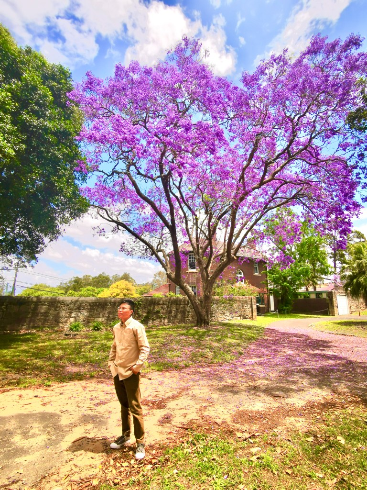
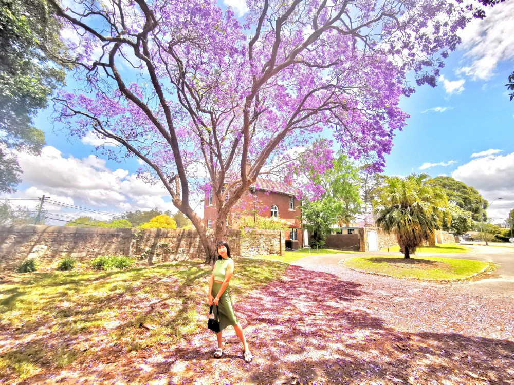

<figure>

<figcaption>

文 / 友林  
时间 / 11/8/2020

</figcaption>

</figure>

先用佛陀的传统一体论来解析老子的“道生一，一生二，二生三，三生万物”，佛陀的“佛”与老子的“道”其实本质上一致，且都是无神境界，虽然前者有佛祖，后者有太上老君等神的代表，都是后人出于对偶像的崇拜而演变出来的。佛本质上是一种自性，道亦是如此，故曰：佛是觉悟的众生，众生是迷惑的佛。或俗曰：佛是过来人，人是未来佛。佛教发源于古印度地区，相对于信奉诸神的印度教（信徒一生供奉特定的某位神），佛陀并没有献身给某位神，而是专注于明心见性的正知正念，以至于后来的佛教受到当地主流信仰的排斥，到了中国才有所发扬。

我在苏州创业期间，由于属于某灵修团体，因此向各界灵修人士开放，还专门准备了两间客房，有许多人来拜访，并分享他们的灵性成长经验，有各个派别的灵修人士，有佛教思想的，有道家思想的，也有所谓新时代灵修团体的。我都虚心受教。

先说道教思想对老子悟道的理解，倾向阴阳学说，他们对道的认识是基于二元论的。“道”是一体性的存在，处于绝对的寂静，没有任何相对的概念，因此“道”无法反观自身的存在，故一分为二：被动阴柔之气的“阴”与主动阳刚之气的“阳”。那绝对寂静的道代表着原始的“阴”，有一股主动的能量从中分离显示于外，便产生了“阳”，从此阴与阳并存，成为了一股永远易变、生生不息且相互消长的平衡能量。阴阳图就是其最佳写照，阴中有阳，阳中有阴。而世界就是这种象征二元性的阴阳中运作的结果。

道教注重阴阳平衡，找到象征万事万物之阴与阳的一个绝对平衡点是毕生追求的，似乎悟道的要点就是某种绝对的平衡。

新时代灵修团体其实本质上也是这种二元论思想的，以为从一体性到二元性是为了某种进化需求，是对一体性的扩展，并认为绝对的平衡可以超越二元极性的对立与冲突，甚至认为这个宇宙的存在就是为了满足这种二元极性的某种意识模拟实验。

像所有一体论哲学思想一样，都会被后人改成二元论的思想，因为这个世界看起来更加符合二元论，而无法坚持一体论。就像原始一体论思想之吠陀哲学，被世人理解为了二元论的印度教思想，其实佛陀的思想根基源自原始吠陀哲学，并没有信奉印度教的某位神，才成就其一体论思想境界。老子对道的理解本质上是一体论思想的，后来的道教却改造成了二元论思想的教派。一体论思想用时空性的线性思维确实不好理解，因此也很难坚持！但是唯有一体论思想才能悟道，才能获得真正的解脱，否则二元性人生就像阴阳图那样不停的转啊转啊，直到人们受不了为止，阴与阳永远不可能达到某种完美的平衡，你似乎只有选择“先苦后甜，还是先甜后苦”，或者接受“痛并快乐着”的份儿。《薄伽梵歌》中“痛苦等同于喜悦”就是在精准的描述这种二元性思想的变态本性！

“道”就是圆满的一体性，这是言语道断之境，只有开悟或接近开悟的心灵才可心领神会其圆满与美妙。“道生一”中的“一”指的是意识，意识本质是一种判断/对比机制，因为道是一体不分的，你一意识到其外还有什么，就是与其分离了，因此意识也就产生了，人们可能认为没有意识，还叫生命吗？其实这个问题真的很难一时说清，但是像耶稣说的那样“有眼之人会看得到的”，处于道境的真实的生命不需要意识，意识的本质就是一种二元性，二元性本身就是一种不确定性、矛盾与对立，一体境界没有不确定性，更没有对立面以及所谓的矛盾，因此那里没有基于意识的各种“知见”（你的知见与我的知见不同，便是对立与冲突），只有确定性的“真知”，在某些灵修学派中也称之为“灵知”，属灵的生命就是处于一体性的灵知状态（就是确定的知道，无需画蛇添足似的意识判断）！这就是为什么圣经里说“当亚当夏娃吃了分辨善恶之树的果子后，往后的日子就会死亡”。象征二元性的意识对于商人来说是贵与贱，对于政客来说是敌与友，对神学家来说是善与恶，因此编写圣经的作者潜意识透露了这样的事实：没有死亡的永恒灵性生命在进入象征分裂的意识领域之后，是有可能成为会死亡的生命——本来只有生的生命，却成了会生又会死的生命！生与死亦是一种二元性，此时的“生”不再是本来的那个“生”，本来没有的“死”似乎也存在了，这就是进入二元性领域后必然的结果。

“一生二”表达的是灵性生命进入二元性意识领域之后的心灵（此时，属灵生命变成了有意识的心灵），所出现的第一个意识性的观点：相信（道生一）分裂发生了；或不相信分裂发生。选择前者就是“妄念”，选择后者就是“正念”，用耶稣的思想来说，前者即导致“小我分裂思想体系“，后者将导致“圣灵一体思想体系”，因此这里也可以看出来，妄念/小我的思想存在根基就是选择相信分裂确实发生了，正念/圣灵的思想根基就是选择相信分裂不曾发生，这是分辨与把握小我二元思想和圣灵一体思想的关键之处。“相信分裂不曾发生”也成了悟道、解脱或救赎的首要基本原则，这也是为什么佛陀与老子都坚称这个世界只是一个梦境或幻相，某些科学家（特别是量子物理科学家）也开始意识到了这一点，二元性本身就是一种迷思！

如果立刻选择否定分裂的发生，是可以立马回归道境的，不幸的是，心灵最终选择相信分裂发生了。为什么要选择相信分裂？这其实就是耶稣所说的“诱惑”（如魔鬼的诱惑，愿心灵免于诱惑等说法），诱惑至少来自两大方面，其中一方面就是出于好奇心渴望获得一个不同于一体性的独特身份，看看体验二元性会是怎样的。这个好奇心随着我们对二元性的绝望与迷失会得到化解的，这也构成了渴望回归道境的初始愿心，但是最重要的是另一大诱惑，这才是悟道之路上的最大障碍，要等到下次用耶稣的纯粹一体论思想才可说清！于是“二生三”就是表示选择了那个相信分裂发生了的虚妄的念头，即小我分裂思想体系！

“三生万物”则表示基于妄念思想之下所“妄造”的世界，宇宙大爆炸就是象征这一妄造的结果而已。于是，一个以分裂为思想基础：对立、分裂、矛盾的二元性宇宙鬼斧神工般的诞生了！这就是二元世界：高低、上下、左右、先后、大小、软硬、男女、善恶、爱恨、阴阳、苦乐、贵贱、贫富、健康与疾病、光明与黑暗…不会死的生命变成了可死之物（此时，有意识的心灵成了可死之物）！

由此看出，与一体性的道分裂，进入二元性领域，并不是为了某种对道的体验（相反失去了对道的体验），也不是为了某种进化与实验，只有失去对完美一体性的真知体验之后，才可能这么想，否则如果道不是完美的话，老子就不会要弟子悟道了。其实我们必须承认二元性只是一个错误，才可能心甘情愿的悟道，寻求解脱！

这里仅理性的分析了一下，初步构建一个基本架构，其每次分裂的具体缘由，要等到之后用耶稣的纯粹一体论思想才能够说的清楚，但是我并不打算很快写耶稣的纯粹一体论思想的解析过程（虽然我已经在实践耶稣的纯粹一体论思想），因为这涉及到神的领域，我打算在引入耶稣“上主”概念之前，把传统一体论思想功夫做足，因唯有扎实的传统一体论思想才能够有精确的对耶稣纯粹一体论思想境界的认识！佛陀当年“顶着无神论的罪名”才有了完整清晰的传统一体论思想认知，当我们再进入耶稣上主概念的神的境界时，将是一个更加高明的对神认知的境界，并且在悟道阶梯上，对上主/真神的认知是必然的，因为缺少了这一步认知，就无法真正悟道！

**写在本文之前**

最近深刻理解了老子所说的“道生一，一生二，二生三，三生万物”这句话的含义，并为此兴奋不已，不禁感慨老子的智慧超凡脱俗，老子在《道德经》开篇就指出“道可道非常道”，好一个“非常人理解之道”！这实在是一个“活地图”啊！顺着看，展示的是心灵如何沦落为娑婆世界的失心之人，倒着看，屹然是一副从娑婆世界解脱的灵性地图！每一“生”都意味着一次与代表着一体性的”道“的分裂，而每一次分裂都是我们在心灵层面做出的错误选择，这里有四个“生”，意味着四次分裂，然而如果理解这四次分裂的缘由，那么就理解了世界，因为整个缤纷万象的人生事件都是这四次分裂的象征，都可以在这四次分裂中找到原型，而人生看似缤纷，实则是这四次分裂的重复演绎；而如果理解第一次分裂，即”道生一“，那么就理解了所有的分裂都是这一次分裂的象征；其中“一生二”是整个错误的关键点，如果能够在心灵层次重新返回这个点，那么就是在重新做选择，而心灵的力量就这一重新选择的力量！

  
我不知道我是不是第一个如此解读的人，但我保证我是用与佛陀和耶稣同样的一体论思想来诠释的，这一诠释加深了我们对一体论思想的信心，超越时间与空间以及形体（生于不同年代、不同地域、不同的人）的三位大师的思想相辅相成，这才是真正的“对观福音”啊（耶稣三位门徒分别写了三部福音，因记载内容相似性高达70%左右，因而称之为对观福音，以此宣称其可靠性极高）！

  
我以前中学时代是一名绘画艺术生，开始无法欣赏抽象画派的画法，后来我爱上了。因为我发现抽象画有一种魔力，画作浑然一体，每次欣赏都有巨大的想象空间，因此它有一种比传统的具体表现画法更加回味无限的吸引力，百看不厌！这一点感悟很重要，因为代表一体性的“道”，是永恒（超越时间）、无限（超越空间）、抽象（超越形体）的，我们在时空世界的线性思维模式下，已经很难体会到抽象的意义，潜意识中认为抽象的东西，就是不现实，不现实的东西就是没有意义的！这不是因为抽象的缘故，完全是因为我们的心灵太相信和习惯生活在形体世界中了！然而，形体的存在是一种具体化的存在，具体化的本质其实就是分裂的过程，因为要成为“这个”而不是“那个”东西的过程，就是在区分与剥离的过程，其实质就是分裂的过程，我们在现实世界中所谓的创造/创作的过程，其实都是处于分裂的妄造进程当中，都是那“前四次分裂”的写照与模仿而已！

  
只有理解了“抽象”与“具体”的本质之后，我们才能够彻底看清世界的本质，也才能够心甘情愿的选择那浑然一体的抽象之“道”，我敢向你保证，如果你理解了抽象的无限本质，无拘无束的特点，你会喜欢它的，你也会安心的返回那个你所来之处的！否者，你在潜意识中会不停的告诉自己“如果抽象的一体世界代表着不切实际，我还不如留在这个形体世界中呢”，会对一体之道有潜意识的抗拒。这也是为什么那些画家、艺术家们，有更多的感悟与觉知能力，因为他们大部分都是依靠抽象思维在思考，并通过艺术作品来表达，唯有抽象的思维方式，才能够跳脱时空线性思考模式，因为时空模式本质是上就是一种禁锢，这也是为什么我不厌其烦地告诉朋友们，佛陀的“时空形皆虚妄”以及爱因斯坦的“空间、时间、物质，本质上是人类认知的错觉”是心灵从娑婆世界解脱的“理论基础“的缘故！

**相关文章**
