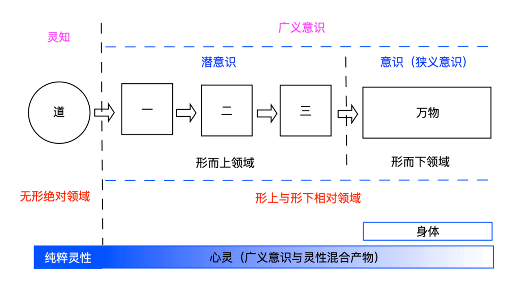
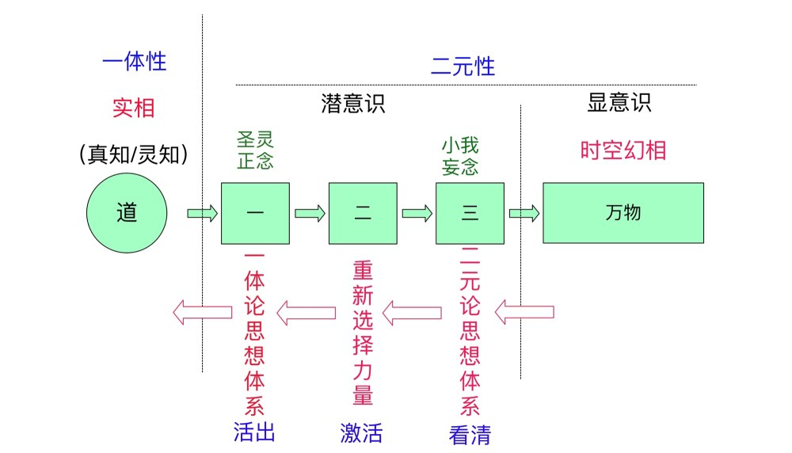

<figure>


<figcaption>

文：友林  
时间：2021.7.24

</figcaption>

</figure>

导读：通过二元存在的谜思，认知世界的方式由二元论思想体系转变为一体论思想体系，引入老子悟道思想“道生一，一生二，二生三，三生万物”灵修主轴线，通过重新审视尼采“上帝已死”与“超人”的观点及其对“罪咎”的解释引入耶稣一体论思想体系下的“宽恕”思想，并通过耶稣“宽恕之道”得出老子悟道主轴线的简化等效诠释，以此作为灵修实践的蓝图。最后强调灵修知行合一，讲究平缓过渡，重在实践，否则容易遭受不必要的痛苦。

本文目录：

- 无主客体的一体论思想体系
- 老子的灵修“标准蓝图”
- 尼采为何称“上帝已死”
- 超越二元论思想体系
- 一体论思想对实修的影响
- 罪咎对心灵选择与认知的影响
- 小我思想的诱惑
- 尼采的“永恒轮回”
- 结语

**无主客体的一体论思想体系**

有了一个更大的灵性视角之后，我们终于可以来讨论一体论思想体系之下的灵修问题了。

根据牛顿力学式经典的认识论上，主体与客体独立存在，互不影响，所谓的科学研究就是建立在主体对客体的一系列观察总结认知的集合。然而，量子力学已经逐渐使一些物理学家意识到，主体与客体之间存在着不可分割的联系，单独说客体的属性和规律毫无意义，必须同时说明主体的情况与其采取的观测方式，主体对客体的认识必须通过对客体施加影响（如观测）来实现（参见《二元存在的谜思》一文）。主体与客体的存在其实并不是我们以为的二元论问题，而是一个一体论问题，因此，人类的认知基础必须由传统的有主体与客体之分的“二元论”，转换到无主客体之分的“一体论”，分别对应着“二元论思想体系”与“一体论思想体系”的认知体系。

虽然唯物主义一元论在理论上认为意识是物质的结果，只承认物质一元论，但在实践意义上，依然采取主体与客体相互独立的二元论思想原则，而唯心主义一元论在理论上认为物质是意识的结果，但在实践意义上，也是难免陷入主体与客体相互独立的二元论思路。因此，不论是唯物主义还是唯心主义，都存在某种程度上不可避免的陷入主体与客体二元论思想，有别于我们所要讨论的纯粹的无主客体之分的一体论思想体系。

这两种思想体系是我们认识世界最本质上不同的思想体系，这种思想体系上的转变必然带来我们对世界的全新认识。

根据《老子悟道思想解析》一文，“道”代表一体性，“一”代表心灵进入二元性后拥有相对概念的意识形成，所谓意识最原本的解释就是“判断”，意识是判断的基础，“道生一”标志着心灵落入二元性的意识领域，“一生二”表示心灵在进入意识领域之后所做的第一次意识性的判断，如果把“道生一”比喻为“一体之外可能还有点什么”的“与一体性分裂之念”，那么“一生二”就是选择相信了“与一体性分裂之念”（其实，原本是可以否定分裂之念，避免进入后来的时空分裂的幻境的），“三”代表“二元论的思想体系”，“万物”则是基于“二元论思想体系”而于焉成形的宇宙，包括各种身体。

<figure>



<figcaption>

老子“道四生万物”示意图

</figcaption>

</figure>

值得强调的是，心灵由“道”的一体性境界的“创造的主体”，降格为了二元性境界的“认知的主体”，而心灵进入二元性境界之初仅存的一点创造能力也沦为了“二元分裂思想体系”的俘虏，为其妄造提供动力，于是在某种诱惑之下“三生万物”，宇宙于焉形成，也标志着心灵彻底沦落为认知的主体。

理论上，我们只能够在“认知”上下工夫，“万物”是基于“时间、空间、形体”概念而形成的，而“二元论思想体系”是“时空形”信念的幕后推手。根据《论广义意识与狭义意识》，不论是一体论思想体系，还是二元论思想体系，都是属于“潜意识”领域。

**老子的灵修“标准蓝图”**

“道生一，一生二，二生三，三生万物”是一条总结非常好的思考主线，悟道就是要反其道而行之超越“万物”幻相，厘清背后推手“二元论思想体系”，回归“道”之一体性境界。

然而，从理论上来说，已经进入意识性幻相“万物”领域的心灵来说，已经在相当程度上将幻境当真，很难从中解脱，无法直接从二元性领域进入一体性境界，必须要有一个对“万物”重新认知的桥梁，这个桥梁就是“一体论思想体系”。于是“悟道”的具体思路应该是：认清“万物”背后的运作的幕后推手“二元论思想体系”，通过心灵重新选择认知的力量，用“一体论思想体系”取而代之，为最终进入一体性的“道”境做准备。

于是，老子总结的灵性蓝图，从“道”到“万物”来看，阐述的是心灵如何沦落为娑婆世界失心之人，由《老子悟道思想解析》一文来诠释；而从“万物”到“道”来看，可以看作是“悟道”的阶梯。于是从“悟道”的灵修角度来说，为了方便理解与应用，老子“道生一，一生二，二生三，三生万物”可以采取以下等效替换：

<figure>



<figcaption>

老子“道四生万物”反向等效灵修蓝图

</figcaption>

</figure>

“道”依然是永恒不变的“一体性”境界；把“一”替换诠释为“一体论思想体系”，把“二”替换诠释为“心灵重新选择的力量”，“三”依然是“二元论思想体系”，“万物”依然是基于“三”而于焉形成的时空宇宙。

由于二元论思想体系实则属于“分裂的思想体系”，我们用“小我”来取代，类似于佛教中“我执”的概念；而一体论思想体系属于合一性的思想体系，用“神圣灵性”或“圣灵”来表示。

**尼采为何称“上帝已死”**

尼采在其作品中，探讨了各种人生问题，而所有问题都立足于一个对世界的基本看法，即世界是生成的，存在是段设的，同样，上帝也是根据人的需要而虚构的。因此，尼采认为：世界上没有事实，只有解释，并指出“上帝已死”，强调价值重估。

尼采的基本思路是正确的，认出了“解释”的重要作用，所谓的世界事实，都是人们解释后的东西，因此，尼采非常强调意识背后深层心理的探索，这也使他日后成为学界公认的弗洛伊德心理分析学派的先驱者。（我一直想单独谈谈被称为最伟大的心理学家的弗洛伊德的心理学，著名的《盗梦空间》电影就是依据弗洛伊德心理学制作的）

根据《论广义意识与狭义意识》一文，我们通常所说的“意识”，即狭义意识，也可称为“身体意识”（以身体为思维中心的意识，也是绝大部分人所处的意识），只是整个广义意识的冰山一角，那意识背后的意识就是我们称为的“潜意识”，心理分析学派着眼分析的就是“潜意识”的部分。

那尼采为何会说“上帝已死”呢？他认为，欧洲人两千年的精神生活是以信仰上帝为核心的，人是上帝的创造物，附属物。人生的价值，人的一切都寄托于上帝。虽然自启蒙运动以来，上帝存在的基础已开始瓦解，但是由于没有新的信仰，人们还是信仰上帝，崇拜上帝。尼采的一句名言“一声断喝——上帝死了”——是对上帝的无情无畏的批判。他借狂人（其著作《查拉图斯特拉如是说》中的虚构人物）之口说，自己是杀死上帝的凶手，指出上帝是该杀的。基督教伦理约束人的心灵，使人的本能受到压抑，要使人获得自由，必须杀死上帝。但尼采也不得不强调，杀死了作为神的上帝，又迎来了资本的上帝，资本化身的上帝！

尼采同时引入了“超人”的概念，“超人”是在他宣称“上帝死了，要对一切传统道德文化进行重估”的基础之上，用新的世界观、人生观构建新的价值体系的人。超人具有不同于传统的和流行的道德的一种全新的道德，是最能体现生命意志的人，是最具有旺盛创造力的人，是生活中的强者。“超人”是尼采最高的道德理想人格，其本身并未脱离“人格”的范畴，依然局限于“万物”的框架与“小我思想体系”之内，但是我们不可否认的，尼采的出发点是正确的，摒弃束缚心灵的“上帝”，超越自我。所谓尼采眼中的“上帝”，在一体论思想体系来看，其实就是基于二元性分裂思维的产物，尤其是指被奉为“偶像”而崇拜的那部分，不论是所谓的“神”，还是“金钱”、“身体”、“权力”等。

**超越二元论思想体系**

尼采的问题主要是缺乏一个对“小我思想体系”的整体认识，对超越“小我思想体系”而取而代之的“一体论思想体系”整体性认知更无从谈起。

耶稣说：“你们为什么要清洗杯子的外层？难道你们不知，造出内层之人也正是造出外层之人吗？”（《多玛斯福音》89）

这句话的意思非常明确，杯子外层是指“万物”表相的部分，具体来说就是我们生活的现实环境，人们通常一生致力于重构我们的生活环境，试图让自己处于幸福与平安的环境中。然而耶稣认为，象征杯子外层的“万物”与象征杯子内层的小我思想体系是“同一伙人”，不清洗杯子内层，就无法真正清洗外层，对于透明玻璃杯而言，内层的污垢不除，外层不论怎么清理都是充满污垢，无法令人真正感到平安与满足，耶稣这句话不仅反映了他对小我思想体系认知清晰无比——它才是“万物”的幕后推手，同时也为人们指出了一条全新的从内在而非外在下工夫的思路。即唯有清除了小我思想体系的贻害，才能够真正享有一体论思想体系所带来发自内心的幸福、平安与满足感。

也正是因为“造出内层之人也正是造出外层之人”，即小我思想体系构造了宇宙“万物”，包括我们生活的世界环境，如果一个人是基于二元论思想体系而活的，那么我们以为在这里做了这个，做了那个，岂都不是幻觉？因为我们的二元思想和所谓的现实，一唱一和，还以为真有什么自由意志（参考《人类自由意志的错觉》）。也正因为这样，耶稣才会说“让死人去埋葬死人吧”。

于是耶稣才会说：“门口站着好多人，但只有无伴者方能登堂进入那新娘的闺室。”如果把“新娘”比作人们发自内心渴望的幸福、平安与满足的话，“无伴者”比作清除了“小我思想体系”贻害之人的话，那么的确只有那些将心灵内小我思想清洗干净的人，才能够真正享有幸福、心灵的平安与自性圆满的满足感，才能真正活出一体论思想体系。

因为小我思想体系与一体论思想体系不可共存，有小我思想的不平安，就无法享有圣灵思想的平安。于是，耶稣才会反问人们：“泉源从一个泉眼里能流淌出甜苦两样水来吗？”（《雅各书》3:11）

**一体论思想对实修的影响**

在现实层面，一体论思想与二元论思想对于我们认知世界与周遭环境，包括人与人之间的关系，有什么本质上的不同呢？

二元论思想者首先是把外在的一切当真，即独立存在于外界，与自身所处的主体性存在相对分离，那么我们从外界看到的一切问题也都是客观存在的，我们实际上是赋予了问题某种真实性，然后再寻求解决方案，且通常是对外界做出修正来完成的。比如一个人犯了错误，我们认为这个错误是真实存在的，于是通过指正的方式来修正这个人所犯的错误，同时可能不可避免的指责他人，因为潜意识中认为对方要为自己的平安与满足感遭受损失而负责。

而对于一体论思想者看待同样的问题，认为某人的错误并非客观存在，而是取决于我们的观测方法或者视角，错误源自于我们的看法与诠释，一体论思想的诠释认为，我们之所以认为某人所犯的错误，完全是因为我们自身本身存在某种不平安因素与不满足感，只是由他人他事而促发了内心隐藏的不安因素，对于二元论思想者，他人他事成为了自身内潜意识中隐藏的不安因素而发泄的“替罪羔羊”，而对于一体论思想者，他人他事此刻成了我们“自我宽恕与自我救赎”的神圣时刻。前者将不可避免的为自己无法宽恕而辩护，所谓的客观现实将作为无法宽恕的借口；而后者则将他人他事的不平安的看法，做为自己宽恕的工具，借机化解潜意识中小我思想而获得自我解脱与救赎。

一体论思想体系认为所谓的“看”，只不过是一种心灵的思维方式，所谓的客观现实，只不过是我们思维方式的结果而已。我们看待世界的方式决定我们体验世界的方式。而二元论思想者所认为的“看”，是在潜意识中压抑住了，或者说掩盖了“看实际上是心灵的思维方式的结果”这一事实，从而将所“看到的世界”独立于主体之外，然后别有用途。

被称为现代三大心理分析学派之首的弗洛伊德，曾与格罗德克Groddeck合作过一段时间，后来自立门户，成为现代心理分析学派创始人，根据后人评论，“格罗德克是唯一一位对弗洛伊德产生影响的分析家”，弗洛伊德也在其著作中写道：

```
“现在我认为，如果我们听从一位作家的建议，我们会大有收获，这位作家出于个人动机，无法证明他所做的与纯科学的严密性毫无关系。我说的是Georg Groddeck，他从不厌倦坚持称我们所谓的自我在生活中本质上是被动的，正如他所表达的那样，我们‘生活’在未知和无法控制的力量之下。我们都曾有过相同的印象，尽管它们可能没有压倒我们而排斥所有其他人，我们需要毫不犹豫地为格罗戴克的发现在科学结构中找到一席之地。”

（译自维基百科"Georg Groddeck"）
```

其所谓的“自我在生活中基本上是被动地行为”，实际上就是在描绘人类自由意志的错觉。参考《人类自由意志的错觉——论广义意识与狭义意识》一文。

所谓的“我们被未知且不可控制的力量‘活着’”，其“不可控制的力量”其实就是指的小我思想体系，因为小我思想体系是处于二元性境界非时空性的存在层面，即形而上层面，其实其本身就是“时空形”的构造者，因此，理论上来说，如果心灵不从时空性觉知中提升到非时空性的觉知中，就无法超越小我思想体系，这也正是我们为何非要借助“圣灵思想体系”才能超越其上，甚至悟道，只因圣灵思想体系同样来自于非时空领域，只有在此同等级层面，我们才可能超越小我思想体系。实际上来说，“圣灵”与“小我”都存于心灵之内，它们存在着心灵主导权与合法性的争夺。

而所谓“无法证明他所做的研究与纯粹科学的严格性无关”和“找到科学结构中的一席之地”，从一体论思想来看，其实就是在说人类的认知水平应该从经典力学的“牛顿式的主客体二元分裂的思维”转换到量子力学的“无主客体之分的一体论思维”，即从牛顿式线性思维过渡到量子式非线性思维，否者许多认知将无法进入我们的意识。

如耶稣所说：“我要给你们的，是眼所未见、耳所未闻、手无法触及，且不曾浮现于人心的事。”因为他要将人们的意识层面带入不为人心所知的潜意识领域，在那里有代表一体论思想体系的“圣灵”与代表二元论思想体系的“小我”的主导权争夺之战，心灵由哪种思想所主导，心灵就便成了它，其实“圣灵”才真正代表了心灵的自性（心灵的自性就是纯粹的灵性，圣灵象征的正是神圣的灵性），“小我”是心灵妄造之后自讨苦吃的结果。

**罪咎对心灵选择与认知的影响**

尼采提出“主人-奴隶道德说”，从心理的角度剖析道德中奴隶道德的成分。尼采认为道德的起源是当弱者被强者欺凌时，便运用他们的精神力量，制造出良心谴责、善恶等来抵制强者的进犯。奴隶道德通常带着怨恨及衍生而来的反动心态。例如企图将具有创造力量的强者的价值拉平，而将他们的特性，转换为成具伦理意义的“恶”；自己身上软弱的性质，转换成“善”等。（源自百度百科“弗里德里希·威廉·尼采”）

尼采认为所谓的道德价值，只不过是弱势者通过利用行为上的弱势，来博得强势者的同情，引发其内心的罪恶感，而达到向强势者反击的目的，并认为是弱者的道德评判影响了强者引领人类迈向代表自我超越的“超人”境界。并特别举例圣经中“不要与恶人作对。有人打你的右脸，连左脸也转过来由他打。”（太 5:39）

认为耶稣教导世人面对强势者时，打了你的右脸，那就连左脸也让他打，尼采的解释是，这样就能够博得同情，引发强者的罪咎，让弱势者“反败为胜”处于道德高地，从而起到影响对方的心灵。

当然，尼采的逻辑可能适用于宗教与人们的世俗生活中，但是却不适用耶稣所要真正表达的“一体论思想体系”的精髓。

尼采的“主人-奴隶道德说”的确道出了小我思想体系的惯用伎俩之一，道德奴隶的心理学分析适用于人们的许多人际关系中，尤其是那些特别亲密的关系中，如父母与子女、夫妻关系等，越是亲密的关系越是表现明显，除非活在一体论思想体系中才可能避免。但是，耶稣所要表达的一体论思想观点，就是用于超越小我思想体系的束缚的。两者所要讨论的核心思想根本不在同一个级别上，可以说尼采发现了小我的秘密，而耶稣是在教导世人超越小我的伎俩与束缚的方法。

首先，在英文版的《圣经》中关于“左右脸”原文的引述为“But I say to you, Do not resist an evildoer. But if anyone strikes you on the right cheek, turn the other also”，关键就在于句尾“also”（“也”的意思）非常暧昧。原文翻译应该是：然而，我要告诉你们的是，不要去反抗作恶者，但是如果有人打你的右脸颊，就把另一面“也”转过去。注意《圣经》原文并未说把另一面转过去也给人打，这是人们惯性或线性思维的结果。到了中文版的《圣经》甚至直接翻译成了“只是我告诉你们，不要与恶人作对。有人打你的右脸，连左脸也转过来由他打”（中文和合版）。

《圣经》本来就是经过长时间演变与编译的结果，尤其是在印刷术发明之前的长期处于抄录阶段，很难不产生演变。耶稣的教诲是超凡脱俗的，“然而，我要告诉你们的是”就已经预示着，耶稣的教诲有别于传统理解。左右脸的比喻只是一个象征，意思是，如果有人通过任何攻击方式，包括且不限于肢体的或言语的攻击，影响了我们内在的平安，请注意，因为外在的现实只不过是我们内心潜意识中不平安因素的象征，不要受到小我思想的诱惑，而以牙还牙，这样只会强化潜意识中的不平安因素，助长小我思想体系。我们要将外在的象征做为我们宽恕的契机，用“圣灵的思想”取而代之，通过宽恕彰显心灵重新抉择的力量。更广泛地来看，“有人打你”只不过象征着那些令我们处于不平安的一切人事物（如人际关系，生活环境等），仅具有象征比喻的意义。如果真有人动手要打你，我想，耶稣的建议一定是“快跑”，灵修主要是用来修正人们的心态的，具体行为上的反应，只要我们作为一个人，就应该按照人基本正常的行为方式去应对。具体诠释参考《如果有人打你的左脸，就把右脸转给他——小我与圣灵思想体系》一文。

**小我思想的诱惑**

小我思想的诱惑是什么？就是那些所谓的“不平安因素”，其实就是“罪咎”。

根据佛陀的“时间、空间、形体”皆空的理念（由量子力学所揭示），教导世人超越这三界之外的智慧，实际上就是一体论思想体系。尼采认为道德是弱者引发强者内心的罪咎而反击的措施，根据“时空形皆空”的一体论思想，如果人们潜意识中若不是早就存在了“罪咎”，他人他事他物何以能够引发人们的罪咎？所以对于二元论思想者，是先承认了客观存在，然后才有了罪咎，即“导致不平安的他人他事”（如遭受攻击行为，不公正的待遇，生活困境等）是“因”，“罪咎”是“果”；而对于一体论思想者则清晰的明白，“罪咎”是“因”，那些看似导致“不平安之他人他事”只不过是“果相”，是潜意识中“罪咎”的象征。

于是，对于二元论思想者，把“导致不平安之他人他事”通过指责来做为自己潜意识中早就存在的“罪咎”提供发泄的机会，同时作为逃避“罪咎”之苦的“解脱方案”，该方案看似瞒天过海，实则掩耳盗铃，因为通过指责，无法真正将潜意识中的“罪咎”化解掉，最多只是给自己一个“合理性”理由来表达而已，随便通过指责，来逃避正视自身内的“罪咎”，“罪咎”不除，类似不平安的他人他事随时会以不同的时间、空间、形体找上门来，心灵匆忙地活在指责与辩解之间。

所以，世间的对与错、善与恶的观念，对于二元论思想者显得格外重要，因为唯有自己是“对的”，才有通过指责向外投射“罪咎”的资格，如果自己是“错的”，那么身陷“罪咎之苦”的一定是自己。这也是为什么大部分人如此热衷于争论世间的是非善恶，因为人们潜意识中认定正确与否，是自己心灵得救的关键，然而这种争论无形中助长了小我思想的真实性，荣耀的是小我。

相反地，对于一体论思想者，旨在尽力放下世间的是非对错，放下评判，专心发挥“心灵重新选择的力量”，心灵的选择——小我思想还是圣灵思想——就在短暂的那一瞬间。有评判就没有重新做选择的机会，重新做选择的人，绝对没有心思去评判！评判与宽恕不可能同时存在，只因其背后的主导思想体系——二元论思想体系与一体论思想体系——不可能同时存在。唯有看清了小我思想的毫无道理、荒诞不经与贻害，才会明白“圣灵思想体系”才是唯一的出路！

于是，潜意识中的“罪咎”成了二元论思想者试图躲避的东西，对此避之不及，何谈正视它，又更何谈化解它与宽恕它。除非是一位心灵开放、有一定修为的人，否则很难接受这点，当初就是为了躲避这种挥之不去的“罪咎感”而选择相信小我思想的，藏身于这娑婆世界的幻相之中（宇宙形成的“因”），要自己承认“罪咎”是先于“万物”而存在的，就等于让自己脱去掩盖“罪咎”的遮羞布，以赤裸之身在大街上跑！然而，我们试想一下，如果真的抛下世间一切的“时空形”层面的存在，我们生气只因为我们生气，我们愤怒只因为我们愤怒，我们不安只因为我们不安，我们不满只因为我们不满，没有任何可以从世界万事万物可寻找的借口，我们是不是应该自己为自己的愤怒、不安、生气、不满而负责？

当耶稣说“你的罪宽恕了你”，就是在告诉人们，“罪”的观念存在于你之内，不在他人身上，他人之罪过，只不过是自己思维的结果与解读，“因为你有，所以看得见”是对此最直截了当的诠释。看似宽恕了他人的罪过，实则宽恕的是自己潜意识中的“罪咎”。所以对于一体论思想大师而言，宽恕他人与宽恕自己毫无差别，两者是同一回事，这也是一体论思想体系之“一体性”在自我救赎上体现的精髓所在。世界也正是通过这种自我宽恕的一体观念而得救的！

**尼采的永恒轮回**

尼采提出了其思想哲学中最重要的概念，就是“永恒轮回”，在其著作中描述：

_“万物方来，万物方去，永远的转着存在的轮子。万物方生，万物方死，存在的时间永远的运行。离而相合，存在之环，永远地忠实于自己每一刹那都有生存开始，‘那里’的球绕着每一个‘这里’而旋转，中心是无所不在的，永恒之路是曲折的。”_

_“你们是永远的存在着！永远爱世界！而且向世界痛苦说：‘去吧！但是还要回来！’因为，一切的快乐要求永恒。”_

_“十字架上的上帝是对生命的诅咒，一个由生命寻找救赎的路标。酒神被斩成碎片是对生命的承诺：他会由毁灭中再生与回归。”_（源自维基百科“永恒轮回-尼采”）

尼采的永恒轮回说，更多的是一种体验与感受，而无需从科学层面去证实，他在试图向人们传递这样的讯息：我们的人生看似千差万别，每个地方，每个时刻，与每个人的模样与场景可能不同，但是在体验上，我们好似在永恒轮回着，等待我们重新选择，用快乐取代痛苦，用喜乐取代哀嚎，用对生命的回归对抗魔鬼对生命的诅咒。

显然，魔鬼就是小我思想体系，生命在它的思想体系下被构建为“生与死的二元性存在”，让人欲生又欲死，迷失不知所措的心灵为其提供生存的温床。生命的回归就是“圣灵的思想体系”，唯有活出一体论思想体系，心灵才能够从时空的魔抓中解脱出来，活出耶稣的“属灵的生命”，破除永恒轮回的魔咒。

心灵中的“罪咎”是何时又是因何而潜入心灵潜意识中的呢？很难说清楚，只能打比方大概体会一下。好比一个孩子由于贪玩而离家，怕回家后受家长责备，又受人蛊惑，承诺要带这孩子去一个更好玩的地方，于是孩子就天真的答应了，只是离家出走的背叛感，形成强大罪恶感而被隐藏在内心，随着对“那个更好玩地方的承诺”的愈加失落，更加凸显出心灵中“罪咎”的难耐，想要化解而不得其道，于是只有向外界“投射”一途。

尼采的“永恒轮回”就是在表达对生命的喜乐的渴望，我们现在知道了，唯有化解了潜意识中的“罪咎”才能够解除诱惑，才能够活得彻底自信，活出生命的喜悦，化解罪咎是心灵解脱的关键。也是一体论思想大师所要传授人们的思想核心，用真理之光照耀心灵中的阴暗与失落。

所谓“心灵重新选择的力量”主要是指重新选择诠释世界的方式，用新的一体论思想体系去重新诠释我们所知所见的世界，而不是用旧有的二元论思想体系去解读。重新选择后的诠释，必然导致同一剧情的不同解读，例如我们知道任何一部电影，其实只是画面与声音的集合，其本身毫无意义，其意义全凭我们怎么去解读它，虽然我们的解读不会改变电影的“画面与声音”，但是根据完全不同的诠释，会有完全不同的观感体验。因此，一体论思想体系与二元论思想体系诠释下的剧情虽然都相同，但体验却大相径庭。

体验上的改变，又强化了我们对其所属的思想体系的信念。我们的信念又促进转变了我们的思维方式，于是我们“看”世界的方式也会跟着改变。在《一体论思想之量子力学诠释》与《一体论思想之冯诺依曼-魏格纳诠释》中具体阐述了，心灵的思维方式形成了我们所看到的世界，我们所体验到的梦境的美丽程度与“一体论思想”在心灵内主导程度成正比，与“二元论思想”成反比。

在上述两篇文章中，从平行时空的角度，从理论上说明牛顿式线性思维模式将固化特定的世界版本，量子式非线性思维模式，也可理解为一体论思想的“宽恕”或“重新抉择”思维模式，将可能形成多世界版本之间的跳跃，也就是改变我们所处体验的的世界现实。多时空层次的平行宇宙的存在好比电脑的硬件，我们的思维方式是软件，软件要升级，硬件必然也要升级，这是由于思维决定现实来决定的。这个“跳跃”过程通常是在心智层面无法察觉，因为肉眼属于二元论思想的产物，基于肉眼去观察的世界必然受到其所属思想体系的线性诠释而无法得知世界的细微改变，但是心灵倒是有可能通过体会察觉到些许不同，随着我们越来越多的宽恕机会，心灵内的罪咎化解的程度越深，我们越能够体会到“宽恕”所带来的好处，正所谓“不要看广告，看疗效！”

所谓灵修，其本质是指思想模式的转变，即通过心灵之内灵性的全新全局视野，来修正心灵之内偏执与局限性判断和妄造的部分，或简而言之，用灵性的正见来修正心灵中的妄见。

尼采后半生长期处于精神病苦折磨中，主要是因为尼采触碰到了潜意识中隐藏的秘密，让小我思想感受到了威胁，由于尼采的思想只是停留在哲学层面，且其思想本身并未认知全面，也没有进行必要的心灵训练，即灵修或宽恕实践，给了小我思想可乘之机。并不是要评判尼采什么，只是想借此说明实践的重要性，只有在实践中，才能够化解潜意识中的“罪咎”，也只有实践，才能够真正体会到生命的真谛，也只有通过实践，才能够活得心灵的疗愈，活得心安，活得自在。

**结语**

为了写这篇文章，在这之前，写了好几篇相关的基础性文章，从量子力学着手，分析了主客体二元论思想的谜思，引入无主客体之分的一体论思想，并通过多时空平行宇宙的概念阐明了思维方式对现实的影响，从理论上说明了心灵通过改变思维方式获得现实层面转变与解脱的可能性。在阐述灵修基本原理的时候，我想到了尼采的哲学思想，从尼采的思想入手，分析其方向的正确性，但是技术性分析的时候，依然落入小我思想的线性思维模式中，致使其无法超越小我思想，也无法获得一个更加全面的灵修视野，而这一点由老子、佛陀、耶稣三位杰出一体论思想大师背书，跟着他们的步伐，我们得以窥视整个灵性视野，对灵修有了全局宏观的把握，心灵方能看到出路，依据从老子“道生一、一生二、二生三、三生万物”的反向推理的等效诠释，我们能够按部就班的锻炼我们的心灵，活出一体论思想体系，为最终的悟道做好准备。

**相关文章**
