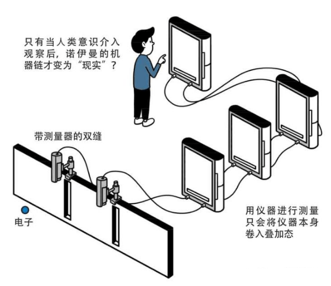
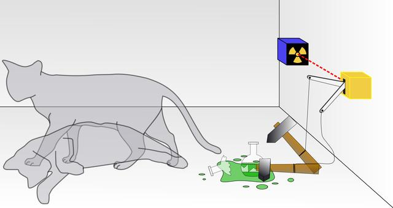

<figure>

<figcaption>

文：友林  
时间：2021.7.18

</figcaption>

</figure>

**导读：**从量子力学对世界认知上的颠覆性，引入冯·诺依曼-魏格纳诠释，提出无主客体之分的一体论思想体系，基于一体论思想阐述广义意识与平行宇宙的关系。

**本文目录**

- 量子力学在认知上的颠覆性
- 冯·诺依曼思想实验
- 魏格纳思想实验
- 无主客体之分一体论思想
- 广义意识与平行宇宙的关系
- 人之初，性本“二”
- 二元论思想体系的贻害
- 问题是宇宙的起源而不是其奥秘
- 结语

**量子力学在认知上的颠覆性**

我们知道，牛顿几乎以一人之力就完成了万有引力定律和牛顿三定律；麦克斯韦在法拉第工作的基础之上，提出了麦克斯韦方程；爱因斯坦也几乎是凭借一人之力就完成了狭义相对论和广义相对论。物理学的三大基础理论几乎都是仅凭一人之力就实现了理论的奠基。

唯独量子力学，是由许许多多的科学家前赴后继才逐步完善的。这是因为量子力学非常违反人类的直觉与三观。

我们在日常生活中，描述一个物体运动时，通常会使用一些常见的物理量来描述，比如：速度、路程（位移）、质量、时间等等，这属于经典物理学的描述框架。

但在微观世界，这一切全变了。例如，在平时，我们很容易知道自己的具体位置，步行的速度，以及接下来要去到的地方。但如果你是一个电子，那么这一切你都是不知道的，你甚至连自己接下来要去到哪里也是一无所知的！

目前主流的量子力学理论是波尔等人提出的哥本哈根诠释。该诠释认为，电子在原子核外处于叠加态，意思是电子同时处于任何一个位置。当我们观测电子，这时候用于描述电子概率的波函数就会塌缩，得到一个确定的存在结果，即由量子叠加态确定为人们宏观可以理解的经典状态。如果我们不对其进行观测，电子的状态就会继续遵循波函数的方程。

**冯·诺依曼思想实验**

哥本哈根诠释对其所定义的“观测”说法非常暧昧，到底是指仪器测量还是人为观察呢？并未给出一个明确的说法。

做为量子力学奠基人之一，也被称为科学界全才的冯·诺依曼（现代计算机之父，懂计算机原理的人，无人不知，现代量子计算机领域急需一名像冯·诺依曼一样的人，架构起应用型量子计算机体系结构），一直在思考“观测”这个问题，如何具体定义“观测”，到底是用手触碰，还是用眼睛去看呢？

<figure>

<figcaption>

冯·诺依曼的无限复归链

</figcaption>

</figure>

冯·诺依曼就进行了一套逻辑推理，具体的推理如下：首先，观测仪器本身就是由不确定性的粒子构成的。因此，观测仪器本身也拥有波函数。如果用仪器去观测电子的状态，仪器本身也就会卷入到“叠加态”中。如果用无限多个仪器去观测电子的状态，这就意味着第一台仪器观测着电子，第一台仪器和电子都处于叠加态，然后第二台观测第一台仪器，它们也同时处于叠加态，第三台仪器观测第二台仪器，也是如此，一直无限复归下去，那么整个系统就不会发生波函数坍缩，这就是冯·诺依曼的无限复归链。

通过这个推理，冯·诺依曼就提出，如果没有“人的观测”的介入，那么仪器和观测对象应该一直处于叠加态，而不会发生波函数坍缩。因此，他认为“人的观测”才是影响波函数坍缩的原因。“人的观测”说明了“人的意识”其实是会影响波函数的坍缩。因此，只有电子“被意识”到，电子的波函数才会坍缩。如果电子没有“被意识”到，那电子就会一直处于叠加态。

除了冯·诺依曼提出了这样的想法和理论，还有一位叫做魏格纳的科学家（也是量子力学奠基人之一，1963年诺贝尔物理学奖获得者）提出了一个著名的思想实验：魏格纳的朋友。这个思想实验也是用来证明波函数坍缩与“人的意识”有关。

**魏格纳思想实验**

魏格纳的思想实验“魏格纳的朋友”其实就是“薛定谔的猫”的升级版。魏格纳提出，如果他有一个朋友带着防毒面具进入到薛定谔的猫的实验盒子当中去“观测”这只猫的状态。而他自己则不去观测，因此，他自己是不知道猫的状态，可是他可以通过询问自己的朋友来获知猫的状态。这时他的朋友其实会告诉他猫的具体状态，而不是告诉他猫处于叠加态。因此，他的朋友其实导致了整个系统发生了波函数坍缩，而起到关键作用的其实就是他朋友的“意识”。

<figure>

<figcaption>

薛定谔的猫思想实验

</figcaption>

</figure>

魏格纳还提出，根据牛顿力学的第三定律，作用力与反作用力，“人的意识”也应该会和外部世界发生作用和反作用。

通常来说，科学家们研究的都是客观存在物，并不喜欢把“意识”这个主观存在的东西纳入到研究中，对于这个“说不清道不明的东西”一向都是推诿给哲学家们去研究，自然地，“冯·诺依曼-魏格纳诠释”理论并未成为主流的科学理论，但从一体论思想体系角度来说，“冯·诺依曼-魏格纳诠释”将波函数坍缩的根源定位为“意识”这个方向是对的。

用于描述宏观世界的“传统力学（相对论为主）”与微观世界“量子力学”构成了人们认识世界与宇宙的两大基本科学理论框架，科学家们都希望将其统一成一个能诠释整个宇宙的完美理论，但是却无法统一起来，人们甚至不知道宏观与微观的绝对界线在哪里，从根本上来说，人类的思想体系需要从根本上做出转变才可能统一起来看待这个问题！

**无主客体之分一体论思想**

一些科学家们，已经开始意识到“主体”与“客体”的界限已经没有那么明显了，人类潜意识中认定“主体”与“客体”相互独立，互不影响，所谓的科学就是建立在这种经典牛顿力学式的“主体对客体的观测研究”，主体是研究者，客体是被研究者，但是如果研究者与被研究者存在着某种互动或者关系的话，不就说明了主体与客体并非相互独立，说得更加明确一点，主体与客体的存在并不一定是一个二元论问题，也有可能是一个“一元论/一体论”问题！

那么人类建立在“二元论思想体系”上的所有认知/知见，岂不是都要用“一体论思想体系”来重新诠释了吗？这样的转变一定是开天辟地的，一个我们能够想象到的“最大的、根本性的转变”！

一体论思想大师看待世界的方式可以概括为一个古老的谜题：森林里的一颗树倒下时，如果没有人在那儿听，它依旧会发出声音吗？

处于“二元论思想体系”的人，通常都会认为，不论有没有人在那儿听，树总是会发出声音的，因为树倒下发出声响是一个客观现象，不因主观判断而改变，这是二元论的标准答案。

但是这种认识是错误的，即使从物质世界的层面来讲，树木最多只能送出音波，而音波就像收音机的电波一样，需要一个收听器才能接收得到声音。如果在房间里充满了种种电波，但我们却听不到一点声音，因为这儿没有收听器。人类与动物的耳朵是个收听器，如果森林里的一株树木倒下去，没有人在那儿听的话，它不会有声音的，因为在我们听到以前，声音不算声音。可能有人说，可以用某种音波记录仪，如录音机记录下来就可以证明有没有声音了，但是，如果最终播放出来没有一个去听，记录下来的也只是数字或模拟的信号，是不会以我们人所理解的“声音”来呈现的。如果是用磁带录音，就是把音波转换为了磁信号而已。

同样的，在我们看到或触摸到以前，能量磁波也不会构成物质的。总而言之，需要两个人才舞得出探戈来，互动需要二元，若非二元对立，我们就没有东西可以互动的。镜子的对面如果没有一个形象扮演观者的角色的话，镜子里就显不出任何东西。若非二元对立，就没有森林里的树木。

有些量子物理学家已经明白了，“二元的存在”只是一个谜思，如果二元存在之境根本是个谜思的话，那么，根本就没有树，也没有这个宇宙了，若没有这个宇宙，那么这个身体也并不存在了！

我们都知道身体本身也是由量子不确定性的微观粒子构成的，唯有意识才可能觉知到它所看到的世界，“冯·诺依曼-魏格纳诠释”方向是正确的。从整体层面来说，“（广义）意识”是如何与这个二元幻相世界互动的呢？

**广义意识与平行宇宙的关系**

在《量子式非线性思维基本原理》一文中（参加后文相关文章列表），宇宙产生之初，就导致数量庞大却有限的平行宇宙版本的存在，即多世界版本，“非线性思维”导致多世界之间的跳跃，而“线性思维”导致同一世界内中的显化/营造（并非跳跃），多世界的每一个版本在宇宙诞生初期就已经确定了，都按照各自既定的剧情演变。每个版本内的剧情是由“时间、空间、形体”基本元素确定的，那不同版本之间的剧情的差别又是由“一体论思想”与“二元论思想”的比例大小来确定，同一版本的世界中，“一体论思想”与“二元论思想”的比例是相对恒定的，一旦这一比例发生改变，那么就会发生多世界之间的跳跃，对于灵修人士来说，通常是“一体论思想”的比例会逐步提升，那么就会朝向“美梦”版本的世界发生转移，直到完全活出一体论思想体系，进入“真实世界”。所谓真实世界就是不受二元论思想操弄的世界，没有小我思想的作怪，世界就是平安的，平安的世界就是真实的世界，但真实的世界依然属于二元幻境，因为我们仍能看得见“物质世界”，只不过，这个物质世界的目的不再服务于“小我分裂思想”了，而是由“圣灵思想”取而代之，重新赋予世界新的含义，这个新世界必然是心灵平安的世界。因为没有“不平安”的“因”，即没有小我思想存在了。

量子力学揭示了时间是同时存在的，过去、现在、未来皆同时存在，同步发生，心灵本是非时空性的生命，从“三生万物”之后，只不过是做了一个时空性的梦而已！

可能有人觉得一个宇宙就足够庞大了，还有近似无限多个版本的世界同时存在，确实不可思议，其实并非如此，就好比一张存有一款游戏的光盘，如果这个游戏有多个版本，我们并非一定非要制作多张对应版本的光盘，只需在程序中设计版本切换的条件指令即可，当玩家触发这个条件指令后，对应版本的游戏场景自动切换，只要光盘容量够大，程度设计合理，没有太多的冗余代码，就可以在同一个光盘中装下许多版本的游戏。

同样的道理，多平行宇宙就有如这样的光盘一样，其实只有一张，我们的（二元思想）意识就好比被设计好的程序，当我们“看世界”的时候，程序被执行，对应的不同层次意识触发对应版本的世界现实，“看世界”的过程将模糊混沌的、处于叠加状态的粒子瞬间塌缩，重新定义原子排列，构成被观察到的世界现实。

用某位不记得名字的现代量子物理学家的比喻，他说，如果把我们身后的场景比喻成一堆“量子汤”的话，那么当我们回头看或触摸的时候，瞬间天衣无缝的由无序量子叠加态排列成了我们所看到与感知到的物理形态之场景。

**人之初，性本“二”**

根据《老子悟道哲学》一文，由于是心灵做出了错误选择，导致“三生万物”，“三”即“二元论思想”，“万物”即包括身体在内的时空宇宙，那么人类诞生之初，必然是“预设的二元论思想”，即“人之初，性本‘二’”，不是“人之初，性本恶”，也不是“人之初，性本善”，人们不必再为此而争辩不休了，因为“善恶”是二元性相对的，“恶”必然天然地映射出“善”，“善”也必然映射出“恶”，就好比处于量子纠缠的两个粒子，不论相距多远，观测一个粒子的某一属性，瞬间另一粒子的该属性必然相反呈现！这就是二元性！所以佛陀才总结道：“厌即是恋”。

类似的，人们也不必为先有鸡还是先有蛋这类的难题而争辩不休了，因为宇宙的形成是瞬间同时完成的，现代天文学家开始意识到这个问题了，因为他们发现从我们地球观察角度而已，宇宙始于约138亿年前的“大爆炸”，然而宇宙核心角度而已，宇宙可能才刚发生“大爆炸”不久，时间是相对的！

如英国哲学家、数学家、逻辑学家，诺贝尔奖获得者罗素提出的“世界五分钟前假说”，假定这个世界是在五分钟前被创造出来的。且罗素认为这个假说无法被反驳，因为超过五分钟前的一切记录都是一段记忆而已，都是相对存在的，无法被证实，不论是通过碳14鉴定还是树木的年轮记录，它们所表示的时间就有如一幅记忆之画中的时钟显示一样，并没有实际证明的意义。记忆完全可以被植入，这一点在类似“缸中之脑”的思想实验的效果差不过。

虽然罗素的假说无法从科学角度证明或证伪，但反驳者通常认为，相比记忆可以伪造的假设，这个“指控”太过严重，需要大量的证据的证明，至少要说明这样伪造的目的是什么，而如果仅仅“合理性”的接纳五分钟前的记忆是真实发生的这种思想则不需要太多证明条件，显得自然得多！“显得自然可接受”这样的理由过于偏执，如果一个相对复杂的解释成立，却可以拯救整个人类于苦难之中，不论是身体的还是心理层面的，我想我们会愿意放弃这种偏执。

在灵修哲学思想中的数学问题很简单，唯一的数学问题就是“一”还是“二”，别无其他数学问题了，如果是“二”，那么必然导致缤纷万象的世界，问题永远比答案多；如果是“一”，那么正如耶稣说的“最后统御一切”！（“寻觅者，别放弃寻见，要锲而不舍，直到找着为止。他们一旦找到了，会感到坐立难安。坐立难安之余，他们会惊叹不已，最后统御一切”《多玛斯福音》2）

普通人与灵修大师的区别就是，普通人在“二”之内徘徊不定，正如阴阳太极图☯️所显示的那样，不停地在二元性存在中纠缠不休，而一体论大师看透了“二”，选择了“一”，并且一直在教导世人“一”的思想，即一体论思想体系！

回到刚才的游戏光盘的比喻，通常在现实中，游戏设计者与玩家不是同一个人，但在多世界宇宙模型中，参与设计者与投入角色认同者的是同一个，因为心灵只有一个。（关于心灵本只有一个，为何看似有无数分裂的心灵个体存在，在以前有零碎的分享过，日后整理一下，将这种现象称为“心灵超级相对论”，它看似“二/多”，其实是“一”）

如果“人之初，性本‘二’”，即人的预设思想体系是“二元论思想体系”，那么我们身处的世界版本岂不是永远没有转变到其他（美梦）版本世界的可能？并非如此，因为根据“广义意识论”（参见《论广义意识与狭义意识》一文），心灵是由广义意识与灵性形成的混合产物，不论心灵如何妄造，远离“道”的一体性境界，灵性始终无法磨灭，它一直都在，只是因心灵由于某种“原始诱惑”导致错误的选择，让某种妄见思想遮蔽其上，使其好似隐而不见而已，该思想就是二元分裂思想。

**二元论思想体系的贻害**

可以说这种心灵层面的“原始诱惑”是在刹那间产生并做出的决定，二元分裂思想在这一瞬间接管了心灵的创造能力，由于思想离不开心灵这个宿主，又害怕心灵的觉醒，扭转思想体系，为了“自我防卫”，于是也在那一刹那间，二元思想瞬间构建了基于“时间、空间、形体”存在的“万物”宇宙层面，“四方上下谓之宇，往古来今谓之宙”，宇宙就是指时间与空间，包括基于时空的物质形体在内。宇宙大爆炸理论反映的就是宇宙基于二元论思想体系构造的瞬间。可以说二元论思想体系，其实就是一整套自我防卫体系，保护二元思想免遭瓦解！从这个层面来说，二元思想体系果然聪明至极，只有心灵才是创造的主体，唯有心灵才有最终选择权，对心灵恐惧万分，但同时心灵又是自己思想体系的宿主，不可以，也无法磨灭心灵，于是只能够使心灵遭受蒙蔽，用形体取代心灵，将心灵雪藏于形体之下，又用时空概念分隔形体，努力拖延心灵的觉醒。只不过也是在几乎同一刹那间，一体论的思想体系就对心灵的错误妄想做出了修正，在时空之外，心灵已经觉醒，二元论思想体系已经溃败。只不过在心灵进入时空领域的那一刻，就注定要根据时空法则，一点一滴的去体验这份觉醒，可以说，这个过程就好比一个非时空性的心灵做了一个时空性的梦而已！

只要心灵参悟透了这种思想体系的不完美性与贻害性，就会慢慢地甘心转变心态，放下原有思想，寻获另一种思想体系，这便是“一体论思想体系”。

即便心灵还没有参悟二元论思想体系的牵制与贻害性，由于灵性始终存于心灵内，不管二元性幻相如何掩饰灵性，也无法完完全全的隐藏灵性存在的一面，因为神圣灵性（圣灵）永不磨灭，即便是希特勒这样的人之内也存有1%的圣灵，然而正是这不可磨灭的灵性将在非常缓慢的进展中促进着心灵线性地历遍所有时空存在。多世界或平行时空的概念就是二元思想对心灵在各个层次的阻截与钳制措施，这是从二元分裂思想来看的，如果从一体思想角度来看，这种多世界平行宇宙的概念是对心灵进行修复的具体措施的体现，也是对一体思想境界的保护，唯有净化的心灵才能逐步踏入一体思想境界，最终归于“道/一体性”，于是我们才会说，分裂思想采取“走为上计”，在思想上致使心灵远离“道/一体性”，而圣灵思想则采取“将计就计”，用分裂思想自身的妄造物作为救赎的工具，于是对于分裂思想来说，“时空形”是分裂的工具，对于圣灵思想来说，“时空形”成为了救赎与合一的工具，这个工具如何使用，全凭我们愿意从哪个思想体系来看待世界。

如果参透了二元分裂思想体系，果断弃之，新的一体论思想体系重见光日，成为了心灵解脱与救赎的桥梁！心灵从此有计划的锻炼心灵，修正心灵的妄见，净化心灵，即我们熟知的“灵修”，灵修的必然结果是引发多世界的跳跃。

从理论上来说，没有计划系统性锻炼的心灵（即灵修）将经历遍几乎所有的多世界版本，线性地从版本A到B、C、D等，直到“真实世界”，所谓真实世界是指时空形无法束缚心灵的世界，“时空形”由心灵重新定义，赋予新内涵，这就好比梦境中的“清明梦”，具有自主梦境的能力。而如果处于“灵修”进程中的心灵，那么跳跃将会呈现跨越式的，例如从世界版本A跨越到C，因为灵修乃是对心灵思想的修正，扭转二元分裂思想到一体论思想的过程，根据前面谈到的，随着这两种思想体系的比例被打破，即一体论思想比重越大，这种跳跃跨度将越大，可能是A到C，也可能是A到F，这就取决于心灵渴望解脱的心愿有多大，而这种心愿反映到具体措施“量子跳跃式的宽恕”上实践功夫有多强。

因此，我们可以说，心灵在时空领域内所经历的时间是有限的，也是相对的，可以很长很长，也可以通过灵修大幅缩短所需的时间，当时空不再对心灵生效之时，就是心灵觉醒之时。如著名科幻电影《盗梦空间》里面反映一样，盗梦者进入梦境中体验了可能有数十年之久，可醒来的瞬间发现“真实世界”的时间才流淌了数分钟而已，差不过的感觉。所以，因心灵已在时空之外得到了修正，时间是有始必有终的，心灵的觉醒是必然的，只不过如果我们不想在二元幻境中遭受“生老病死”的痛苦太久，就必须通过灵修来缩短这个时间，早日觉醒，脱离痛苦之源。这里给出一个简单明了的恒等式：“一”=喜悦与平安，“二”=痛苦与恐惧。灵修中的数学公式只需要这一个足矣！

**问题是宇宙的起源而不是其奥秘**

科学家们都在试图寻找统一宇宙四大基本力的“万有理论”，认为宇宙的一切运作原理都基于这四大基本力，如果明了了四大基本力的原理，就可以通过一套公式去描述宇宙的奥秘。自从牛顿发现万有引力及其公式以来，在当时天文学得到普遍的验证，还通过万有引力理论预测出了冥王星的存在，牛顿一度被认为是最接近神的人，直到爱因斯坦的广义相对论出现为止。历史上曾有科学家口出狂言，认为只要知道了所有电磁力与万有引力（那时还没有亚原子的强力与弱力的发现），并有足够计算能力，就可以预测整个世界的运作轨迹！

根据《超越宇宙奇点》一文，我们可能被宇宙间各种电磁力（太阳风暴，宇宙辐射，肢体冲突等），来自各个方向上的万有引力的牵扯，强力与弱力的影响（如恒星核聚变发热发光），这些基本力就好像一双无形的双手操弄着宇宙与人生的发展，我们的目的并不是要去研究这双无形的双手是如何运作的，而是去试图了解控制这双手的那个“人”，我们现在知道了，这个“人”就存于我们的心灵内叫做“二元分裂思想体系”的那部分。研究宇宙的奥秘，不如研究宇宙存在的原因！

我经常在文中引用“宇宙大爆炸”理论，该理论至今已经历经了多次的发展，成为了“大暴胀”理论，因为科学家们发现，宇宙观测结果与大爆炸理论模型不符，理论上来说，宇宙应该处于减速分离的过程，然而宇宙经历了短暂的减速分裂之后，突然又加速分裂，因此大爆炸理论改名为更普通的“大暴胀”理论更准确，我所提到的大爆炸应该从思想，而不是理论层面去理解，大爆炸可以理解为更为广义的“大爆发”，从无到有。

宇宙为何要大爆发，原因何在？我们现在知道“万物”存在的“因”是“三”，即“二元论思想体系”。那么心灵为何要陷入“二元分裂思想”呢？这是一体论思想体系负责解释的部分，也是灵修原理的基础，因为只有找到了“因”，才有可能从“果境”解脱。也就是说，心灵当初遭到了何种“诱惑”，刹那间选择了“二元思想”，远离了“一体性”，只有找到了“因”，才可能解除“诱惑”的影响，自愿放弃“二元思想”，活出“一体思想”，为了最终超越“第一临界点”回归“道/一体性”做准备。

如耶稣主祷文里面所说的：“不要让我们陷于诱惑，但救我们免于凶恶”，这里的“凶恶”就是“二元分裂思想的噩梦”，那“诱惑”是什么？如何才能不陷入“诱惑”呢？这是灵修基本原理需要解释的问题，方能从根本入手解决问题，化解“二元思想体系”，用“一体思想体系”取而代之。

**结语**

一体论思想体系对于二元论思想体系者而已，是显得非常奇怪的，但是借用一部电影的名称来说就是：strange but truth。其实从一体论思想来看待二元论思想体系，也是如此，显得光怪离奇，用佛陀的话来说就是“无常”，心灵在“无常”之境是不可能享有平安的，最多只能说是快感，稍纵即逝，总会在好与坏，善与恶之间徘徊，真真假假。真与假最终其实就是假，好与坏的二元性结果其实就是坏！不必留念世间的二元性真假是非，因为二元性就是一个无常幻境，在这里不可能有平安，只有无尽的诱惑与不安。

**相关文章**
