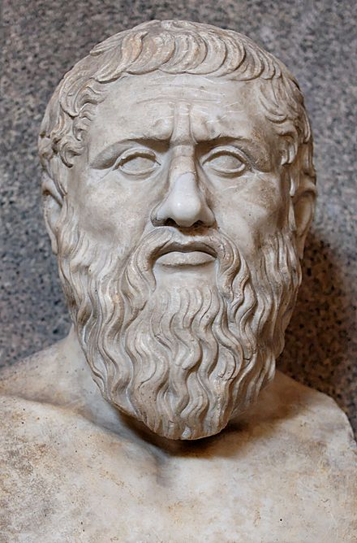
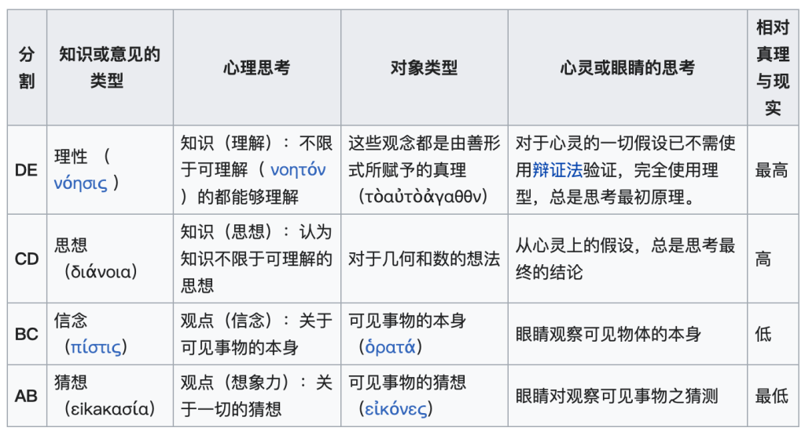
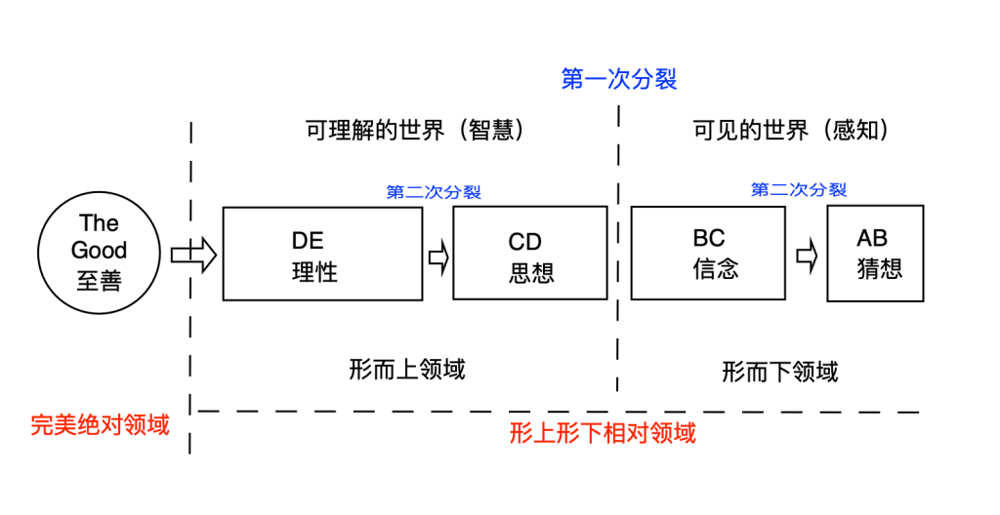

<figure>

<figcaption>

文：友林  
时间：2021.8.4

</figcaption>

</figure>

导读：柏拉图哲学思想体系对以西方文化主导的世界文明影响极其深远，尤其是在哲学界、数学界与科学界，本文先对柏拉图哲学思想体系进行介绍，尤其理型论、著名的“洞穴囚犯的寓言”、形而上哲学体系，然后与老子哲学思想体系进行对比，指出柏拉图哲学思想中缺失的“环节”，从一体论思想体系来进行深入解读，并介绍超越二元性，化二为一的基本原理。

**本文目录：**

- 柏拉图简介
- 柏拉图哲学思想体系
- 柏拉图的宇宙观
- 柏拉图哲学思想与老子哲学思想对比
- 一体性、一体论、二元性、二元论的区别
- 超越二元性——化二为一基本原理
- 总结

**柏拉图简介**

<figure>

<figcaption>

柏拉图Plato (ca. 427-347 B.C.)

</figcaption>

</figure>

柏拉图是著名古希腊哲学家，生于公元前400年左右，差不多与老子生活在同一时代，柏拉图的哲学思想对整个欧洲，乃至现代整个文明都有着深远的影响。英国哲学家怀德海甚至说，西方两千年来的哲学思想就是一系列柏拉图哲学思想的注脚而已。许多西方哲学家也将他们的理论根基于柏拉图的著作之上。柏拉图的哲学思想体系在数学界和科学界影响极大。

公元前399年，柏拉图的老师苏格拉底受审并被判死刑，28岁的柏拉图对当时的政治体制彻底绝望，于是开始游遍意大利半岛、西西里岛、埃及、昔兰尼加等地以寻求知识。期间还受邀当了西西里岛的国师，建立理想国，但由于岛内愈演愈烈的权贵阶级斗争而以失败告终，最后还落得被当作奴隶出售的悲剧，后来被朋友发现后解救出来。柏拉图直到四十岁时，结束旅程返回雅典，并在雅典城外西北角创立了自己的学校，即著名的柏拉图学院，这所学院成为西方文明最早的有完整组织的高等学府Academy，后世的高等学术机构也因此而得名，也是中世纪时在西方发展起来的大学的前身。

**柏拉图哲学思想体系介绍**

柏拉图将世界分为两个不同的部分：“理型的”智慧世界以及我们所感觉到的世界。我们所感觉到的世界是从有智慧的形式或理想里所复制的，但这些复制版本并不完美，那些真正的形式是完美的而且无法改变的。

柏拉图在《理想国》的第一卷、第二卷和第七卷里，举出了几个隐喻来解释他的哲学观点：太阳的隐喻、知名的洞穴囚犯寓言以及更直接的“线寓”。这些隐喻故事加起来便架构了一个复杂而艰深的理论：称为“至善的形式”（The Form of the Good）或“至善的理想”（后来也有学者直接将其称为“至善的一位”（The One of the Good），本文简称为“至善”，这也经常被解读为柏拉图心中的上帝），这种源自“至善的形式”便是知识的终极目标，同时也是这种形式塑造了各种其他的形式（例如哲学的概念、抽象、以及属性），所有形式也都是“源自”于这种至善的形式。

至善的形式塑造其他形式的方式，就如同太阳照亮其他物体一般，使得我们能够在可感知的世界看到这些东西。柏拉图认为，自然界中有形的东西是流动的，但是构成这些有形物质的“形式”或“理念”却是永恒不变的。柏拉图指出，当我们说到“马”时，我们没有指任何一匹马，而是称任何一种马。而“马”的含义本身独立于各种马（“有形的”），它不存在于空间和时间中，因此是永恒的。但是某一匹特定的、有形的、存在于感官世界的马，却是“流动”的，会死亡，会腐烂。这可以作为柏拉图的“理念论或理型论”的一个初步的解说。

在太阳的隐喻里，柏拉图描述太阳为“启蒙”的来源。根据柏拉图的说法，人类的眼睛与其他器官不同，因为它必须要有照明的媒介才能看清楚东西。而最强大的照明媒介便是太阳，有了太阳我们才能清楚的分辨一般事物。同样的道理也可以套用在智慧的事物上，如果我们试着探索那些围绕我们身边的事物的本质以及分类他们的方式，除非我们具有理性的“形式”，否则我们便会彻底失败而一无所知。

<figure>

<figcaption>

洞穴囚犯寓言

</figcaption>

</figure>

柏拉图以著名的洞穴囚犯的隐喻来解释他的形而上学理论：有一群囚犯在一个洞穴中，他们手脚都被捆绑，身体也无法转身，只能背对着洞口。他们面前有一堵白墙，他们身后燃烧着一堆火。在那面白墙上他们看到了自己以及身后到火堆之间事物的影子，由于他们看不到任何其他东西，这群囚犯会以为影子就是真实的东西。最后，一个人挣脱了枷锁，并且摸索出了洞口。他第一次看到了真实的事物。他返回洞穴并试图向其他人解释，那些影子其实只是虚幻的事物，并向他们指明光明的道路。但是对于那些囚犯来说，那个人似乎比他逃出去之前更加愚蠢，并向他宣称，除了墙上的影子之外，世界上没有其他东西了。柏拉图利用这个故事来告诉我们，“形式”其实就是那阳光照耀下的实物，而我们的感官世界所能感受到的不过是那白墙上的影子而已。我们的大自然比起鲜明的理型世界来说，是黑暗而单调的。不懂哲学的人能看到的只是那些影子，而哲学家则在真理的阳光下看到外部事物。

而在柏拉图提出的线喻（divided line）里，我们则可以想像宇宙中的所有东西都代表了一连串渐增的“现实”（reality）；这个现实曾经经过一次不平均的分裂，分裂后的子部分又依据与第一次相同的比例再进行了一次分裂（第二次分裂的比例是相同的）。参考以下线喻图，第一次的分裂代表了智慧（CE）和感觉世界（AC）间的分割，而接下来的分裂则又代表了这些世界里的进一步区隔：代表感觉世界的部分被切割为代表“真实事物”的部分（BC）以及代表“反射的阴影”的部分（AB）；代表智慧世界的部分也被切割为代表整体形式的部分（DE）以及代表“反射”的部分（CD）。

<figure>

<figcaption>

线喻示意图

</figcaption>

</figure>

 由此产生了四个部分，这四部分分别代表了四个“层次”。较低的两个部分为感官，而较高的两个部分为可理解性，它们分别阐述了从猜想到信念、从思想到最终理解，即从现实一直提升到最高真理的整个过程，如下图所示。 

<figure>

<figcaption>

两次分裂的四个层次

</figcaption>

</figure>

**柏拉图宇宙观**

柏拉图的哲学思想对西方文明影响极为深刻，尤其是在数学与科学界。为了全面性地理解柏拉图形而上学哲学理论，绘制了以下示意图，为了之后方便与老子的悟道哲学思想的“灵性蓝图”做对比，对柏拉图原始的线喻示意图做了反向镜像处理，如下图所示。 

<figure>

<figcaption>

柏拉图哲学体系示意图

</figcaption>

</figure>

根据柏拉图的理型论，万事万物都有理型，理型是超越我们能够感知到的世界之前而存在的，而最根源的理型就是“至善”，其它的“形式”都是源自于“至善的形式”，如哲学思想、数学几何、科学理论等。我们所处的可见可感知的宇宙，包括可理解世界的智慧，都是从完美境界的“至善”复制而来，或者说我们所处的宇宙是对“至善”的一种仿制。

在柏拉图的哲学思想体系中，我们的宇宙，包括我们的智慧，都是从“至善”经历两次分裂之后的产物。从“至善”经历第一次分裂形成了代表可理解世界CE，也称智慧世界，与代表可见世界的AC，也称可感知世界。在第二次分裂之后，代表可见世界的AC，形成了表示“真实事物”的BC，及代表其反射阴影的AB；代表可理解世界的CE，又分裂为了代表“整体形式”的部分DE，及代表其反射阴影的CD。

真实事物之阴影AB代表着人们对“真实事物”BC的猜想，而真实事物是人们抱持的一种信念，但唯有通过CD的思想（在柏拉图哲学中，这部分尤其指几何学与数学理论部分，柏拉图特别重视数学，认为整个宇宙是基于数学而构建的），来完善我们对真实事物的信念，而由各个层次的思想整体提升到象征“整体形式”的DE，也是最终理性的阶段，只有这一阶段最接近“至善”的理型。因此，宇宙（包括人的理解世界的智慧）的产生源自于“至善”，那么人们为了从无知中解脱出来，就必须反向提升，从猜想，到信念，再到思想，最后直到最接近“至善”的真理。唯有如此，人类才能够从愚昧提升到象征智慧最高形式的真理，人们才能够活出其理想的国度，每个人充满正义，智慧，美善，此谓柏拉图的“理想国”。

柏拉图认为所有的知识都是回忆出来的，而不是通过后天学习而来的。为什么宇宙是数学来描述的，而数学又只能够通过心灵来理解呢？这个世界之所以有“理性”的结构可以供人来回忆，本质上就是因为理性（数学）、宇宙、心灵这三者同出一源于“至善”。这个宇宙起源于一个理性的“工匠神”，“工匠神”掌握所有理型知识，知道万事万物最完美的形式，因为“工匠神”本来就是“至善”的体现，他自然会希望万事万物尽善尽美。

有人反问柏拉图，为何完美的“至善”会创造出不完美的宇宙万物，我们所在的宇宙，包括人的身体，没有一物是不会死亡与腐败的。柏拉图对于这个问题，只能够说，“至善”虽然是完美的，但是用于制造宇宙万物的“原材料”原本就是处于混沌之中，“工匠神”只是利用了这些“原材料”来创造出宇宙万物，虽然万物背后的理型是完美的，但是原本处于混沌中的“原材料”不是完美的，所以才有了不完美的宇宙。

**柏拉图哲学思想与老子哲学思想的对比**

柏拉图的哲学体系，是建立在自下而上的思维结果，对完美的“至善”为何分裂产生不完美的世界，底层逻辑解释并不完美。因为凡是绝对完美的一体之物不可能会有对立物，而原初混沌的造成不完美宇宙之创造的“原材料”就是“完美一体”的对立物，有对立者就不可能是圆满的“一体”。因此只有两种可能性：如果“至善”是完美一体的话，而赋予宇宙理型的“工匠神”就无法与“至善”一体等同，“工匠神”必然已经与“至善”分裂；如果“工匠神”是与“至善”一体的话，那么“至善”本身就不可能是完美一体的。 

<figure>

<figcaption>

老子哲学体系示意图

</figcaption>

</figure>

与老子悟道哲学思想相比，柏拉图哲学体系中的AB+BC等同于“万物”，CD+DE属于“三”的范畴，“工匠神”也必须属于“三”的范畴，因为是“工匠神”根据CD+DE的理型来创造宇宙万物的。那么由于柏拉图明确说明“工匠神”是“至善”的体现，所以柏拉图还没有像老子那样将“至善”提升到“一体性”境界的“道”，两者其实并不在一个层次。这里为了讨论与分析，我们可以试图将“至善”提升到真正完美一体性的“道”的境界（我想这也是柏拉图的初衷），那么所谓的“工匠神”就无法体现“至善”，两者之间必然早已经分裂了，或者说“工匠神”本身只是对“至善”的一种模仿。

如果“工匠神”能够与不完美的“混沌世界”互动，表示其本身就是“二元性”的相对性领域，那我们必然要问的是，如果“至善”就是一体性的“道”的话，那从完美一体性的“至善”到“工匠神”之间必然还有我们遗漏的环节，这个环节就是“一”和“二”！

根据《老子悟道思想解析》一文，“道生一”表示心灵最初从一体性存在，变为二元性的存在。“一体性”是没有相对性的观念的境界，没有内外之分，没有你我之别，也没有什么完美与不完美的相对概念，没有善与恶，因为只有永恒的一体性，也只有在一体性中才没有矛盾与对立，一体性本身就是圆满性的，如果还有什么不圆满的话，那就必然不是一体性了。人们对这种一体性的存在非常缺乏认知，只有领悟很深的心灵，才能够对其领略一二、惊鸿一瞥。

在一体性中没有所谓的意识，意识只有在二元性境界才存在，所谓的意识就是一些列的对比与判断，因为要有可对比性的形式，或者额外的参照物，才可能意识到不同，并产生不同的观点。“二元性”是有相对性观念的境界，也就是要比“一体性”多一点的念头，亦即“一体性”之外还有某样东西，某个观念的存在，才可能意识到有内外之分，你我之别，才可能形成意识性的判断，有判断才可能有认知上的矛盾与对立。

于是“道生一”表示心灵已经从一体性境界跌落到了二元性境界（第一次分裂），这也是最初意识诞生的地方；“一生二”表示最初的意识所做的第一个判断，即第一个观点的形成，做了“相信分裂发生了”的判断（第二次分裂）；于是“二生三”表示心灵基于二元性，形成一整套自我判断与生存机制，实际上就是自我防卫机制（第三次分裂），即“三”代表二元论思想体系，该思想体系建构于分裂思维的基础上；而“三生万物”表示根据二元论思想体系形成的一个新的存在现实（第四次分裂），该现实与代表一体性的存在境界完全相反。

根据《一体论思想之灵修基本原理》一文，对老子“道生一、一生二、二生三、三生万物”做了反向等效诠释：“道”依然是永恒不易的一体性；“一”就是一体论思想体系；“二”代表“心灵重新选择的力量”；“三”代表二元论思想体系；“万物”代表我们可感知的时空宇宙。

柏拉图哲学思想体系缺失的环节正是代表“一体论思想体系”的“一”，以及代表“心灵重新选择的力量”的“二”。他把人类提升的目标定位于超越万物之上的思想与理性，但是如果不彻底看清二元性存在本质，即二元论思想体系的本质的话，就无法超越其上，所谓的思想与理性也只是在“二元论思想体系”中打转转，如同太极图那样循环往复的旋转，变化无常，说是爱，它是恨，说是恨，它似乎又是爱，纠缠不清。

无法超越代表二元论思想体系的“三”，就无法重获“心灵选择的力量”，也就没有可能构建起一整座通往“一体性境界”的桥梁——一体论思想体系。

**一体性、一体论、二元性、二元论的区别**

一体性是永恒不易的存在境界，虽然我们特别重视意识与思想的作用，但是它的存在与创造方式，不是建构于意识与思想的基础之上的，它超越二元性境界“知见”的层次，属于“真知”（也被称为“灵知”）的层次，是言语道断之境，这就是佛陀所称的“法空”境界（小乘佛法讲究“我空”，大乘佛法讲究“法空”）。

一体论思想体系，就是用一体性的体悟去重新看待我们目前所处的世界，通过扭转我们对世界的看法，来为重新进入真正的“一体性境界”做准备，这个新的看法就是“一体论思想体系”。“一体论”之所以称为“一体”，是因为它的看法是从“一体性”出发，永远着眼于万事万物的一体性，时刻为一体性背书；之所以称为“论”，是因为它依然是一种基于二元性意识层次存在的思想，只是这种思想体系为“一体性”代言，而不是为“二元性”代言。

一体性与二元性是两个绝对概念的境界，互不相容，二元论是为“二元性”代言的，支持二元性观念，为二元性的存在撑腰，信仰分裂，鼓吹矛盾与斗争，认为只有在矛盾与斗争中才有力量。而一体论则是在二元性境界中，为“一体性”代言的那部分思想，身陷二元性的心灵必须借助二元性的意识与思想来逐步操练心灵，体悟一体性之真谛，信仰合一精神，信奉爱与美善，认为在真正的超越二元幻相的爱之中，才能够重获生命的力量。

二元论思想体系者将善与爱看作是软弱无能的象征，而一体论思想体系者将矛盾与斗争视作非必要的无谓之举，亦是心灵遭受痛苦的根源，是需要从中获得解脱与救赎的，唯有真实的爱才是获得疗愈的力量之源泉，因为只有心灵处于一体性心态，才能够不受二元性无常变幻的折磨而困扰。

一体性心境犹如二元性无常变幻之风暴漩涡的中心，唯有处于风暴中心，才可能寻得心灵的平安与智慧。所谓智慧，只不过是放下对世俗事物的判断之执着而已，如同佛陀教导的放下“我执”的观念。

柏拉图哲学思想为现代数学界与科学界提供了发展依据，面对新的未知事物，人们提出猜想（AB），建构信念（BC），并运用数学模型（CD）进行思想推理，然后通过引导实验观测，完成验证，使其提升为人类的理性层次（DE），这个层次被认为是最接近“至善”的真理，于是人类才有机会对完美的“至善”有所认识，并通过这种智慧的升华，获得完美“至善”的理念，并据此建构“理想国”，人人安居乐业，乐享平安。

这是一个看起来相当美好的想法，但是根据上述“一体性”与“二元性”的阐述，其中迷失了两个至关重要的部分。因此，柏拉图哲学思想不能够将人类从迷途中解救出来，所谓的理性与思想，依然受制于“二元论思想体系”，“万物”看起来因为思想与理性有了新的面貌，实际上，其二元性无常本质根本不曾改变。

象征柏拉图“工匠神”的理型的数学与几何学，与万物的表现形式的变化，都同时出自“二元论思想体系”之手。如同柏拉图之后约400年诞生的耶稣所说的：“你们为什么要清洗杯子的外层？难道你们不知，造出内层之人也正是造出外层之人吗？”

所以，二元论思想体系中的一切，只会维护自身（二元性存在层面）的存在，如果要从中解脱出来，就必须有跳出该思想体系的觉悟，参考《圣人无为故无败——超越宇宙奇点》与《人类自由意志的错觉——论广义意识与狭义意识》。

柏拉图哲学思想看似推动了现代文明的发展，强调“理性思维”的重要性，但是我们日常生活中的许多人际关系的问题，并不是可以用理性来解决的。

柏拉图式的理想国度可能通过其哲学思想提升数学理论与理性知识，在物质层面带来提升，但是并不一定能够为人类带来心灵上的提升，这是因为没有一个统合整个存在层面的思想体系，心灵与物理层次必须统一起来看待。正如象征二元“太极文化”的传统灵修体系，以及近一百年来对微观世界有了全新的认知，即量子力学底层逻辑的二元性特征，揭示出我们所在的宇宙，不论是心理层面还是物理层面，都是属于二元性范畴的，参考《二元性存在的谜思》与《一体论思想之量子理论诠释》。那么如果体悟到，唯有超越二元性，进入象征一体性的一体论思想体系，才是人类最终走向和平与喜悦的唯一出路。这倒不是要人们在物质层面彻底放弃这个世界，而只是改变对世界的固有看法，其实世界的发展有其固有的模式，于是对于世界的发展，就只是自然跟随这股潮流即可，更多的精力，应该放到心灵之内的探索，心向内走。

（量子力学哥本哈根学派领军人波尔亲自为自己设计的大象勋章，太极图上方拉丁文意思：对立即互补）

**超越二元性——“化二为一”**

我想我们可以将二元相对性观念分为形上相对性概念，形下相对性概念两类。形下性相对性概念作用于时间、空间、形体的物理层面，即我们所看所见所感知的世界。例如：上下、左右、大小、高低、远近、快慢、正反等，其描述的对象是物理层面的，这一类概念较多，但是不需要我们特意化二为一，物理层面的发展就顺随其规律自行演化就好，在心灵内不要有“分别心”，在心态上超越其上，不以这些相对观念来论断他人。

形上相对性概念又可分为“可合一型“与“不可合一型”形上相对性概念，相比形下相对性概念，形上相对性概念较少。根据“可合一型“与“不可合一型”这两类不同的特点，我们有不同的“化二为一”的策略。

例如“可合一型”包括教导与学习、给予与获得等，“不可合一型”包括平安与攻击、爱与恨等。

“可合一型”可以在一体论思想体系思维中合一，比如教导与学习，在一体论思想下，教导他人等于学习，而学习的同时其实就是在教导他人，教与学是可以从一体性心态来看待的，以身作则就是其最好的诠释；有别于二元论思想下的“教导”与“学习”相互对立的角色，老师一般不会成为学生的学生，学生也不会成为老师的老师，“教导”与“学习”因为某种“权威”的关系，而阻隔了原本一体不分的概念。如爱因斯坦开玩笑说：“为了惩罚我对权威的蔑视，命运把我自己变成了一个权威”。

“不可合一型”的相对性概念在一体论思想中不可能共存，只可能二选一后，将其升华为一体论思想体系下的一体性概念。比如爱与恨，在一体论思想下，二选一就是“爱”，因为所谓的“恨”只不过是缺乏爱的一种对爱扭曲的观念的思维产物而已。然后将二元性的爱再升华为一体性的爱，爱他人与爱自己是等价的，唯有懂得爱戴他人的人，才能够彻底学会爱自己，从恨的魔咒中解脱出来；而在二元论思想下，爱是非常具有选择性的，具有排他性，爱他人与爱自己是矛盾与冲突的，爱这个人就无法爱那个人，只因为人们着眼于眼前的小惠小利。如耶稣所比喻的“渔夫发现一条肥美的大鱼，于是丢弃其它所有的小鱼，只要了这条大鱼”，这条大鱼就是象征一体论思想所带来的心灵永恒平安的解脱，其它所有的小鱼象征二元论思想下着眼于物质层面的小恩小惠而已。

于是如何超越“二元论思想体系”，重新获得心灵选择的力量，“化二为一”构建完整的回归一体性之“道”之桥梁的“一体论思想体系”，才是人类唯一的出路，是柏拉图哲学思想所缺乏的部分，也正是老子灵修哲学思想所要教导世人的部分。老子的悟道思想是自上而下的结果，唯有处于寂静状态下的心灵，才能够做到这点，参考《三只猴子的故事》一文。

**总结**

柏拉图的哲学思想并未将“至善”的观念，从二元性境界脱离出来，提升到纯粹一体性境界，正如其著名的“洞穴囚犯”寓言所作的比喻一样，那些囚犯眼之所见只是某种所谓“真实事物”的象征或影子而已，它们并非是真实的。但是矛盾的是，柏拉图无法从最底层的逻辑完美解释，为什么完美的“至善”会创造出非真实的东西？最后，柏拉图只好妥协，他下结论说，我们所看见的东西不是真实的，但那些东西背后的理型是真实的。所以他的结论依然属于“二元论”范畴，因为只要“至善”这个万物之源，依然与二元性存在层面的事物互动，那么它们就都依然属于同一境界，即“二元论”范畴。

因此，柏拉图虽然是一位非常聪明的哲学家，但是事实上，我们所看到的象征并非是真实的，连同它们背后的理型也同样不是真实的。它们都源自同一颗看似分裂的心灵中，都是为了某个目的而构建的虚幻世界。这颗与分裂认同的心灵（如柏拉图所谓的“工匠神”）并非真实生命的源头，而只是对一体性境界的模仿。

整个宇宙与人生，都是一场精心设计的骗局，它存在的目的完全只是为了分散心灵的注意力，让我们远离真相，无法体验到真相，用虚假的生命来替代真实的生命，阻止我们认识真实的生命，即耶稣所谓的“属灵的生命”。

二元性的幻相与一体性的真相不可同时存在，有“一”就不可能有“二”，有“二”就不可能有“一”。只有一体性的真相是真实的，除此之外，都是虚幻的。对于体悟灵性之真谛的人们来说，我们必须在这两者间做出一个毫不妥协的抉择，这也是从“二元太极循环”中解脱所做的一劳永逸的抉择！相比二元性的无常变幻，一体性是永恒不易的，唯有在圆满一体性境界心灵才可能“永恒安息”，在永恒平安与无限喜悦中自由扩展一体性生命，这才是心灵应该存在的境界，有些人已经能够对此惊鸿一瞥，他们正在二元时空境界向世人诉说着非时空境界的事情！

在柏拉图的洞穴囚犯的隐喻中，挣脱枷锁逃出洞穴，看到外面真实事物的那个人，就是指柏拉图的老师苏格拉底。苏格拉底时代背景下，社会上流行的相对主义和怀疑主义，认为道德、正义、知识全都是相对的，不存在客观的真理。苏格拉底为了捍卫真理，而被反对者们审判而处决，最后服毒而死，于是柏拉图才会说：“小孩害怕黑暗情有可原，但是大人却害怕光明，令人匪夷所思！”。

那些囚犯早已习惯自己的想法，根本不想听这个自由人的说明，不仅如此，他们还要置他于死地。人们也许会认为自己希望自由自在，其实他们并不真想放弃自己固有的看法。而柏拉图想通过洞穴囚犯的寓言故事，一方面向其启蒙导师致敬，另一方面也是在藉此告诫人们，我们的存在真相根本不是我们心目中所想的那样。

向苏格拉底和柏拉图致敬！

本文参考文章列表

- [老子悟道思想解析——道生一，一生二，二生三，三生万物](http://mp.weixin.qq.com/s?__biz=MzA3NzMzNjIxMQ==&mid=2652031071&idx=7&sn=cc5c0fd86ee3a695f52244146a80bb7b&chksm=84b5f3a3b3c27ab5d9907ab98c0a501d55eb975c391c75f1c534d56689a44823fa9fe0c8a8c8&scene=21#wechat_redirect)  
    
- [人类自由意志的错觉——论广义意识与狭义意识](http://mp.weixin.qq.com/s?__biz=MzA3NzMzNjIxMQ==&mid=2652031071&idx=2&sn=f07c91fde5bc62e664c0b24ce2a8aa7c&chksm=84b5f3a3b3c27ab589407b80f53a942a6bf20e8ef97d302db7c5a0fcf5fd90f7cdb4f9a2c0fd&scene=21#wechat_redirect)  
    
- [如何超越二元性——化二为一](http://mp.weixin.qq.com/s?__biz=MzA3NzMzNjIxMQ==&mid=2652031071&idx=8&sn=7397752e7b83778e838f9cf3b490b105&chksm=84b5f3a3b3c27ab5fc54cbb015ab0dedeaae166254e8d6e780453afb8196840f90b54dba2570&scene=21#wechat_redirect)  
    
- [圣人无为故无败——超越宇宙奇点](http://mp.weixin.qq.com/s?__biz=MzA3NzMzNjIxMQ==&mid=2652031071&idx=1&sn=9ba446dbf8dd9844cd2bfa5a55291664&chksm=84b5f3a3b3c27ab54d0923e40a77145fde38bef4bda9dbeef9abdc8d6c378812fe3b47468c69&scene=21#wechat_redirect)  
    
- [一体论思想之量子理论诠释——量子化非线性思维基本原理](http://mp.weixin.qq.com/s?__biz=MzA3NzMzNjIxMQ==&mid=2652031096&idx=1&sn=5923a6d81e120b5a1f973c490e2710f3&chksm=84b5f384b3c27a927b11b86e8804181010bf22e69f8e3434377a8d3e0e3723f1e9d1789ea366&scene=21#wechat_redirect)  
    
- [一体论思想之冯·诺依曼-魏格纳诠释——二元性存在的谜思](http://mp.weixin.qq.com/s?__biz=MzA3NzMzNjIxMQ==&mid=2652031103&idx=1&sn=d526f819e36f6265d4730d17c520ed61&chksm=84b5f383b3c27a9537aa4c153c901e25434fc5d44b86502a68e50569af816e4d786459d10f6f&scene=21#wechat_redirect)  
    
- [一体论思想之灵修基本原理](http://mp.weixin.qq.com/s?__biz=MzA3NzMzNjIxMQ==&mid=2652031112&idx=1&sn=0921b6e680c9c9dd2ea83038ba630823&chksm=84b5f374b3c27a62efb6ec8f30e942a476d8129cf3b313e0029ea63ffa29ba9ae6045ba03ed4&scene=21#wechat_redirect)  
    
- [三只猴子的故事——生命纯属理念](http://mp.weixin.qq.com/s?__biz=MzA3NzMzNjIxMQ==&mid=2652031071&idx=6&sn=8e19bcea83d3aee760a8b7ac284305f9&chksm=84b5f3a3b3c27ab56115709233a8bdef99b812c1d2b01dffbe5f9eb40bcbfddae0263959ac2e&scene=21#wechat_redirect)
