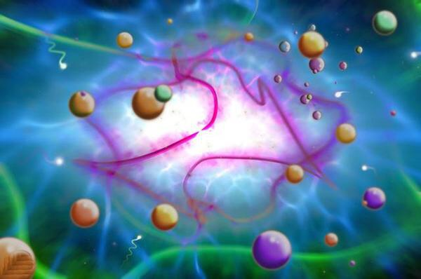
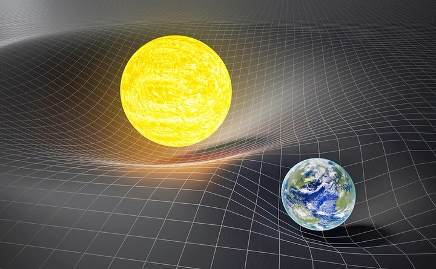
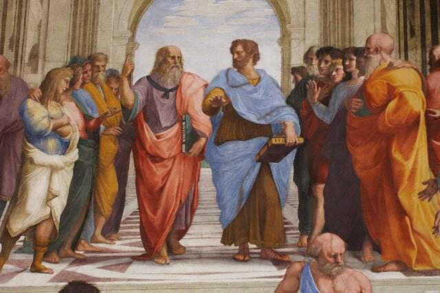
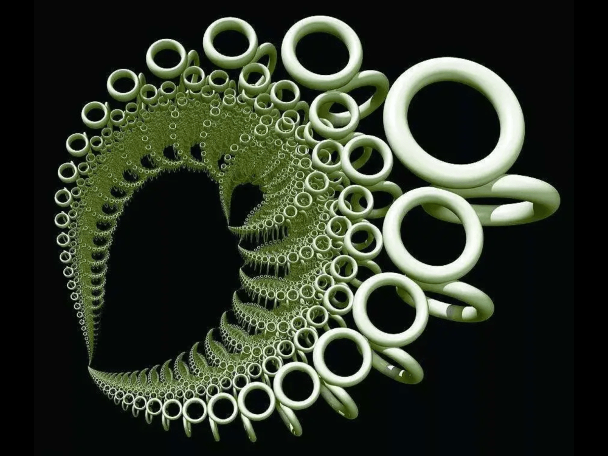
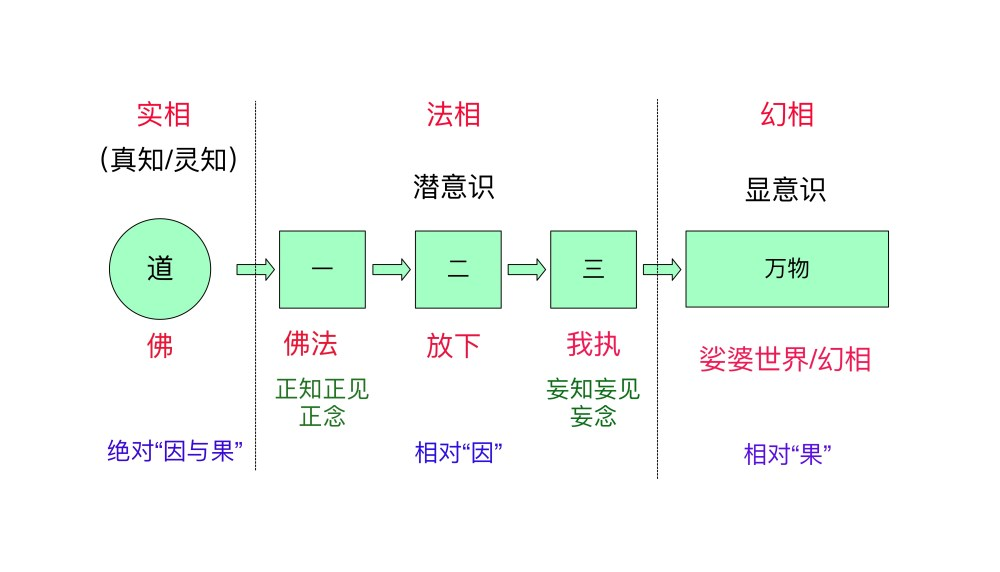
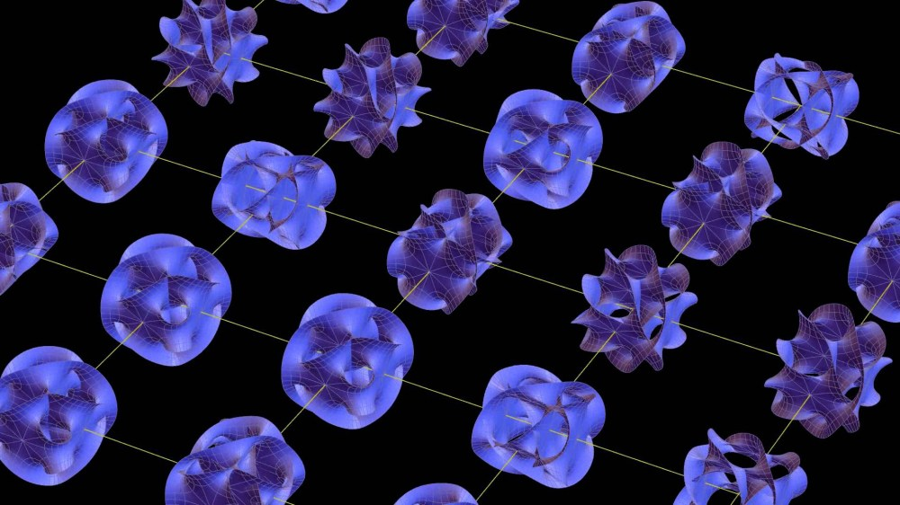
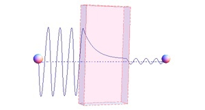
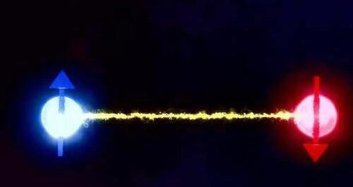

**导读：**由于现代心理学与量子力学的突破，使科学研究与心灵探索的融合成为了可能，这将极大的提升人类集体意识，促进文明物质与灵性层面的整体发展。本文试图从一体论思想体系的角度来重新看待前沿科学理论，尤其是量子力学所反映出来的二元性本质世界的底层逻辑，将物理学底层逻辑与心灵潜意识中二元论思想体系进行融合解读，彻底看清二元性幻相本质。

**本文目录：**

- 寻找万有理论
- 万有理论不存在的本质原因
- 科学理论的哲学思考
- 从一体论思想来看科学
- 理论与理念不再容易区分
- 从经典的决定论到量子的概率论
- 科学研究与心灵探索的融合
- 认清二元性的本质
- 总结

# 寻找万有理论

作为现代两大物理学理论支柱的广义相对论与量子力学，对人们的世界观有了巨大的转变。广义相对论突破了牛顿式经典物理学的绝对时空观，揭示了时间、空间、形体之间运动的内在联系；而量子力学突破了经典物理学对世界的决定论描述，运用概率论揭示了世界的深层规律。

然而，广义相对论与量子力学互不相容，从根本上来说，广义相对论是经典场论，作用是定域的，物质只能在某一个空间内相互影响，这个空间的大小受限于光速，运动得再快也不可能超光速。而量子力学因为其波函数是弥散在整个空间的，是非定域的，两者存在本质上的矛盾。这也是为什么爱因斯坦对量子力学中鬼魅般的超时空的“量子纠缠”现象百思不得其解，就是因为用定域性思维去理解非定域性是不可能理解，两者存在根本的差别，前者是封闭式系统，后者才是开放式的。

广义相对论通常应用于宏观世界，用来解释引力，量子力学应用于微观世界，负责解释强力、弱力与电磁力，本来井水不犯河水。然而，物理学家意识到，在微观的粒子世界，粒子都运动特别快，同时存在相对论效应与量子效应。物理学家尝试如何才能统合这两大支柱理论，形成一套万有理论，用一套理论来描述这四大基本作用力。

所以，在量子力学相续统合了强力、弱力与电磁力之后，如何继续统合引力，即引力量子化，就成为了理论科学家们为了追求将四大基本力统合到一套完美理论的万有理论的终极目标，即用同一套万有理论——而不是目前互不兼容的两大理论——来解释万物。

圈量子引力论与弦理论（M理论）作为两大有可能成为万有理论的候选理论，是引力量子化的主流研究方向。但是这两个主流的引力量子化或万有理论，都是不成熟的，还处于理论研究阶段，更没有得到实验证实。

圈量子引力论和弦理论都用自己的方法去融合各个理论，成为万有理论。弦理论用拓高维度去实现，圈量子引力论只用了一维的量子结构，用碎片化和拼图的方式解释万物本质，时空或许是离散的。

在圈量子引力论中，人们把时空不再看做是光滑连续的变量，而是一种在微观的普朗克尺度下的“圈”结构。正是由这些时空背景相互独立的“圈”所组成的无限可分时空下的曲率引起的引力。圈量子引力论对广义相对论支持者是友好型的，因为只是对广义相对论的量子化的深入解释与扩展，只是一次内部改造，而不是全盘否定，因此深受广义相对论支持者们的追捧。其逻辑可以这样理解，引力本身无法直接量子化，然而根据广义相对论，引力只是一种时空的扭曲效应，那么就只需要对时空进行量子化就好了。因此该理论依然是需要通过广义相对论负责引力的解释。圈量子引力论只需要描述时空量子化之后的“圈”之间的相连、打结以及如何纽结结合在一起，就可以构建出广义相对论的量子力学版本。

圈量子引力论可以看做是以大（时空相关性的引力）开始，转向微小（量子理论），而弦理论则是从微小（量子理论）入手，最终达到大（引力）。

弦理论（M理论）是目前最被看好的一种可以解释整个宇宙的万有理论，或许是最有希望将自然界的四种相互作用力统一起来的理论。该理论认为自宇宙诞生之初，宇宙之间的四种基本力就是一个统一的基本力，所有的粒子以及各种相互作用力都在量子微观尺度——即普朗克长度里——围绕在十一维的全区空间中振动的弦，根据这些弦不同的振动模式而产生了不同的粒子的质量以及相互作用。弦理论对于引力的解释是建立在一种预言中的“引力子”之上的，然而引力子基本上是一种无法被实验证实的假设基本粒子。

<figure>



<figcaption>

“弦”想象图

</figcaption>

</figure>

然而近一百的时间过去了，发展迅猛的量子力学理论为什么迟迟没有统合广义相对论呢？进入二十一世纪伊始，由二十多位物理学家与哲学家在美国举行了一次国际会议，经过多日的讨论认为，物理学家以两种不同的方法（广义相对论与量子场论）探索统一场论，但是这两套理论所得出的时空观从根本上不相容，关于时空的问题不解决，统一场论无法建立起来。

在广义相对论看来，引力只不过是一种时空的几何效应，传递引力的媒介就是时空本身，在没有物质的情况下，空间本身是扁平的。也就是说，引力是时空弯曲造成的一种几何效应，用一句非常具有哲理的话来描述就是：物质告诉时空如何弯曲；时空告诉物质如何运动。

<figure>



<figcaption>

时空扭曲造成"引力"

</figcaption>

</figure>

广义相对论是严重依赖时空背景性的，而在量子力学理论下，包括所有的量子化尝试，不管是狄拉克的正则量子化，惠勒（黑洞、虫洞等著名词汇的提出者）的量子泡沫，还是彭罗斯的自旋网络，都遇到了同一个问题，那就是在量子理论中“时间不见了”。也就是说，量子理论基本上是时空背景独立的。在量子力学大部分情况下，都是把时间、空间当成独立于物质的一种单独的存在，而广义相对论则完全不同，认为时间、空间和物质是紧密联系在一起的。

# 万有理论不存在

量子力学被广泛的应用到各大科技领域，几乎涵盖了所有领域，包括化学、光学、电学、激光器、半导体与晶体管、微处理器等领域，所有其它应用理论的底层解释几乎都要靠量子力学来解释才可能理解。

量子力学历经了一百年的发展，在许多方面颠覆了科学家们的认知，某些方面依然争论不休。其中就包括逐步升级的量子双缝干涉实验，可以说，量子力学的物理实验就是科学家与粒子躲猫猫的游戏。从最初的量子双缝干涉实验，直到逐步升级的量子延迟擦除实验，甚至是心理学家也加入到了躲猫猫的游戏中，即通过集体意念上的“观察”来干预双缝干涉实验结果。人们在实验过程中的观测与否将决定实验的结果，即量子呈现粒子特性还是波特性。在没有观测的情况下，量子总会呈现波的特性，而在有观测的情况下，量子总会呈现粒子的特性。也就是说，实验过程是否存在人为因素的观测，将改变我们观测到的结果。

同样的，包括“量子纠缠”实验，也是一种超时空的观测导致粒子之间瞬间交互作用的效应。引用玻尔（量子力学主流哥本哈根学派核心人物）的那句名言：

```
“如果你不为量子力学所深深地震惊，那么你还没有理解它。”
```

就是在说量子力学的各种诡异现象，要想从本质上弄清楚量子力学并没有那么简单，现代量子科学家普遍采取“闭嘴，计算”，就是避免去讨论量子力学背后深层的原因，而只是将精力放在应用层面。

根据《一体论思想之冯诺伊曼-魏格纳诠释》一文，人的意识是量子力学不可忽视的重要因素之一。魏格纳甚至认为，根据牛顿力学的第三定律之作用力与反作用力，“人的意识”也应该会和外部世界发生作用和反作用。（目前的确出现了部分哲学家开始主张主客体上的“相互作用的二元论”，然而最终应该是无主客体之分的“一体论”。）

量子力学接触到了微观世界的二元性底层逻辑，开始意识到人类的观测与否将决定现实的呈现方式。然而，广义相对论是完全处于“观测中”的世界，再来总结其运动规律的理论。也就是说，如果量子力学是一种基于“观测与否”的理论，广义相对论则是一种处于“观测之中”的理论，前者是开放式系统，意识到了“观测”可能影响实验结果，而后者则没有意识到“观测”已经“污染”了实验结果而得出的片面的规律性理论，属于封闭式系统。

这就注定了广义相对论只是量子力学这个概率论的开放式系统，在受到经典力学的决定论思维模式观测之后的一个封闭式系统而已。两者本质上不可融合，开放系统如何与自己的一个“特殊解”的封闭式系统相融合呢？这是不可能的，逻辑上都不可能。

# 科学理论的哲学思考

许多科学家到了晚年的时候都或多或少的涉及到哲学思考的层面，或者转而研究意识领域。比如，波尔到了晚年就非常关注哲学，特斯拉到了晚年则开始研究意识。

如果我们在认识世界的时候，必须把“观测与否”，或者说“如何观测”这个因素考虑进去，否者一种处于无意识（广义意识上的）状态的思维模式，将只能够得出一个“预设”或“默认”的宇宙规律。

而广义相对论就是这样一种默认的、预设的宇宙规律，所谓的自然规律将不是一成不变的，正如同该理论名称所显示的那样，该理论本质上是相对的，所谓相对的就不是不可改变的，至于如何改变，这要用处于底层逻辑的量子力学去负责解释。然而，底层量子力学逻辑是与人的观测相关的，明确的说，现实世界是与人们如何去“看待/看法”相关的。把“观测”等效变换为“看待”将有一个非常巨大的好处，因为前者偏向物理学意义上的，而后者则统合了物理意义与心灵层面的含义，即将物理现实与心灵精神层面的概念统一起来对待。

科学家大都致力于物理理论的统一，然而人类精神层面的东西要如何统一起来看，却是一个非常具有现实意义的命题。

广义相对论作用于经典可见的宏观世界，认为引力是由于时空扭曲造成的，物质与时空是相互纠缠的，即物质告诉时空如何弯曲；时空告诉物质如何运动。另一方面，量子力学将强力、弱力与电磁力分别看做是胶子、波色子与光子之间相互交换作用的表现，量子力学中存在着粒子相互交换与粒子属性之间的对立互补的二元性纠缠。

所以，从哲学层面上统合来看待广义相对论与量子力学就是，物理世界普遍存在着交换、纠缠、扭曲的底层逻辑。从这个底层逻辑，将与二元论思想体系的形而上领域的知见对应起来，即处于二元论思想体系的人类思维模式中，潜意识地存在着某种“交换”、“纠缠”与“扭曲”概念（参见《二元存在的谜思》一文的“人之初，性本‘二’”一节）。

人与人之间的互动普遍存在着某种心理与物质层面的交换，这种交换由于某种原始欲望与诱惑所致，在这种交换或交互过程中，难免存在着某种程度的纠缠，这种纠缠将加强心灵对于世界与内心观念上的扭曲看法。总的来说，“交换”、“纠缠”与“扭曲”的概念融合了二元论思想体系的形而上与形而下领域的的知见，形成了一套自圆其说的循环认知体系。

柏拉图与亚里士多德是师生关系，他们的宇宙观对于我们如何认识宇宙万物有非常大的影响。

<figure>



<figcaption>

柏拉图与亚里士多德

</figcaption>

</figure>

柏拉图指向了天空，象征着他的理念论。他认为我们所感觉到的这个世界之上有一个理念世界，其中是永恒不变的理念与形式，而我们的感官所呈现的这个世界只不过是这个理念世界的投影。而亚里士多德则指向了大地，代表着他作为西方文明现实主义的鼻祖。他关注的重点是现实世界中各种特定具体的形式与理念，强调经验，钻研物理，生物，地理等各种自然科学就是最好的注解。

虽然亚里士多德在科学发展中起到了重要的影响作用，但当进入量子力学时代之后，人们重新开始思考柏拉图的理念，现代柏拉图主义的宇宙观认为宇宙是基于某种数学模型的产物。

柏拉图认为人们的知识是通过回忆起来的，是每个人心灵内固有的，只需要回忆即可。而如果只是一味的通过外在的观测行为，只是起到一个暗示的作用，这样认识的万物之知识，将是严重依赖于源自二元论思想体系下的某种特定的数学模型的。如果像老子、佛陀、耶稣等修行人那样，超越外在行为上的知见，即超越特定思想之下的数学模型，才能够超越物质幻相（参见《真实的生命纯属理念——三只猴子的故事》一文）。

# 从一体论思想来看科学

如前所述，广义相对论是观测中的现实总结的理论之产物，是在实验结果受到某种形式的“观测污染”（即我们的固有看法）之后的结论，这种数学形式的理论，是其背后二元论思想体系希望人们有的“默认或预设”的看法与思维模式。而对于一体论思想体系者而言，这种预设的看法与思维模式本身就是一种对心灵的束缚与桎梏，真正的修行者都一生致力于从这种束缚中解脱出来，首当其冲的就是解除“时空形”的束缚。因为人类的一切表面上的苦难都与时间、空间、形体脱不了干系。例如，等待一个人，因其未能如期而至而生气，就是时间上的错位；因为自己的错误行为举止而懊恼不已，就是因为形体未能在时空排列组合上达到预期的目的所产生的烦恼等。

因为宇宙万物，及其背后的主导思想体系都是缘起二元性的观念，而量子力学的底层逻辑就是揭示这种二元性本质的，那么我们看待问题就应该从这种二元性本质的视角来看待宇宙万物，乃至其背后的二元论思想体系。

由于广义相对论是受到“观测污染”的理论结果，因此不应该执着于广义相对论理论本身，虽然它揭示出来的时间、空间、物质相对性的本质亦是一种认知上的进步，但是该理论终究还是在试图固定人们对于“时空形”的整体上的绝对认知，这一点就是与量子力学所揭示的二元对立的本质相违背的。

所以广义相对论将无法被融合进入量子力学体系内，这就注定了依赖于广义相对论而存在的“圈量子引力论”最终是失败的尝试。如果弦理论从量子理论发出，预期的目的地是导出广义相对论相同的结论的话，那么这条路也注定是走不通的。

但是我们可以通过这两大“候选万有理论”数学模型背后的底层逻辑，用一体论思想体系来重新看待我们的世界。

圈量子引力论认为由无限可分时空的曲率引起的引力，即由无数个时 空独立性的、处于微观的普朗克尺度的“圈”所构成的时空的扭曲造成的引力效应。 据初步理论计算，宇宙的每立方厘米包含大约10^99体积量子“圈”，可见的宇宙相较而言则包含越10^85立方厘米。这是一个量子化到一个极微观尺度。

<figure>



<figcaption>

圈量子示意图

</figcaption>

</figure>

在佛教经文中也有类似对“念力”的量子化的思想，如佛陀问弥勒“心有所念，几念几相识耶？”弥勒答：“举手弹指之顷，三十二亿百千念，念念成形，形皆有识，念极微细，不可执持。”

弹指之间“三十二亿百千念”，看似数量庞大，但是根据量子化思维，这个数字规模在形而上的“潜意识”领域（法相），是显得相对合理的。

<figure>



<figcaption>

法相示意图

</figcaption>

</figure>

弦理论将基本粒子的生灭看做是一种舞动的“丝状物”的“弦”，并携带着能量，类似振动的琴弦，以各种不同的振动模式，产生出不同的基本粒子，就像吉他弦通过不同的振动模式产生的音符一样。弦理论就是为了找到生产宇宙万物之所有基本粒子的这个“乐器”，有了这把乐器，就可以用一套工具（理论）解释宇宙万物。

自从科学家发现这种“乐器”存在于极微观世界，不得不将目前所知的四维时空提升到十一维度，这种乐器就是那些高出四维时空之额外维度下的极其复杂的几何结构。如果把乐器想象成复杂结构的管弦乐器，而那些不同的方式的流动的气流就是弦理论中所称的“能量丝”。

<figure>


<figcaption>

象征几何结构的乐器

</figcaption>

</figure>

最开始科学家只从理论计算找到了五种这样的几何结构，本来打算找到其中一种为候选的弦理论最终的几何结构，然而随着计算能力的提升，模拟出了越来越多，寻找最终的“候选几何结构”越来越难，直到目前接近无数的级别，弦理论科学家们直接快要奔溃了。正在人们准备将这套理论丢进垃圾桶的时候，有人提出引进平行宇宙的概念，每一种几何结构都代表了一个宇宙（这里的宇宙是物理参数不同的平行宇宙，不同于解释薛定谔的猫的多世界诠释里的参数相同的多宇宙），这才将弦理论拯救了回来。正是验证那句“遇事不决量子力学；解释不通穿越时空”的梗。

<figure>



<figcaption>

多样性的弦理论几何结构

</figcaption>

</figure>

正如霍金对弦理论（M理论）所描述的那样，他认为M理论不是通常意义上的单个理论，而是众多理论组成的一个网络。这有点类似于地图。要将整个地球如实记录在二维平面地图上，人们必须使用一套地图，其中每一张只覆盖一个有限区域。这些地图会互有重叠，在这些重叠的区域，不同地图都展示出相同的地貌。

霍金认为我们不可能找到真正意义上的万有理论，这是由于“现实”的多样性所决定的。他认为要描述整个宇宙，我们必须在不同情况下使用不同的理论。每个理论对于“现实”或许都有各自不同的理解，但根据基于模型的唯实论，“现实”的这种多样性是可以接受的，不可以说哪一种“现实”比其他“现实”更真实。

然而为什么造成这种现实的多样性？但从理论上来说，可以从弦理论的多样性的几何结构来领会些许。虽然弦理论演算出的数量庞大的几何结构，被应用到了多元宇宙理论，然而，从一体论思想体系来看，这里的每个几何结构代表的是每个有意识生命的个体的时空性的思维模式，每个人的思维模式都有些许不同，可以想象弹指之间数量庞大的二元性的念头，经过这样的几何结构（思维模式）之后，造就了每个人不同但有所重叠的“现实”。

正如“举手弹指之顷，三十二亿百千念，念念成形”，说明了这些量子化的念力，是如何从多样性的几何结构，演化成了有形可见的多样性的现实。所谓“形皆有识，念极微细，不可执持”，说明了形体的所见乃是心识的反映，每一个再微小的念头，在广义意识的潜意识领域，都是极其微细的，正是这些数量庞杂的念力的二元性的纠缠、交换、扭曲的作用之后，投射出来了我们有形可见的多样性的“现实”。“不可执持”说明了作为修行人，看清的世界的二元性虚幻本质，而寻求出离之道，由二元性境界解脱，进入一体性境界。

形而下的四大基本作用力，可以等效为形而上的某种念力上的势力。这样等效变换的好处是，凡是作用力，都有作用力与反作用力，将各种作用形式不同的力分为吸引力与排斥力，这样可以将作用力作为二元性观念来看待，为“化二为一”做好准备工作。另一方面，万一哪一天科学界又发现了某种不同于四大基本作用力的其他形式的力时，在这种等效变换下，我们不必关心力的具体表现形式。再一点就是可以统合理解目前新发现的“暗能量”，它本质上是一种不可见的，但是与引力相反的斥力，正是由于这种排斥力导致了宇宙大爆炸的加速膨胀，包括“暗物质”亦是如此。宇宙正是形而上某种念力上的二元对立互补的势力，在这种二元性相互作用下的具体表现结果。

# 理论与理念不再容易区分

杨振宁认为高能物理的盛宴已经结束，他是对的。上世纪50-80年代的物理学是大型粒子加速对撞机的天下，目前的标准模型粒子许多都是通过高能物理的加速对撞来发现的。然而，到了有望统合四大基本力“万有理论”的弦理论与圈量子引力论，不论是其“弦”还是“圈”，都无法通过高能物理来实验验证。

有科学家估算过，如果非要建造足够高能的粒子对撞机，理论上以目前的技术手段，可能要建造环太阳系，甚至环银河系尺度的环形加速器。这是不现实的，即是可以用某种方式建造足够高能的对撞机，获得了所需的能标，“黑洞”将成为不可逾越的屏障，因为能级越高，产生的微型“黑洞”的可能性就越大，其尺寸也将越大。（这也是为什么欧洲核子研究机构CERN高能加速器，备受人们的担忧，就怕万一哪一天不小心搞出了黑洞。）

目前理论上数学模型已经到了几乎不可能得到实验物理的验证支持，理论物理已经远远超越了实验物理，理论得不到验证将等同与主观的理念。所谓理念者，将不仅作用于有形物理层面，也可作用于无形精神层面。

尼采认为“世界上没有事实，只有解释”，他是对的，佛教也认为“虚空无南北，人心妄分别，执念信为真”！

所谓的现实，就是我们潜意识中所愿意相信的结果，它如何展现，都取决于我们的心灵的“看法”或“理念”（参考《真实的生命纯属理念》一文）。

数学模型不一定非要用于解释物理层面的事物，在思想层面，通过概念化，也是可以看出其背后思想体系的端倪的，毕竟数学模式也是一种思维模式的体现，自然能够在某种层面上，概念化与抽象化地说明其背后思想体系的运作法则。

弦理论中的“弦”的概念好似“念力”，在我们观看到或者触摸到之前，物质还不成为物质，它只是一团能量，准确来说，它根本上只是一连串的思想念力（举手弹指之顷，三十二亿百千念）。这也是为什么“能量不灭”的原因。弦理论中发现的不计其数的几何结构就好似象征着每个人的思维模式都不同，一连串思想念力通过这种复杂的几何结构，二元性念头在这里相互交换、扭曲、纠缠，最终构成了所谓的有形可见的现实（念念成形）。

当然，随着心灵的成长，思维模式的转变，几何结构也将发生转移。从这种几何结构上的转变，过去的自己与现在的自己，甚至未来的自己，将不是同一个人。或者反过来说，处于不同几何结构的人，也可以看做是过去的自己、现在的自己以及未来的自己。如果真实的生命纯属理念的话，那么应该将所见到的不同形体上的人之看法，都看作要么是过去的自己，要么是现在的自己，要么就是未来的自己！

即使是目前正统的描述电磁力、强力与弱力的量子场论里，认为当某粒子对应的场处于基态时，由于该场不可能通过状态变化来释放能量，所以就无法输出任何信号，或显现出直接的物理效应。在这种情况下，观测者就无法观测到粒子的存在，而当场处于激发态时，就会产生相应的粒子。场的不同激发态，所对应的粒子数目、运动状态以及排列组合是不同的，所以粒子的产生与湮灭，就代表着量子场的激发与退激。

由此可见，无形不可见的“场”是比所谓的基本粒子更基本的存在，粒子只是场处于激发态时的体现。粒子之间的相互作用，其实就是场之间的相互作用。事实上，无论一个场是处于基态还是激发态，都同样地与其他场相互作用。

所以，如果把无形不可见的意识也看做一个场的话，即意识场，那么意识场有可能通过我们对世界的“看法”（观察），将引起量子层次的次原子状态的改变，包括粒子显现的数量、运动状态以及排列组合等。

现代的物理学家越来越明白，物质是由虚空之中生出的，其本身也几乎是由虚空的空间所组成。但一般人没有注意到的是，即使物质显现为肉眼可见的形体以后，仍然不存在于任何地方。这也是为什么正统的大乘佛教将世界的“空性”本质看得如此透彻，而这一点并不是一般人所能够坚持的。

弹指之间，三十二亿百千念，一连串的念力构成了我们肉眼所见的局部世界（当然，还需要头脑上的解析，物理属性中没有关于色彩的属性，只有光的波长，如何完成由波长到色彩的解析，以及又是谁设计了这套色彩编码方案？）。然而一整套思想体系将构造整个有形层面，即“三生万物”，所谓的“三”指的就是二元论思想体系，其本质是基于分裂思维的。一个思想造出一切形象，它们的外表看起来有所不同，所代表的却是同一个东西。

# 从经典的决定论到量子的概率论

所谓的决定论，认为自然界和人类社会普遍存在客观规律和因果联系的理论和学说。在量子力学出现之前，决定论是人们认识自然与社会的主导思想。然而量子力学的诞生，让决定论在物理学领域变得不再那么牢固，逐步被概率论取代。

在宏观领域，物质由其具体位置与诸多属性来描述，而到了微观的量子世界，构成物质的基本粒子则由存在的概率来描述，即量子系统的描述是概率性的。

哥本哈根诠释不认为波函数除了抽象的概念以外有任何真实的存在，而一个事件的概率是波函数的绝对值平方，那么一个事件从底层的量子逻辑来看，只是一个存在的概率而已。关于这一点，“量子隧穿”效应得到充分的说明。

<figure>



<figcaption>

量子隧穿效应

</figcaption>

</figure>

在量子世界中，薛定谔方程有一个解预示着某个粒子出现在“墙”的另一侧的概率。所谓的“墙”，就是指当一个粒子周围的势能高于自身的能量时，就相当于在它面前竖了一堵墙，粒子存在的概率就被限制在“墙内”了。这是经典的决定论所理解的，然而，在量子世界，不是这样的，不论如何，粒子总有一个概率会存在于墙的外侧，虽然概率不大，但并不是零。在得到这个“特殊解”之后，由于这个解在决定论为主导的经典力学领域没有意义，因此通常是要被舍弃掉的。

这个可以“穿墙解”的特殊解，最早是由德国物理学家费里德里希-洪德在研究分子光谱时发现的。后来真正意识到我们并不应该将这个“穿墙解”舍弃掉的，正是后来宇宙大爆炸模型的创立者伽莫夫。

伽莫夫首次成功利用这个“穿墙解”解释了阿尔法衰变。在经典力学里，粒子会被牢牢地束缚于原子核内，因为粒子需要超强的能量才能逃出原子核。这是因为原子核中的质子和中子，是被四大基本力之一最强的强力紧紧束缚在原子核内的，形成了一道挡在射线粒子前面势垒，即“墙”。经典力学无法解释阿尔法衰变，而在量子力学里，粒子不需要具有比势能还高的能量，就可以逃出原子核的束缚；粒子可以概率性的穿越过原子核的势垒，从而逃出原子核的束缚。这就是所谓的量子隧穿效应。随后，科学家根据这一量子隧穿效应成功解释了许多物理现象。

量子隧穿效应虽然比较奇特，经典力学下无法理解，但是在宇宙之中却非常常见。例如我们每天都会接触到的太阳光，就是依赖这种奇异的量子隧穿效应。恒星由于氢原子核聚变而发光发热，然而由于恒星内部温度只有1500万度，要产生核聚变，就必须突破原子核之间融合时所产生的强大库伦势垒，理论上恒星内部的温度不足以突破这一强大势垒，然而正是由于量子隧穿效应的存在，两个原子核才能够突破库伦势垒这堵墙而结合，产生核聚变反应。于是才有了我们地球赖以生存的太阳光环境，不仅如此，这种量子隧穿的概率发生的恰到好处，才能够有目前适合地球生命生存的光照强度，要不然核聚变发生的太快或太慢，即量子隧穿概率太大或太低，都会影响地球生命的繁衍。（宇宙设计论在这里又得加一分！）

许多现代器件的运作也都依赖这效应，例如，隧道二极管、扫描隧道显微镜、原子钟也应用到量子隧穿效应。量子隧穿理论也被应用在半导体物理学、超导体物理学等其它领域。到目前为止，已有五位物理学科学家因为量子隧穿效应的应用而获得诺贝尔物理学奖。

量子隧穿可以解释许多概率性的现象，甚至被某些科学家用来解释宇宙可能是从这种效应中随机从虚无之中诞生出来的“免费午餐”。

不论如何，这种概率论是理解量子力学的核心。既然宏观世界是由微观量子构成的，我们应该摈弃先入为主的宏观世界的经典力学理论，包括广义相对论，运用量子式的思维模式去重新看待世界万物。

首先，我们不要再用经典力学下的决定论的绝对观念来看待事物，而是用概率特性来看待事物，没有任何事物是一成不变的，当我们在评论一件事也好，评判一个人也好，都是在“执念信为真”，把事情当真了，巩固了现实的存在（可能是我们不想要的现实），助长了其背后的潜意识思想体系。所谓概率论，只是把所见之世界当作一个投影屏，屏幕上概率性的呈现各种画面，没有哪一个画面比另一个画面更加真实，因此没有必要去评判它，一评判就是在巩固它的投影。也没有任何事情是不可能的，“不可能”这一概念就好似一道束缚心灵的“墙”，然而不论墙有多坚固，我们都有突破的可能性，用佛陀的话来说“要靠愿心”。然而我们的愿心来自于对真实生命的领悟，没有这份领悟，我们将不知道将愿心放在何处，如果一味的放在外在世界这个投影屏上，一会觉得这个好，一会儿觉得那个真，然而最终其实就只是活在幻相里不得解脱。

# 科学研究与心灵探索的融合

牛顿物理学主张客体存在于主体之外，且是一个真实与个别之物，这种认知自然引入了牛顿式绝对时空观的思想体系；然而量子物理则证实了这种理念的谬误，宇宙并非我们原先认定的样子，状似存在的个体，其实都是出自相互指责上不可分的念头。我们的观察本身都会引起物体在量子层次的变化。

有些量子物理学家也已开始明白了，“二元的存在”只是一个谜思（参见《二元存在的谜思》一文）。如果二元性存在之境根本就是一个谜思的话，那么除非有我们（心灵）在那儿知与觉，否则宇宙根本就不存在。当爱因斯坦反问哥本哈根学派：“难道我不看天上的月亮，它就不存在了吗？”，这就取决于我们对月亮存在的概率有多少信心！“执念信为真”不正说明了，我们对眼前的事物有多当真，反映了我们对幻相的执念有多深吗？

我们对外界人事物的一切评断与指责，都是基于这些人事物是与自己这个主体“分裂”或“分别”存在的概念这个认知基础之上的。然而，因着现代心理学（佛洛依德心理分析学为代表）与量子物理学的突破，即使在这个有形世界层面，“分裂”实际上是并不可能的，这种分裂的认知只可能发生在心念或观念上。

正如柏拉图所说的“小孩害怕黑暗，情有可原；大人却恐惧光明，令人匪夷所思。”在旧有的二元论思想体系遭到推翻之际，在潜意识心理层面必然引起极大的抗拒与恐惧，这是因为“人之初，性本‘二’”，二元论思想体系是我们作为人的默认思想体系，我们所有通过肉眼所获取的知见都是在为二元论思想体系背书的。旧有的二元论思想体系（小我或我执）将感受到自己遭受灭亡的威胁，体现在个体身份的消逝，因此并没有那么容易退出历史舞台，这是因为潜意识中还有一些有待处理的遭受扭曲的旧有思想观念的作祟，小我之执念很深。这也是为什么我们要有意识的去锻炼自己的心灵，逐步化解小我，这便是真正修行人在做的事。

量子物理也已证实了时间与空间仅为幻觉，而过去、现在和未来实际上都是同时存在，同时发生的，非时空性的生命做了一个时空性的梦。这个时空之境只不过是一个幻相罢了，要维系幻相的存在，就必须强化时间与空间的信念，在信念上把心灵之一体性认知，做一些表面上的分割，这就是二元论思想体系之小我一直在做的事情。唯有如此，我们才看似好像这人在这里，那人在那里，实际上都只是一个幌子，因为空间只不过是一个分裂的观念，时间也是如此。我们把时间与空间分割成不同的区块，营造出不同时段，不同地点的感觉，万事万物似乎有了不同的面貌，实际上都是同一回事，都是幻相，都是缘起“道四生万物”的四次分裂（柏拉图两次分裂，参见《柏拉图哲学思想解析》一文），而最本源性的分裂就是“道生一”，因此一次次分裂之执念，“执念信为真”，我们的信心放在哪里，当然就会看到哪里，也当然会信以为真的。

<figure>


<figcaption>

老子“道四生万物”示意图

</figcaption>

</figure>

许多物理学家还看不到这一本源性的分裂所导致的幻相，他们虽然知道人们对事物的经验都是虚幻不实的，经不起我们仔细的推敲与查看，但他们对世界的认知缺乏整体性，从现实层面上来说是学科之间分门别类导致的，当然本质上是“集体潜意识”在心灵层面还没有做好准备的缘故。

然而，不论怎么说，现代心理学与物理学上的突破，预示着科学研究与心灵探索也差不多快要碰头了，两者之间的融合必然是一个高等文明必经之路。

自古以来，人们信以为真的事，最后都几乎证实是错的。刚证实的科学现象，下个世纪就被推翻掉了（这大概也是为什么当年爱因斯坦并没有很快因为相对论而获得诺贝尔奖，也怕过不了多久就被另一科学理论所推翻，被其所推翻的牛顿万有引力力学好歹经受住了两百年的考验）。这是因为每种科学研究及其理论都受到当时意识形态的影响，或者研究经费的奖励制度左右。才有了目前对于量子力学所揭示出来的深层问题，存在着“闭嘴，计算”的思想，这种心态不过反映出人们对真实问题的视而不见，刻意回避真相的心态，这也隐藏了“三生万物”的内在动机，这个内在动机——即耶稣所谓诱惑——不彻底领悟清楚，人们是不会原意正视真正问题之所在，获得真相的。

# 认清二元性的本质

波尔是量子力学主力的哥本哈根学派的核心人物，1947年丹麦国王弗雷德里克九世宣布授予玻尔大象勋章（通常只有王室成员和国家元首能获此殊荣），表彰玻尔在量子力学领域的卓越贡献。玻尔亲自设计了这枚勋章，章纹由象征二元性的太极图以及格言“对立即互补”为主旨设计的。

<figure>


<figcaption>

波尔设计的大象勋章

</figcaption>

</figure>

太极是中国古代哲学思想非常重要的组成部分，本质上就是在描述我们的世界，不论是物质还是思想层面，都是太极之二元性的体现。现在的量子物理学家，通过对量子世界的底层逻辑分析，同样得出了这种二元性本质的结论。再一次加强了我们对于二元性世界本质的认知。

许多人不知道修行的目的何在，主要是因为没有深刻理解这两件事情：第一，我们的一切痛苦与内心的不平安都是由于二元性本性所致（二元性的相互交换、纠缠、扭曲）；第二，我们没有体悟出，除了二元性境界，还有一体性境界的存在。

理解一体性与二元性的本质区别，才能够理解“悟道”者所追求的到底为何物。实际上，我们正是来自这一体性，由于某种原始思想层面的“扭曲”，才营造出了这有形可见的“万物”之幻相，与之纠缠不清，在这欲生又欲死、似苦似乐的娑婆世界不能自拔。

老子所说的“道即一”，这里的“一”是指一体性，与“道生一”里的“一”不是同一回事。“道生一，一生二，二生三，三生万物”，这里四次“生”代表的是四次分裂，描述的是作为一体性的“道”，是如何经过这四次分裂一步步进入二元性无形意识与有形物质领域的。孔子说：“形而上者谓之道；形而下者谓之器”，这里孔子所谓的“道”并不是老子所说的一体性境界的“道”，只能够说是形而上的无形意识领域，准确来说是潜意识领域，如同佛教里面的“法相”，可理解为思想体系。（关于一体性、一体论、二元性、二元论之间的区别，参见《化二为一基本原理》一文中相关章节）

在以往传统的修行中，二元性的本质只能够去用心领悟，通过实修证悟，方可心领神会，很难用逻辑来言表。然而，由于现代量子力学的突破，发现了诸如量子纠缠这样的概念，让我们得以通过逻辑来描绘二元性的本质特征。

<figure>



<figcaption>

量子纠缠示意图

</figcaption>

</figure>

例如处于量子纠缠的一对粒子，不论将其分离至多远，人们对其中一个粒子的某一属性的观察，譬如粒子自旋方向，一旦确定了该粒子的自旋方向，另一粒子的自旋方向必然相反性的体现出来，这种交互是超越时空性的瞬时超距完成的，这就是被科学家们称之为的鬼魅般的超距作用的量子纠缠效应。

当《薄伽梵歌》里面说“在世间，痛苦与喜乐是同一回事”，就是在描述这种二元性的深层本质特性。世间的“苦”与“乐”必须从二元性面向去理解，二元性的“苦”天然印证着二元性的“乐”，只是“时间、空间、形体”的区别而已，两者本质上是一回事，是一种禁锢与束缚。这从现代量子力学理论的观点也是很好理解的，由于我们所处的世界为二元性，一切都是以对立互补的形式存在的。

量子纠缠效应揭示出，我们不可能真的将二元性事物从根本上进行分离。二元性的“苦与乐”亦是如此，我们在某一个时刻与空间体验到“乐”的一面，我们也必将在另一时刻与空间体验到“苦”的一面，它们是对立互补的关系，而不论这种时间跨度与空间跨度有多长或多远，出现的形式如何千差万别，它们都因我们的执念在量子式超时空层面，而牢牢的相对性的存在着，这种二元性好似一种诅咒与桎梏。这种“二元纠缠”的本质，是了解二元性宇宙法则的根本所在，了解事物之空性，“化二为一”是唯一从根本破除这一二元性桎梏的解脱方法，这也是譬如老子、佛陀与耶稣之一体论修行者所追求与实践的核心内涵，详见《化二为一基本原理》一文。

世间的是非、善恶、对错等等一切二元性的观念亦都是如此，从二元性境界来说，它们毫无差别，只是一种时空性“纠缠态”。因此，当我们观察、看待、评判一个人、事、物时，在二元性的量子底层逻辑层面，必然产生了一套与之相对互补式的人事物的表现，在一个极大规模上产生二元性观念之间的纠缠，这是超越时空性的发生着的。然而在时空性的经验层面，我们必然是逐步经验到的。也就是说，我们对他人他事他物的看法与评判，会以不同时刻，在不同的地点，以不同的形式来体验到这种纠缠效应。如果跳出二元性的思维模式，通过逐步实践化二为一，活出一体性心态，才可能不受这种鬼魅般的量子纠缠式的影响。这就是为什么耶稣教导人们说“不要论断他人，免得被论断”的深层原因。

现代科学家与哲学家联合探讨意识的话题，得出的基本结论也差不多是：意识其实本质上是出自相互指责上不可分的念头与判断。所谓意识，本质上就是一系列的二元性观念的判断机制而已，本质上其实也就是二元性的某种纠缠而已。当然，这种对意识的认知是基于个体与个体之间分裂的二元论思想体系的，其实还有一种无主客体之分的一体论思想体系可供实践。

由量子力学所揭示出的二元性本质，也将人们由经典力学的决定论思想解脱出来，取而代之的是量子力学的概率论，例如量子隧穿效应。“势垒”这个看似不可逾越的“墙”，不论是在物理科学中，还是在心灵世界中都是存在的。概率论让我们可以有另外一种看待世界的全新看法，突破一切的“墙”或者束缚，没有什么是不可能的。

经典力学是有定域性的，与时空背景严重依赖性的，而量子力学是非定域性的，时空背景独立性。经典力学的时空好似一堵墙，不论是现实还是心灵都不同程度的受到制约，然而开放式的量子力学好似逐渐推倒了这道时空性的束缚之“墙”，越它而去。

正如鲁迅所说的：“世上本没有路，走的人多了，也就有了路”。如耶稣所说的：“我是真理、生命与道路”，又如老子所说的“道可道，非常道”就是在描述这样一条由二元性境界通往一体性境界的道路。

所谓的“化二为一”，就是通过修行，将二元性的人事物之妄知妄见（二元论思想体系），转换为一体性心态下的正知正见（一体论思想体系），扭转心灵的知见，活出一体性心境。

# 总结

目前科学家相续发现了无形不可见的“暗物质”与“暗能量”，通过计算，有形可见的宇宙只占到了整个宇宙的百分之五，百分之九十五的宇宙仍在黑暗之中或隐晦不明。然而现代心理学发现，人类的意识同样有约百分之九十五处于潜意识，这两者之间有着异曲同工的内在联系。

科学家们认为，四大基本力的统合将揭示宇宙终极奥秘这个谜题。然而，不管是何种电磁力（人工产生的，太阳风暴或宇宙千百种辐射），不管是来自何处的引力，以及无处不在的强弱相互作用力等，其实都只是操控整个宇宙这个木偶的无形绳索。我们的目的并不是去研究这些绳索是如何运作的，而是看到背后牵引这些绳索千变万化而影响世界于无形之中的“那双手“！也就是说，研究宇宙运作的奥秘，不如研究到底是什么因素导致了宇宙的形成，宇宙存在缘由与目的何在。科学研究即使可以描述宇宙大爆炸之后的一切，但却无法解释那个什么都不是却又包含一切的“奇点”，由于什么缘故而突然要爆发（参见《超越宇宙奇点》一文）！

目前几乎所有的理论都只是“有效理论”，所谓有效理论指的是一个科学理论主要是用来描述现象，而非解释这种现象的产生机制。就像大爆炸理论一样，它只用来解释宇宙膨胀的这个现象，而不是用来解释宇宙诞生这个问题。某种意义上，几乎所有的物理理论都属于有效理论，我们一直都只是在“描述”这个世界，而非“解释”这个世界。既然宇宙万物的产生与湮灭与其背后的思想体系密切相关，那么要想真正意义上的解释这个世界，就必须将意识提升到潜意识领域，扩展到广义意识领域，才有可能真正理解世界。

正如柏拉图通过洞穴囚犯的寓言故事告诉我们的道理一样，理型或理念其实才是那“阳光”照耀下的实物，而我们的感官世界所能感受到的不过是那白墙上的阴影而已。我们的大自然比起鲜明的理型世界来说，是黑暗而单调的。一般人能看到的只是那些阴影，而将意识扩展到潜意识领域的哲学家，则在真理的阳光下看到一个真实的世界之全貌（参见《柏拉图哲学思想解析》一文）。

也就是说，如果人们只是一味的去探索宇宙的奥秘，非要以一种分裂的眼光去一探究竟，那么我们旅途注定是遥不可及的，反而陷入二元性幻相的谜思之中而不得解脱。倒不如提早看清二元性存在的虚幻本质，它其实只不过是一个时空性的花招而已，心灵才会另寻他路——反向思维的一体论思想体系可能是一条不错的道路！

<figure>


<figcaption>

一体论思想之“道四生万物”反向思维图

</figcaption>

</figure>

科学家们关于统一场论的万有理论的追寻注定会失败，因为“万物”背后的“三”，即二元论思想体系，本质上是分裂与对立的。那么我们就不可能从本质上真正做到“大统一”，如果将意识提升到一体论思想体系，倒有可能在对万物的认知上实现“统一”。如同《多玛斯福音》所说的：

```
“寻觅者，别放弃寻见，要锲而不舍，直到找着为止。他们一旦找到了，会感到坐立难安。坐立难安之余，他们会惊叹不已，最后统御一切”
                                       ——耶稣语录。
```

